## Active Directory Basics     活动目录基础知识


### task 1

Microsoft's Active Directory is the backbone of the corporate world. It simplifies the management of devices and users within a corporate environment. In this room, we'll take a deep dive into the essential components of Active Directory.
微软的 Active Directory 是企业级系统的基石。它简化了企业环境中设备和用户的管理。在本次会议中，我们将深入探讨 Active Directory 的基本组成部分。

Room Objectives 房间目标

In this room, we will learn about Active Directory and will become familiar with the following topics
在这个房间里，我们将学习有关 Active Directory 的知识，并熟悉以下主题。

- What Active Directory is
  什么是 Active Directory？
- What an Active Directory Domain is
  什么是 Active Directory 域
- What components go into an Active Directory Domain
  Active Directory 域包含哪些组件？
- Forests and Domain Trust
  森林和领地信托
- And much more! 还有更多！

Room Prerequisites 房间先决条件

- General familiarity with Windows. Check the [Windows Fundamentals module](https://tryhackme.com/module/windows-fundamentals) for more information on this.
  熟悉 Windows 系统的基本操作。更多信息请参阅 [“Windows 基础知识”模块 ](https://tryhackme.com/module/windows-fundamentals)。

Answer the questions below
请回答以下问题

无

Click and continue learning!
点击继续学习！

### task 2

Picture yourself administering a small business network with only five computers and five employees. In such a tiny network, you will probably be able to configure each computer separately without a problem. You will manually log into each computer, create users for whoever will use them, and make specific configurations for each employee's accounts. If a user's computer stops working, you will probably go to their place and fix the computer on-site.
想象一下，你管理着一个只有五台电脑和五名员工的小型企业网络。在这样一个小型网络中，你很可能可以轻松地单独配置每台电脑。你需要手动登录每台电脑，为用户创建账户，并为每位员工的账户进行特定配置。如果某个用户的电脑出现故障，你可能需要亲自前往其办公地点进行现场维修。

While this sounds like a very relaxed lifestyle, let's suppose your business suddenly grows and now has 157 computers and 320 different users located across four different offices. Would you still be able to manage each computer as a separate entity, manually configure policies for each of the users across the network and provide on-site support for everyone? The answer is most likely no.
虽然这听起来是一种非常轻松的生活方式，但假设你的公司突然发展壮大，现在拥有 157 台电脑和 320 位用户，分布在四个不同的办公室。你还能像以前那样管理每台电脑，手动为网络中的每个用户配置策略，并为所有人提供现场支持吗？答案很可能是否定的。

To overcome these limitations, we can use a Windows domain. Simply put, a **Windows domain** is a group of users and computers under the administration of a given business. The main idea behind a domain is to centralise the administration of common components of a Windows computer network in a single repository called **Active Directory (AD )**
为了克服这些限制，我们可以使用 Windows 域。简而言之，Windows 域是指由特定企业管理的一组用户和计算机。域背后的主要思想是将 Windows 计算机网络中常用组件的管理集中到一个称为 Active Directory 的存储库中（. The server that runs the Active Directory services is known as a **Domain Controller (DC 华盛顿特区)**
运行 Active Directory 服务的服务器称为域控制器（Domain Controller）。.


The main advantages of having a configured Windows domain are:
配置 Windows 域的主要优势有：

- **Centralised identity management:** All users across the network can be configured from Active Directory with minimum effort.
  **集中式身份管理：** 只需极少的工作量即可通过 Active Directory 配置网络中的所有用户。
- **Managing security policies:** You can configure security policies directly from Active Directory and apply them to users and computers across the network as needed.
  **管理安全策略：** 您可以直接从 Active Directory 配置安全策略，并根据需要将其应用于网络中的用户和计算机。

A Real-World Example 一个真实案例

If this sounds a bit confusing, chances are that you have already interacted with a Windows domain at some point in your school, university or work.
如果这听起来有点令人困惑，那么你很可能在学校、大学或工作中已经接触过 Windows 域了。

In school/university networks, you will often be provided with a username and password that you can use on any of the computers available on campus. Your credentials are valid for all machines because whenever you input them on a machine, it will forward the authentication process back to the Active Directory, where your credentials will be checked. Thanks to Active Directory, your credentials don't need to exist in each machine and are available throughout the network.
在学校/大学网络中，您通常会获得一个用户名和密码，可以在校园内的任何计算机上使用。您的凭据对所有计算机都有效，因为每当您在计算机上输入凭据时，系统都会将身份验证过程转发回 Active Directory，由 Active Directory 验证您的凭据。得益于 Active Directory，您的凭据无需存在于每台计算机上，而是在整个网络中通用。

Active Directory is also the component that allows your school/university to restrict you from accessing the control panel on your school/university machines. Policies will usually be deployed throughout the network so that you don't have administrative privileges over those computers.
Active Directory 也是学校/大学限制您访问学校/大学计算机控制面板的组件。策略通常会部署在整个网络中，以防止您拥有这些计算机的管理权限。

Welcome to THM Inc.
欢迎来到 THM 公司。

During this task, we'll assume the role of the new IT admin at THM Inc. As our first task, we have been asked to review the current domain "THM.local" and do some additional configurations. You will have administrative credentials over a pre-configured Domain Controller (DC) to do the tasks.
在此任务中，我们将扮演 THM 公司新任 IT 管理员的角色。我们的首要任务是审查当前域“ THM.local ”并进行一些额外的配置。您将拥有对预配置域控制器（ DC ）的管理权限来完成这些任务。

Be sure to click the **Start Machine** button below now, as you'll use the same machine for all tasks. This should open a machine in your browser.
请务必立即点击下方的 **“启动机器”** 按钮，因为您将使用同一台机器完成所有任务。这将在您的浏览器中打开一台机器。

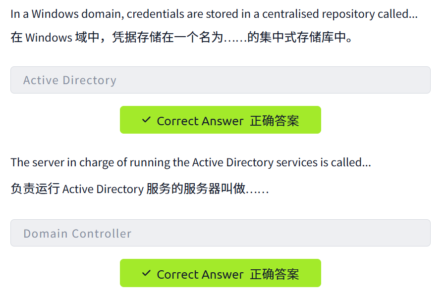


### task 3

The core of any Windows Domain is the **Active Directory Domain Service (AD 广告 DS) DS）**
任何 Windows 域的核心都是 Active Directory 域服务 (. This service acts as a catalogue that holds the information of all of the "objects" that exist on your network. Amongst the many objects supported by AD, we have users, groups, machines, printers, shares and many others. Let's look at some of them:
这项服务充当目录，保存着网络中所有“对象”的信息。AD 支持众多对象，包括用户、组 、 计算机、打印机、共享等等。让我们来看其中的一些：

***Users 用户\***

Users are one of the most common object types in Active Directory. Users are one of the objects known as **security principals**, meaning that they can be authenticated by the domain and can be assigned privileges over **resources** like files or printers. You could say that a security principal is an object that can act upon resources in the network.
用户是 Active Directory 中最常见的对象类型之一。用户属于**安全主体** ，这意味着他们可以接受域的身份验证，并被赋予对文件或打印机等**资源的**权限。可以说，安全主体是能够对网络中的资源执行操作的对象。

Users can be used to represent two types of entities:
用户可以用来表示两种类型的实体：

- **People:** users will generally represent persons in your organisation that need to access the network, like employees.
  **人员：** 用户通常指组织中需要访问网络的人员，例如员工。
- **Services:** you can also define users to be used by services like
  **服务：** 您还可以定义要供服务使用的用户，例如IIS 信息系统 or MSSQL. Every single service requires a user to run, but service users are different from regular users as they will only have the privileges needed to run their specific service.
  或者 MSSQL。每项服务都需要用户才能运行，但服务用户与普通用户不同，因为他们只拥有运行特定服务所需的权限。

***Machines 机器\***

Machines are another type of object within Active Directory; for every computer that joins the Active Directory domain, a machine object will be created. Machines are also considered "security principals" and are assigned an account just as any regular user. This account has somewhat limited rights within the domain itself.
在 Active Directory 中，计算机是另一种类型的对象；每台加入 Active Directory 域的计算机都会创建一个计算机对象。计算机也被视为“安全主体”，并像普通用户一样被分配一个帐户。该帐户在域内拥有一些有限的权限。

The machine accounts themselves are local administrators on the assigned computer, they are generally not supposed to be accessed by anyone except the computer itself, but as with any other account, if you have the password, you can use it to log in.
机器帐户本身是指定计算机上的本地管理员，通常情况下，除了计算机本身之外，任何人都无法访问这些帐户，但与其他任何帐户一样，如果您有密码，就可以使用它登录。

**Note:** Machine Account passwords are automatically rotated out and are generally comprised of 120 random characters.
**注意：** 机器帐户密码会自动轮换，通常由 120 个随机字符组成。

Identifying machine accounts is relatively easy. They follow a specific naming scheme. The machine account name is the computer's name followed by a dollar sign. For example, a machine named `DC01` will have a machine account called `DC01$`.
识别机器账户相对容易。它们遵循特定的命名规则。机器账户名称是计算机名称后跟一个美元符号。例如，名为 `DC01` 计算机将拥有一个名为 `DC01$` 机器账户。

***Security Groups 安全组\***

If you are familiar with Windows, you probably know that you can define user groups to assign access rights to files or other resources to entire groups instead of single users. This allows for better manageability as you can add users to an existing group, and they will automatically inherit all of the group's privileges. Security groups are also considered security principals and, therefore, can have privileges over resources on the network.
如果您熟悉 Windows 系统，您可能知道可以定义用户组，将文件或其他资源的访问权限分配给整个组，而不是单个用户。这样可以提高管理效率，因为您可以将用户添加到现有组，他们将自动继承该组的所有权限。安全组也被视为安全主体，因此可以拥有对网络资源的权限。

Groups can have both users and machines as members. If needed, groups can include other groups as well.
群组可以包含用户和机器作为成员。如有需要，群组还可以包含其他群组。

Several groups are created by default in a domain that can be used to grant specific privileges to users. As an example, here are some of the most important groups in a domain:
域中默认创建多个组，可用于向用户授予特定权限。例如，以下是域中一些最重要的组：

| **Security Group 安全组**     | **Description 描述**                                         |
| ----------------------------- | ------------------------------------------------------------ |
| Domain Admins 域管理员        | Users of this group have administrative privileges over the entire domain. By default, they can administer any computer on the domain, including the DCs. 该组用户拥有对整个域的管理权限。默认情况下，他们可以管理域中的任何计算机，包括域控制器 (DC)。 |
| Server Operators 服务器操作员 | Users in this group can administer Domain Controllers. They cannot change any administrative group memberships. 该组中的用户可以管理域控制器，但不能更改任何管理组成员身份。 |
| Backup Operators 备份操作员   | Users in this group are allowed to access any file, ignoring their permissions. They are used to perform backups of data on computers. 该组用户可以访问任何文件，无视其权限设置。他们被用于执行计算机上的数据备份。 |
| Account Operators 账户操作员  | Users in this group can create or modify other accounts in the domain. 该组中的用户可以创建或修改域中的其他帐户。 |
| Domain Users 域用户           | Includes all existing user accounts in the domain. 包括域中所有现有用户帐户。 |
| Domain Computers 域计算机     | Includes all existing computers in the domain. 包括域中所有现有的计算机。 |
| Domain Controllers 域控制器   | Includes all existing DCs on the domain. 包括域中所有现有的域控制器。 |

You can obtain the complete list of default security groups from the [Microsoft documentation(opens in new tab)](https://docs.microsoft.com/en-us/windows/security/identity-protection/access-control/active-directory-security-groups).
您可以从微软文档中获取默认安全组的完整列表。

Active Directory Users and Computers
活动目录用户和计算机

To configure users, groups or machines in Active Directory, we need to log in to the Domain Controller and run "Active Directory Users and Computers" from the start menu:
要在 Active Directory 中配置用户、组或计算机，我们需要登录到域控制器，然后从开始菜单运行“Active Directory 用户和计算机”：


This will open up a window where you can see the hierarchy of users, computers and groups that exist in the domain. These objects are organised in **Organizational Units (OUs)** which are container objects that allow you to classify users and machines. OUs are mainly used to define sets of users with similar policing requirements. The people in the Sales department of your organisation are likely to have a different set of policies applied than the people in IT, for example. Keep in mind that a user can only be a part of a single OU at a time.
这将打开一个窗口，您可以在其中查看域中存在的用户、计算机和组的层次结构。这些对象按**组织单元 (OU)** 进行组织，组织单元是容器对象，允许您对用户和计算机进行分类。组织单元主要用于定义具有相似策略要求的用户集。例如，您组织中销售部门的人员可能与 IT 部门的人员应用不同的策略集。请记住，一个用户一次只能属于一个组织单元。

Checking our machine, we can see that there is already an OU called `THM` with five child OUs for the IT, Management, Marketing, R&D, and Sales departments. It is very typical to see the OUs mimic the business' structure, as it allows for efficiently deploying baseline policies that apply to entire departments. Remember that while this would be the expected model most of the time, you can define OUs arbitrarily. Feel free to right-click the `THM` OU and create a new OU under it called `Students` just for the fun of it.
检查我们的机器，可以看到已经有一个名为 `THM` 组织单元 (OU)，它包含五个子 OU，分别对应 IT、管理、市场营销、研发和销售部门。组织单元的设置通常会反映企业的实际组织结构，这样可以高效地部署适用于整个部门的基础策略。请记住，虽然这通常是预期模式，但您也可以随意定义组织单元。不妨右键单击 `THM` 组织单元，在其下创建一个名为 `Students` 新组织单元，纯粹是为了好玩。


If you open any OUs, you can see the users they contain and perform simple tasks like creating, deleting or modifying them as needed. You can also reset passwords if needed (pretty useful for the helpdesk):
打开任何组织单元 (OU) 后，您可以查看其中包含的用户，并根据需要执行创建、删除或修改等简单任务。您还可以根据需要重置密码（这对技术支持人员非常有用）：


You probably noticed already that there are other default containers apart from the THM OU. These containers are created by Windows automatically and contain the following:
您可能已经注意到，除了 THM OU 之外，还有其他默认容器。这些容器由 Windows 自动创建，包含以下内容：

- **Builtin:** Contains default groups available to any Windows host.
  **内置：** 包含任何 Windows 主机可用的默认组。
- **Computers:** Any machine joining the network will be put here by default. You can move them if needed.
  **计算机：** 任何加入网络的计算机默认都会放置在此处。如有需要，您可以将其移动。
- **Domain Controllers:** Default
  **域控制器：** 默认OU 或者 that contains the DCs in your network.
  其中包含您网络中的数据中心。
- **Users:** Default users and groups that apply to a domain-wide context.
  **用户：** 适用于域范围的默认用户和组。
- **Managed Service Accounts:** Holds accounts used by services in your Windows domain.
  **托管服务帐户：** 保存 Windows 域中服务使用的帐户。

Security Groups vs OUs 安全组与组织单元

You are probably wondering why we have both groups and OUs. While both are used to classify users and computers, their purposes are entirely different:
您可能想知道为什么我们既有用户组又有组织单元 (OU)。虽然两者都用于对用户和计算机进行分类，但它们的用途却截然不同：

- **OUs** are handy for **applying policies** to users and computers, which include specific configurations that pertain to sets of users depending on their particular role in the enterprise. Remember, a user can only be a member of a single
  **组织单元 (OU)** 便于将**策略**应用于用户和计算机，这些策略包含针对特定用户集的配置，具体取决于用户在企业中的特定角色。请记住，一个用户只能属于一个组织单元。OU 或者 at a time, as it wouldn't make sense to try to apply two different sets of policies to a single user.
  同时对同一用户应用两套不同的策略是不合理的，因为对同一用户应用两套不同的策略是不合理的。
- **Security Groups**, on the other hand, are used to **grant permissions over resources**. For example, you will use groups if you want to allow some users to access a shared folder or network printer. A user can be a part of many groups, which is needed to grant access to multiple resources.
  另一方面， **安全组**用于**授予对资源的权限** 。例如，如果您想允许某些用户访问共享文件夹或网络打印机，则需要使用安全组。一个用户可以属于多个安全组，这是为了授予其对多个资源的访问权限。

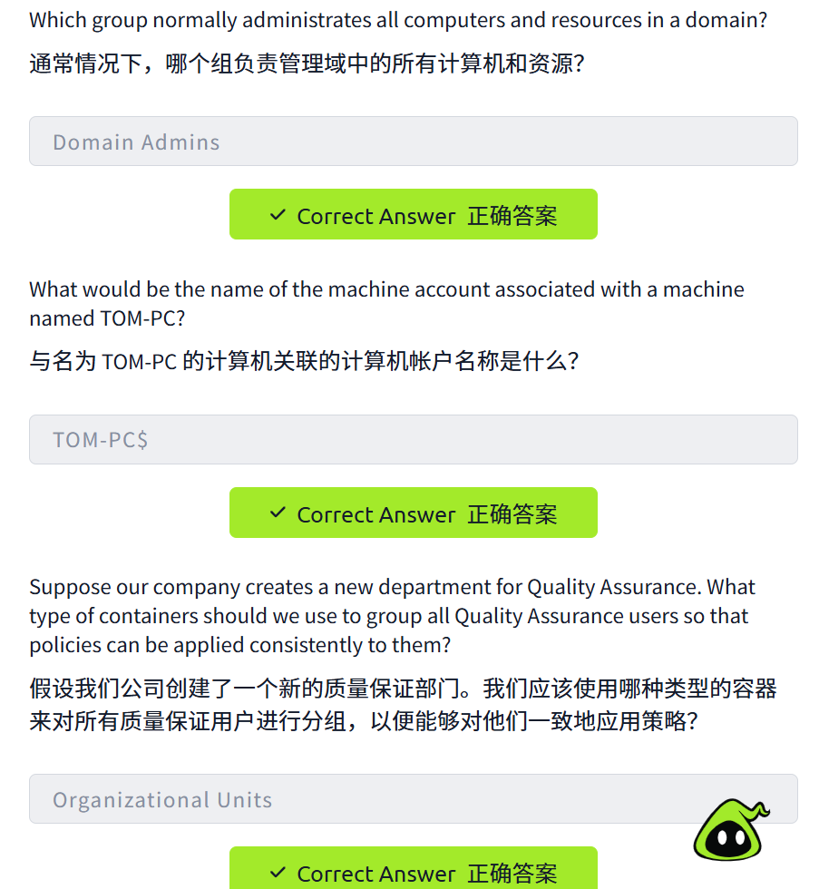


### task 4

Your first task as the new domain administrator is to check the existing AD OUs and users, as some recent changes have happened to the business. You have been given the following organisational chart and are expected to make changes to the AD to match it:
作为新任域管理员，您的首要任务是检查现有的 AD 组织单元 (OU) 和用户，因为公司最近进行了一些业务变更。您已收到以下组织结构图，需要根据该结构图对 AD 进行相应的更改：


Deleting extra OUs and users
删除多余的组织单元和用户

The first thing you should notice is that there is an additional department OU in your current AD configuration that doesn't appear in the chart. We've been told it was closed due to budget cuts and should be removed from the domain. If you try to right-click and delete the OU, you will get the following error:
首先您应该注意到，您当前的 AD 配置中有一个额外的部门 OU ，但它并未显示在图表中。我们被告知该 OU 因预算削减而关闭，应该从域中移除。如果您尝试右键单击并删除该 OU ，将会收到以下错误：


By default, OUs are protected against accidental deletion. To delete the OU, we need to enable the **Advanced Features** in the View menu:
默认情况下，组织单元 (OU) 受到保护，防止意外删除。要删除组织单元，我们需要在“视图”菜单中启用 **“高级功能”** ：


This will show you some additional containers and enable you to disable the accidental deletion protection. To do so, right-click the OU and go to Properties. You will find a checkbox in the Object tab to disable the protection:
这将显示一些其他容器，并允许您禁用意外删除保护。为此，请右键单击组织单元 (OU) 并转到“属性”。您会在“对象”选项卡中找到一个复选框，用于禁用此保护：


Be sure to uncheck the box and try deleting the OU again. You will be prompted to confirm that you want to delete the OU, and as a result, any users, groups or OUs under it will also be deleted.
请务必取消选中该复选框，然后再次尝试删除组织单元 (OU) 。系统会提示您确认是否要删除该 OU ，删除后，该 OU 下的所有用户、组和 OU 也将被删除。

After deleting the extra OU, you should notice that for some of the departments, the users in the AD don't match the ones in our organisational chart. Create and delete users as needed to match them.
删除多余的组织单元 (OU) 后，您会发现某些部门在 AD 中的用户与组织结构图中的用户不匹配。请根据需要创建和删除用户，以使两者匹配。

Delegation 代表团

One of the nice things you can do in AD is to give specific users some control over some OUs. This process is known as **delegation** and allows you to grant users specific privileges to perform advanced tasks on OUs without needing a Domain Administrator to step in.
在 AD 中，您可以做的一件很棒的事情就是赋予特定用户对某些组织单元 (OU) 的控制权。这个过程称为**委派** ，它允许您授予用户特定权限，使其能够在无需域管理员介入的情况下对 OU 执行高级任务。

One of the most common use cases for this is granting `IT support` the privileges to reset other low-privilege users' passwords. According to our organisational chart, Phillip is in charge of IT support, so we'd probably want to delegate the control of resetting passwords over the Sales, Marketing and Management OUs to him.
最常见的用例之一是授予 `IT support` 重置其他低权限用户密码的权限。根据我们的组织架构图，Phillip 负责 IT 支持，因此我们可能需要将销售、市场营销和管理部门的密码重置权限委托给他。

For this example, we will delegate control over the Sales OU to Phillip. To delegate control over an OU, you can right-click it and select **Delegate Control**:
在本例中，我们将把销售组织单元 (OU) 的控制权委托给 Phillip。要委托对某个组织单元的控制权，您可以右键单击该组织单元，然后选择 **“委托控制权”** 。


This should open a new window where you will first be asked for the users to whom you want to delegate control:
这将打开一个新窗口，首先会要求您选择要将控制权委托给的用户：

**Note:** To avoid mistyping the user's name, write "phillip" and click the **Check Names** button. Windows will autocomplete the user for you.
**注意：** 为避免输错用户名，请输入“phillip”并点击 **“检查名称”** 按钮。Windows 会自动补全用户名。


Click OK, and on the next step, select the following option:
单击“确定”，然后在下一步中选择以下选项：


Click next a couple of times, and now Phillip should be able to reset passwords for any user in the sales department. While you'd probably want to repeat these steps to delegate the password resets of the Marketing and Management departments, we'll leave it here for this task. You are free to continue to configure the rest of the OUs if you so desire.
点击几次“下一步”，现在菲利普应该可以重置销售部门任何用户的密码了。虽然您可能需要重复这些步骤来委派市场部和管理部用户的密码重置权限，但本次任务到此为止。您可以根据需要继续配置其余的组织单元 (OU)。

Now let's use Phillip's account to try and reset Sophie's password. Here are Phillip's credentials for you to log in via RDP:
现在我们用菲利普的账号来尝试重置索菲的密码。以下是菲利普的登录凭据，您可以通过远程桌面协议 (RDP) 登录：


| **Username  用户名** | phillip 菲利普 |
| -------------------- | -------------- |
| **Password  密码**   | Claire2008     |

**Note:** When connecting via RDP, use `THM\phillip` as the username to specify you want to log in using the user `phillip` on the `THM` domain.
**注意：** 通过 RDP 连接时，请使用 `THM\phillip` 作为用户名，以指定您要使用 `THM` 域上的用户 `phillip` 登录。

While you may be tempted to go to **Active Directory Users and Computers** to try and test Phillip's new powers, he doesn't really have the privileges to open it, so you'll have to use other methods to do password resets. In this case, we will be using Powershell to do so:
虽然您可能很想通过 **“Active Directory 用户和计算机”** 来测试 Phillip 的新权限，但他实际上并没有打开该目录的权限，因此您需要使用其他方法来重置密码。在这种情况下，我们将使用 PowerShell 来完成此操作：

Windows PowerShell (As Phillip) Windows PowerShell（作者：Phillip）

```shell-session
PS C:\Users\phillip> Set-ADAccountPassword sophie -Reset -NewPassword (Read-Host -AsSecureString -Prompt 'New Password') -Verbose

New Password: *********

VERBOSE: Performing the operation "Set-ADAccountPassword" on target "CN=Sophie,OU=Sales,OU=THM,DC=thm,DC=local".
```

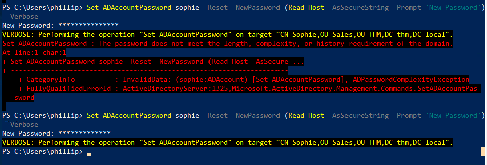

注：这里的new password 要字母和数字都有，而且长度得长一点

Since we wouldn't want Sophie to keep on using a password we know, we can also force a password reset at the next logon with the following command:
由于我们不希望 Sophie 继续使用我们知道的密码，我们还可以使用以下命令强制她在下次登录时重置密码：

Windows 视窗PowerShell(as Phillip) （饰演菲利普）

```shell-session
PS C:\Users\phillip> Set-ADUser -ChangePasswordAtLogon $true -Identity sophie -Verbose

VERBOSE: Performing the operation "Set" on target "CN=Sophie,OU=Sales,OU=THM,DC=thm,DC=local".
```

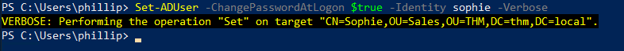

Log into Sophie's account with your new password and retrieve a flag from Sophie's desktop.
使用新密码登录 Sophie 的帐户，并从 Sophie 的桌面上获取旗帜。

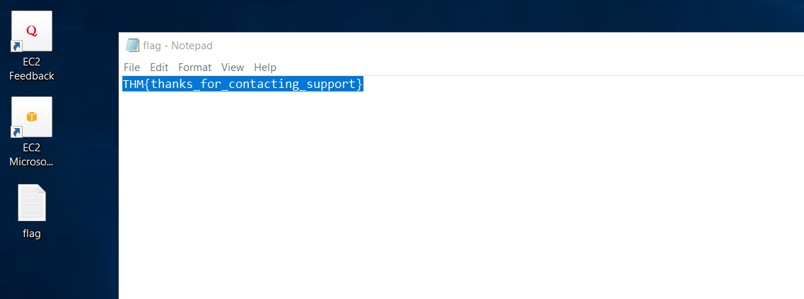


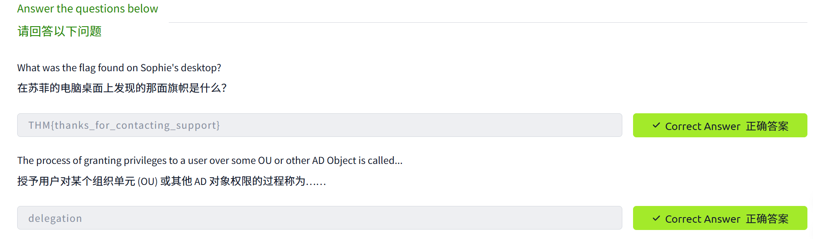


### task 5

By default, all the machines that join a domain (except for the DCs) will be put in the container called "Computers". If we check our DC, we will see that some devices are already there:
默认情况下，所有加入域的计算机（域控制器除外）都会被放入名为“计算机”的容器中。如果我们检查我们的域控制器，会发现其中已经有一些设备：


We can see some servers, some laptops and some PCs corresponding to the users in our network. Having all of our devices there is not the best idea since it's very likely that you want different policies for your servers and the machines that regular users use on a daily basis.
我们可以看到网络中一些服务器、笔记本电脑和台式机，它们分别对应着我们的用户。把所有设备都放在这里并不是最佳方案，因为您很可能希望对服务器和普通用户日常使用的机器采用不同的策略。

While there is no golden rule on how to organise your machines, an excellent starting point is segregating devices according to their use. In general, you'd expect to see devices divided into at least the three following categories:
虽然整理机器没有固定的规则，但一个很好的起点是根据用途对设备进行分类。一般来说，设备至少可以分为以下三类：

**1. Workstations 1. 工作站**

Workstations are one of the most common devices within an Active Directory domain. Each user in the domain will likely be logging into a workstation. This is the device they will use to do their work or normal browsing activities. These devices should never have a privileged user signed into them.
工作站是 Active Directory 域中最常见的设备之一。域中的每个用户都可能需要登录工作站。他们将使用工作站来完成工作或进行日常浏览活动。这些设备绝不应该允许具有特权的用户登录。

**2. Servers 2. 服务器**

Servers are the second most common device within an Active Directory domain. Servers are generally used to provide services to users or other servers.
服务器是 Active Directory 域中第二常见的设备。服务器通常用于向用户或其他服务器提供服务。

**3. Domain Controllers 3. 域控制器**

Domain Controllers are the third most common device within an Active Directory domain. Domain Controllers allow you to manage the Active Directory Domain. These devices are often deemed the most sensitive devices within the network as they contain hashed passwords for all user accounts within the environment.
域控制器是 Active Directory 域中第三大常见设备。域控制器用于管理 Active Directory 域。由于这些设备存储着环境中所有用户帐户的哈希密码，因此通常被认为是网络中最敏感的设备。

Since we are tidying up our AD, let's create two separate OUs for `Workstations` and `Servers` (Domain Controllers are already in an OU created by Windows). We will be creating them directly under the `thm.local` domain container. In the end, you should have the following OU structure:
由于我们要整理 AD ，所以让我们为 `Workstations` 和 `Servers` 创建两个独立的 OU（域控制器已位于 Windows 创建的 OU 中）。我们将直接在 `thm.local` 域容器下创建它们。最终，您应该得到以下 OU 结构：


Now, move the personal computers and laptops to the Workstations OU and the servers to the Servers OU from the Computers container. Doing so will allow us to configure policies for each OU later.
现在，将个人电脑和笔记本电脑从“计算机”容器移动到“工作站”组织单元(OU) ，将服务器从“服务器”组织单元 (OU) 移动到“服务器”组织单元 (OU)。这样做可以让我们稍后为每个组织单元配置策略。

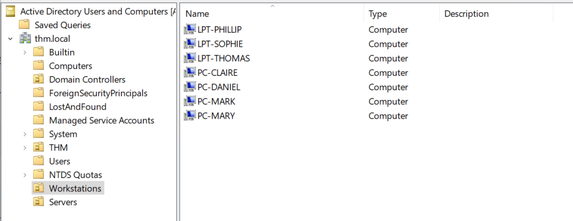

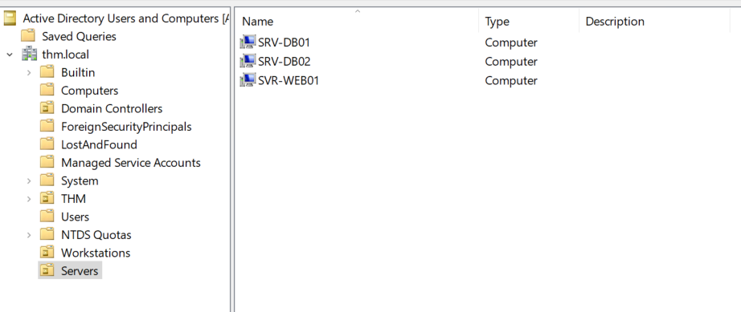

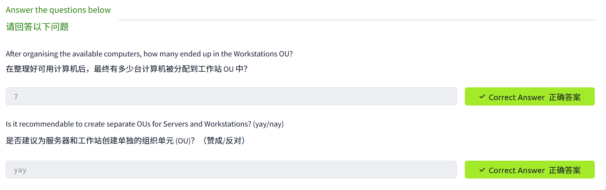

### task 6

So far, we have organised users and computers in OUs just for the sake of it, but the main idea behind this is to be able to deploy different policies for each OU individually. That way, we can push different configurations and security baselines to users depending on their department.
目前，我们只是为了组织用户和计算机而将它们组织到组织单元 (OU) 中，但其背后的主要目的是能够为每个 OU 单独部署不同的策略。这样，我们就可以根据用户所在的部门，向他们推送不同的配置和安全基线。

Windows manages such policies through **Group Policy Objects (GPO 政府邮政局)**
Windows 通过组策略对象 (GPO) 管理此类策略 (. GPOs are simply a collection of settings that can be applied to OUs. GPOs can contain policies aimed at either users or computers, allowing you to set a baseline on specific machines and identities.
组策略对象 (GPO) 只是一组可以应用于组织单元 (OU) 的设置。GPO 可以包含针对用户或计算机的策略，从而允许您为特定计算机和身份设置基线。

To configure GPOs, you can use the **Group Policy Management** tool, available from the start menu:
要配置 GPO，可以使用**组策略管理**工具，该工具可从开始菜单访问：


The first thing you will see when opening it is your complete OU hierarchy, as defined before. To configure Group Policies, you first create a GPO under **Group Policy Objects** and then link it to the OU where you want the policies to apply. As an example, you can see there are some already existing GPOs in your machine:
打开后首先会看到之前定义的完整 OU 层次结构。要配置组策略，首先需要在**组策略对象**下创建一个 GPO ，然后将其链接到要应用策略的 OU 。例如，您可以看到计算机上已经存在一些 GPO：


We can see in the image above that 3 GPOs have been created. From those, the `Default Domain Policy` and `RDP Policy` are linked to the `thm.local` domain as a whole, and the `Default Domain Controllers Policy` is linked to the `Domain Controllers` OU only. Something important to have in mind is that any GPO will apply to the linked OU and any sub-OUs under it. For example, the `Sales` OU will still be affected by the `Default Domain Policy`.
从上图可以看出，已创建了 3 个 GPO。其中， `Default Domain Policy` 和 `RDP Policy` 链接到整个 `thm.local` 域，而 `Default Domain Controllers Policy` 仅链接到 `Domain Controllers` OU。需要注意的是，任何 GPO 都会应用于链接的 OU 及其下的所有子 OU。例如， `Sales` OU 仍会受到 `Default Domain Policy` 影响。

Let's examine the `Default Domain Policy` to see what's inside a GPO. The first tab you'll see when selecting a GPO shows its **scope**, which is where the GPO is linked in the AD. For the current policy, we can see that it has only been linked to the `thm.local` domain:
让我们来检查 `Default Domain Policy` ，看看 GPO 内部包含哪些内容。选择 GPO 后，您看到的第一个选项卡会显示其**作用域** ，即 GPO 在 AD 中的链接位置。对于当前策略，我们可以看到它仅链接到了 `thm.local` 域：


As you can see, you can also apply **Security Filtering** to GPOs so that they are only applied to specific users/computers under an OU. By default, they will apply to the **Authenticated Users** group, which includes all users/PCs.
如您所见，您还可以对组策略对象 (GPO) **应用安全筛选** ，使其仅应用于组织单元 (OU) 下的特定用户/计算机。默认情况下，它们将应用于 **“已验证用户”** 组，该组包含所有用户/计算机。

The **Settings** tab includes the actual contents of the GPO and lets us know what specific configurations it applies. As stated before, each GPO has configurations that apply to computers only and configurations that apply to users only. In this case, the `Default Domain Policy` only contains Computer Configurations:[重试 错误原因](javascript:void(0))


Feel free to explore the GPO and expand on the available items using the "show" links on the right side of each configuration. In this case, the `Default Domain Policy` indicates really basic configurations that should apply to most domains, including password and account lockout policies:
您可以随意浏览 GPO，并使用每个配置右侧的“显示”链接展开查看可用项目。在本例中， `Default Domain Policy` 显示了适用于大多数域的基本配置，包括密码和帐户锁定策略：


Since this GPO applies to the whole domain, any change to it would affect all computers. Let's change the minimum password length policy to require users to have at least 10 characters in their passwords. To do this, right-click the GPO and select **Edit**:
由于此 GPO 应用于整个域，因此对其进行的任何更改都会影响所有计算机。让我们更改最小密码长度策略，要求用户密码至少包含 10 个字符。为此，请右键单击 GPO 并选择 **“编辑”** ：


This will open a new window where we can navigate and edit all the available configurations. To change the minimum password length, go to `Computer Configurations -> Policies -> Windows Setting -> Security Settings -> Account Policies -> Password Policy` and change the required policy value:
这将打开一个新窗口，我们可以在其中浏览和编辑所有可用的配置。要更改最小密码长度，请转到 `Computer Configurations -> Policies -> Windows Setting -> Security Settings -> Account Policies -> Password Policy` 并更改所需的策略值：


As you can see, plenty of policies can be established in a GPO. While explaining every single of them would be impossible in a single room, do feel free to explore a bit, as some of the policies are straightforward. If more information on any of the policies is needed, you can double-click them and read the **Explain** tab on each of them:
如您所见，GPO 中可以设置许多策略。虽然在一个房间里逐一解释所有策略是不可能的，但您可以随意探索一下，因为有些策略非常简单明了。如果需要了解任何策略的更多信息，您可以双击该策略，然后查看其 **“解释”** 选项卡：


GPO distribution GPO 分销

GPOs are distributed to the network via a network share called `SYSVOL`, which is stored in the DC. All users in a domain should typically have access to this share over the network to sync their GPOs periodically. The SYSVOL share points by default to the `C:\Windows\SYSVOL\sysvol\` directory on each of the DCs in our network.
组策略对象 (GPO) 通过名为 `SYSVOL` 网络共享分发到网络，该共享存储在域控制器 (DC) 上。域中的所有用户通常都应该能够通过网络访问此共享，以便定期同步其 GPO。SYSVOL 共享默认指向网络中每个 DC 上的 `C:\Windows\SYSVOL\sysvol\` 目录。

Once a change has been made to any GPOs, it might take up to 2 hours for computers to catch up. If you want to force any particular computer to sync its GPOs immediately, you can always run the following command on the desired computer:
组策略对象 (GPO) 更改后，计算机可能需要长达 2 小时才能同步更新。如果您想强制特定计算机立即同步其 GPO，可以随时在该计算机上运行以下命令：

Windows PowerShell

```shell-session
PS C:\> gpupdate /force
```

Creating some GPOs for THM Inc.
为 THM 公司创建一些 GPO。

As part of our new job, we have been tasked with implementing some GPOs to allow us to:
作为新工作的一部分，我们被委派实施一些组策略对象 (GPO)，以便我们能够：

1. Block non-IT users from accessing the Control Panel.
   禁止非 IT 用户访问控制面板。
2. Make workstations and servers lock their screen automatically after 5 minutes of user inactivity to avoid people leaving their sessions exposed.
   为避免用户在会话期间暴露在外，请将工作站和服务器的屏幕在用户 5 分钟无操作后自动锁定。

Let's focus on each of those and define what policies we should enable in each GPO and where they should be linked.
让我们逐一关注这些策略，并定义我们应该在每个 GPO 中启用哪些策略以及它们应该链接到哪里。

***Restrict Access to Control Panel
限制对控制面板的访问\***

We want to restrict access to the Control Panel across all machines to only the users that are part of the IT department. Users of other departments shouldn't be able to change the system's preferences.
我们希望限制所有机器上控制面板的访问权限，仅允许 IT 部门的用户访问。其他部门的用户不应能够更改系统设置。

Let's create a new GPO called `Restrict Control Panel Access` and open it for editing. Since we want this GPO to apply to specific users, we will look under `User Configuration` for the following policy:
让我们创建一个名为 `Restrict Control Panel Access` 的新 GPO 并打开进行编辑。由于我们希望此 GPO 应用于特定用户，因此我们将在 `User Configuration` 下查找以下策略：


Notice we have enabled the **Prohibit Access to Control Panel and PC settings** policy.
请注意，我们已启用“ **禁止访问控制面板和电脑设置** ”策略。

Once the GPO is configured, we will need to link it to all of the OUs corresponding to users who shouldn't have access to the Control Panel of their PCs. In this case, we will link the `Marketing`, `Management` and `Sales` OUs by dragging the GPO to each of them:
配置好 GPO 后，我们需要将其链接到所有不应访问其电脑控制面板的用户对应的组织单元 (OU)。在本例中，我们将 GPO 拖放到 `Marketing` ”、 `Management` 和 `Sales` 这三个 OU 中，从而将它们链接起来：


***Auto Lock Screen GPO 自动锁定屏幕 GPO\***

For the first GPO, regarding screen locking for workstations and servers, we could directly apply it over the `Workstations`, `Servers` and `Domain Controllers` OUs we created previously.
对于第一个 GPO，即关于工作站和服务器屏幕锁定的 GPO，我们可以直接将其应用于我们之前创建的 `Workstations` 、 `Servers` 和 `Domain Controllers` OU。

While this solution should work, an alternative consists of simply applying the GPO to the root domain, as we want the GPO to affect all of our computers. Since the `Workstations`, `Servers` and `Domain Controllers` OUs are all child OUs of the root domain, they will inherit its policies.
虽然这个方案应该可行，但另一种方法是直接将 GPO 应用到根域，因为我们希望 GPO 影响所有计算机。由于 `Workstations` 、 `Servers` 和 `Domain Controllers` OU 都是根域的子 OU，它们将继承根域的策略。

**Note:** You might notice that if our GPO is applied to the root domain, it will also be inherited by other OUs like `Sales` or `Marketing`. Since these OUs contain users only, any Computer Configuration in our GPO will be ignored by them.
**注意：** 您可能会注意到，如果我们的 GPO 应用于根域，它也会被其他组织单元（例如 `Sales` 或 `Marketing` 继承。由于这些组织单元仅包含用户，因此它们将忽略我们 GPO 中的任何计算机配置。

Let's create a new GPO, call it `Auto Lock Screen`, and edit it. The policy to achieve what we want is located in the following route:
我们创建一个新的 GPO，命名为 `Auto Lock Screen` ，并对其进行编辑。实现我们所需功能的策略位于以下路径：


We will set the inactivity limit to 5 minutes so that computers get locked automatically if any user leaves their session open. After closing the GPO editor, we will link the GPO to the root domain by dragging the GPO to it:
我们将把不活动时间限制设置为 5 分钟，这样如果任何用户离开电脑并保持会话打开状态，计算机就会自动锁定。关闭 GPO 编辑器后，我们将 GPO 拖放到根域，从而将其链接到根域：


Once the GPOs have been applied to the correct OUs, we can log in as any users in either Marketing, Sales or Management for verification. For this task, let's connect via RDP using Mark's credentials:
将 GPO 应用到正确的 OU 后，我们可以以市场部、销售部或管理部的任何用户身份登录进行验证。为此，让我们使用 Mark 的凭据通过 RDP 连接：


| **Username  用户名** | Mark 标记    |
| -------------------- | ------------ |
| **Password  密码**   | M4rk3t1ng.21 |

**Note:** When connecting via RDP, use `THM\Mark` as the username to specify you want to log in using the user `Mark` on the `THM` domain.
**注意：** 通过 RDP 连接时，请使用 `THM\Mark` 作为用户名，以指定要使用 `THM` 域上的用户 `Mark` 登录。

If we try opening the Control Panel, we should get a message indicating this operation is denied by the administrator. You can also wait 5 minutes to check if the screen is automatically locked if you want.
如果我们尝试打开控制面板，应该会收到一条消息，提示此操作已被管理员拒绝。您也可以等待 5 分钟，看看屏幕是否自动锁定。

Since we didn't apply the control panel GPO on IT, you should still be able to log into the machine as any of those users and access the control panel. 
由于我们没有在 IT 系统上应用控制面板 GPO，您仍然可以以任何这些用户的身份登录到计算机并访问控制面板。

**Note:** If you created and linked the GPOs, but for some reason, they still don't work, remember you can run `gpupdate /force` to force GPOs to be updated.
**注意：** 如果您创建并链接了 GPO，但由于某种原因它们仍然不起作用，请记住您可以运行 `gpupdate /force` 来强制更新 GPO。

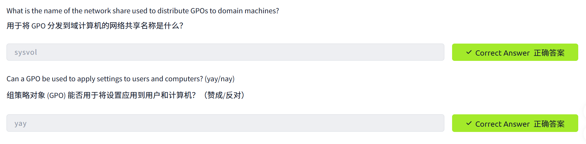


### task 7

When using Windows domains, all credentials are stored in the Domain Controllers. Whenever a user tries to authenticate to a service using domain credentials, the service will need to ask the Domain Controller to verify if they are correct. Two protocols can be used for network authentication in windows domains:
使用 Windows 域时，所有凭据都存储在域控制器中。每当用户尝试使用域凭据对服务进行身份验证时，该服务都需要向域控制器请求验证凭据是否正确。Windows 域中可以使用两种协议进行网络身份验证：

- **Kerberos 刻耳柏洛斯:** Used by any recent version of Windows. This is the default protocol in any recent domain.
  适用于所有近期版本的 Windows 系统。这是所有近期域中的默认协议。
- **NetNTLM:** Legacy authentication protocol kept for compatibility purposes.
  **NetNTLM：** 为兼容性而保留的传统身份验证协议。

While NetNTLM should be considered obsolete, most networks will have both protocols enabled. Let's take a deeper look at how each of these protocols works.
虽然 NetNTLM 协议应该被视为过时协议，但大多数网络仍会同时启用这两种协议。让我们深入了解一下这两种协议的工作原理。

Kerberos Authentication
Kerberos 身份验证

Kerberos authentication is the default authentication protocol for any recent version of Windows. Users who log into a service using Kerberos will be assigned tickets. Think of tickets as proof of a previous authentication. Users with tickets can present them to a service to demonstrate they have already authenticated into the network before and are therefore enabled to use it.
Kerberos 身份验证是所有最新版本 Windows 的默认身份验证协议。使用 Kerberos 登录服务的用户将被分配票据。您可以将票据视为先前身份验证的证明。持有票据的用户可以向服务出示票据，以证明他们之前已通过身份验证连接到网络，因此有权使用该服务。

When Kerberos is used for authentication, the following process happens:
当使用 Kerberos 进行身份验证时，会发生以下过​​程：

1. The user sends their username and a timestamp encrypted using a key derived from their password to the **Key Distribution Center (KDC)**, a service usually installed on the Domain Controller in charge of creating Kerberos tickets on the network.
   用户将用户名和使用从密码派生的密钥加密的时间戳发送到**密钥分发中心 (KDC)** ，KDC 是一项通常安装在域控制器上的服务，负责在网络上创建 Kerberos 票据。

   The KDC will create and send back a **Ticket Granting Ticket (TGT)**
   KDC 将创建并发送一张票据授予票据（, which will allow the user to request additional tickets to access specific services. The need for a ticket to get more tickets may sound a bit weird, but it allows users to request service tickets without passing their credentials every time they want to connect to a service. Along with the TGT, a **Session Key** is given to the user, which they will need to generate the following requests.
   这将允许用户申请额外的票证以访问特定服务。需要票证才能获得更多票证听起来可能有点奇怪，但它允许用户在每次连接服务时无需提供凭据即可申请服务票证。除了 TGT 之外，还会向用户提供一个**会话密钥** ，用户需要使用该密钥来生成后续请求。

   Notice the TGT is encrypted using the **krbtgt** account's password hash, and therefore the user can't access its contents. It is essential to know that the encrypted TGT includes a copy of the Session Key as part of its contents, and the KDC has no need to store the Session Key as it can recover a copy by decrypting the TGT if needed.
   请注意， TGT 使用 **krbtgt** 帐户的密码哈希值进行加密，因此用户无法访问其内容。必须了解的是，加密后的 TGT 包含会话密钥的副本，KDC 无需存储会话密钥，因为它可以在需要时通过解密 TGT 来恢复副本。


1. When a user wants to connect to a service on the network like a share, website or database, they will use their TGT to ask the KDC for a **Ticket Granting Service (TGS)**. TGS are tickets that allow connection only to the specific service they were created for. To request a TGS, the user will send their username and a timestamp encrypted using the Session Key, along with the TGT and a **Service Principal Name (SPN),** which indicates the service and server name we intend to access.
   当用户想要连接到网络上的服务（例如共享资源、网站或数据库）时，他们会使用自己的会话网关 (TGT) 向密钥分发中心 (KDC) 请求**票据授予服务 (TGS)** 。TGS 是一种票据，它只允许连接到为其创建的特定服务。要请求 TGS，用户需要发送用户名、使用会话密钥加密的时间戳、 TGT 以及**服务主体名称 (SPN)，SPN** 指示用户要访问的服务和服务器名称。

   As a result, the KDC will send us a TGS along with a **Service Session Key**, which we will need to authenticate to the service we want to access. The TGS is encrypted using a key derived from the **Service Owner Hash**. The Service Owner is the user or machine account that the service runs under. The TGS contains a copy of the Service Session Key on its encrypted contents so that the Service Owner can access it by decrypting the TGS.
   因此，KDC 会向我们发送一个 TGS 以及一个**服务会话密钥** ，我们需要使用该密钥来验证对要访问的服务的访问权限。TGS 使用从**服务所有者哈希值**派生的密钥进行加密。服务所有者是运行该服务的用户或机器帐户。TGS 的加密内容中包含服务会话密钥的副本，以便服务所有者可以通过解密 TGS 来访问该密钥。


1. The TGS can then be sent to the desired service to authenticate and establish a connection. The service will use its configured account's password hash to decrypt the TGS and validate the Service Session Key.
   然后可以将 TGS 发送到目标服务进行身份验证并建立连接。该服务将使用其配置帐户的密码哈希值来解密 TGS 并验证服务会话密钥。


NetNTLM Authentication NetNTLM 身份验证

NetNTLM works using a challenge-response mechanism. The entire process is as follows:
NetNTLM 采用挑战-响应机制。整个过程如下：


1. The client sends an authentication request to the server they want to access.
   客户端向其想要访问的服务器发送身份验证请求。
2. The server generates a random number and sends it as a challenge to the client.
   服务器生成一个随机数，并将其作为挑战发送给客户端。
3. The client combines their
   客户将他们的NTLM password hash with the challenge (and other known data) to generate a response to the challenge and sends it back to the server for verification.
   使用密码哈希值和挑战（以及其他已知数据）生成对挑战的响应，并将其发送回服务器进行验证。
4. The server forwards the challenge and the response to the Domain Controller for verification.
   服务器将质询和响应转发给域控制器进行验证。
5. The domain controller uses the challenge to recalculate the response and compares it to the original response sent by the client. If they both match, the client is authenticated; otherwise, access is denied. The authentication result is sent back to the server.
   域控制器使用该质询重新计算响应，并将其与客户端发送的原始响应进行比较。如果两者匹配，则客户端通过身份验证；否则，拒绝访问。身份验证结果将发送回服务器。
6. The server forwards the authentication result to the client.
   服务器将身份验证结果转发给客户端。

Note that the user's password (or hash) is never transmitted through the network for security.
请注意，出于安全考虑，用户的密码（或哈希值）绝不会通过网络传输。

**Note:** The described process applies when using a domain account. If a local account is used, the server can verify the response to the challenge itself without requiring interaction with the domain controller since it has the password hash stored locally on its SAM.
**注意：** 所述过程适用于使用域帐户的情况。如果使用本地帐户，服务器可以自行验证质询响应，而无需与域控制器交互，因为服务器的 SAM 中已存储了密码哈希值。

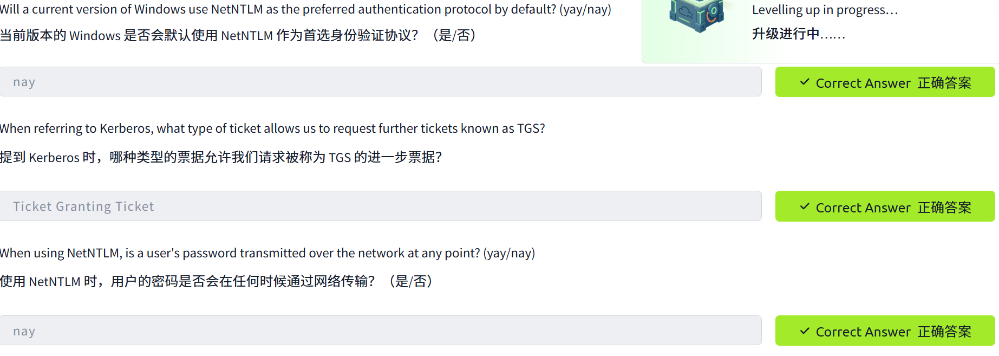


### task 8

So far, we have discussed how to manage a single domain, the role of a Domain Controller and how it joins computers, servers and users.
到目前为止，我们已经讨论了如何管理单个域、域控制器的角色以及它如何将计算机、服务器和用户连接起来。


As companies grow, so do their networks. Having a single domain for a company is good enough to start, but in time some additional needs might push you into having more than one.
随着公司发展壮大，其网络也会随之扩展。起初，公司只需一个域名即可，但随着时间的推移，一些额外的需求可能会促使您拥有多个域名。

Trees 树木

Imagine, for example, that suddenly your company expands to a new country. The new country has different laws and regulations that require you to update your GPOs to comply. In addition, you now have IT people in both countries, and each IT team needs to manage the resources that correspond to each country without interfering with the other team. While you could create a complex OU structure and use delegations to achieve this, having a huge AD structure might be hard to manage and prone to human errors.
例如，假设您的公司突然扩展到一个新的国家。这个新国家的法律法规与您之前提到的国家不同，因此您需要更新组策略对象 (GPO) 以符合规定。此外，您现在在两个国家都设有 IT 人员，每个 IT 团队都需要管理各自国家对应的资源，并且不能互相干扰。虽然您可以创建复杂的组织单元 (OU) 结构并使用委派来实现这一点，但庞大的 AD 结构可能难以管理，并且容易出现人为错误。

Luckily for us, Active Directory supports integrating multiple domains so that you can partition your network into units that can be managed independently. If you have two domains that share the same namespace (`thm.local` in our example), those domains can be joined into a **Tree**.
幸运的是，Active Directory 支持集成多个域，因此您可以将网络划分为可独立管理的单元。如果您有两个共享相同命名空间（例如本例中的 `thm.local` ）的域，则可以将这些域组合成一个**树状**结构。

If our `thm.local` domain was split into two subdomains for UK and US branches, you could build a tree with a root domain of `thm.local` and two subdomains called `uk.thm.local` and `us.thm.local`, each with its AD, computers and users:
如果我们的 `thm.local` 域被拆分为英国和美国分支机构的两个子域，您可以构建一个以 `thm.local` 为根域，以及两个分别名为 `uk.thm.local` 和 `us.thm.local` 的子域的树状结构，每个子域都有自己的 AD、计算机和用户：


This partitioned structure gives us better control over who can access what in the domain. The IT people from the UK will have their own DC that manages the UK resources only. For example, a UK user would not be able to manage US users. In that way, the Domain Administrators of each branch will have complete control over their respective DCs, but not other branches' DCs. Policies can also be configured independently for each domain in the tree.
这种分区结构使我们能够更好地控制域内哪些用户可以访问哪些资源。英国的 IT 人员将拥有自己的域控制器 (DC)，该控制器仅管理英国的资源。例如，英国用户将无法管理美国用户。这样，每个分支机构的域管理员将完全控制各自的域控制器，但无法控制其他分支机构的域控制器。此外，还可以为树中的每个域独立配置策略。

A new security group needs to be introduced when talking about trees and forests. The **Enterprise Admins** group will grant a user administrative privileges over all of an enterprise's domains. Each domain would still have its Domain Admins with administrator privileges over their single domains and the Enterprise Admins who can control everything in the enterprise.
在讨论企业安全时，需要引入一个新的安全组。 **企业管理员**组将授予用户对企业所有域的管理权限。每个域仍然会有自己的域管理员，他们拥有各自域的管理权限；此外，企业管理员还可以控制企业内的所有事务。

Forests 森林

The domains you manage can also be configured in different namespaces. Suppose your company continues growing and eventually acquires another company called `MHT Inc.` When both companies merge, you will probably have different domain trees for each company, each managed by its own IT department. The union of several trees with different namespaces into the same network is known as a **forest**.
您管理的域也可以配置在不同的命名空间中。假设您的公司持续发展，最终收购了另一家名为 `MHT Inc.` 的公司。当两家公司合并时，您可能会为每家公司分别拥有不同的域树，每个域树都由其自身的 IT 部门管理。将多个具有不同命名空间的域树合并到同一个网络中，称为域**森林** 。


Trust Relationships 信任关系

Having multiple domains organised in trees and forest allows you to have a nice compartmentalised network in terms of management and resources. But at a certain point, a user at THM UK might need to access a shared file in one of MHT ASIA servers. For this to happen, domains arranged in trees and forests are joined together by **trust relationships**.
将多个域以树状和森林状结构组织起来，可以构建一个管理和资源分配清晰、彼此隔离的网络。但有时，THM UK 的用户可能需要访问 MHT ASIA 服务器上的共享文件。为了实现这一点，需要通过**信任关系**将以树状和森林状结构组织的域连接起来。

In simple terms, having a trust relationship between domains allows you to authorise a user from domain `THM UK` to access resources from domain `MHT EU`.
简单来说，在域之间建立信任关系，可以授权来自域 `THM UK` 用户访问来自域 `MHT EU` 资源。

The simplest trust relationship that can be established is a **one-way trust relationship**. In a one-way trust, if `Domain AAA` trusts `Domain BBB`, this means that a user on BBB can be authorised to access resources on AAA:
最简单的信任关系是**单向信任关系** 。在单向信任中，如果 `Domain AAA` 信任 `Domain BBB` ，这意味着 BBB 上的用户可以被授权访问 AAA 上的资源：


The direction of the one-way trust relationship is contrary to that of the access direction.
单向信任关系的方向与访问方向相反。

**Two-way trust relationships** can also be made to allow both domains to mutually authorise users from the other. By default, joining several domains under a tree or a forest will form a two-way trust relationship.
还可以建立**双向信任关系** ，允许两个域相互授权对方的用户。默认情况下，将多个域加入同一棵树或同一片森林中就会形成双向信任关系。

It is important to note that having a trust relationship between domains doesn't automatically grant access to all resources on other domains. Once a trust relationship is established, you have the chance to authorise users across different domains, but it's up to you what is actually authorised or not.
需要注意的是，建立域之间的信任关系并不意味着会自动授予对其他域上所有资源的访问权限。信任关系建立后，您可以授权不同域的用户，但具体授权哪些资源完全由您决定。

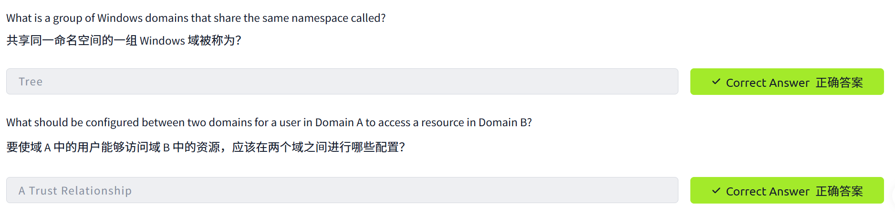


### task 9

In this room, we have shown the basic components and concepts related to Active Directories and Windows Domains. Keep in mind that this room should only serve as an introduction to the basic concepts, as there's quite a bit more to explore to implement a production-ready Active Directory environment.
在这个房间里，我们展示了与 Active Directory 和 Windows 域相关的基本组件和概念。请记住，这个房间仅作为基本概念的介绍，因为要实现一个可用于生产环境的 Active Directory 环境，还有很多内容需要探索。

If you are interested in learning how to secure an Active Directory installation, be sure to check out the [Active Directory Hardening Room](https://tryhackme.com/room/activedirectoryhardening). If, on the other hand, you'd like to know how attackers can take advantage of common AD misconfigurations and other AD hacking techniques, the [Compromising Active Directory module](https://tryhackme.com/module/hacking-active-directory) is the way to go.
如果您想了解如何保护 Active Directory 安装，请务必查看 [Active Directory 加固专区 ](https://tryhackme.com/room/activedirectoryhardening)。另一方面，如果您想了解攻击者如何利用常见的 AD 配置错误和其他 AD 黑客技术，那么 [“入侵 Active Directory”模块](https://tryhackme.com/module/hacking-active-directory)是您的理想选择。