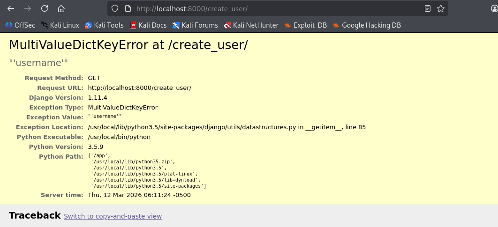
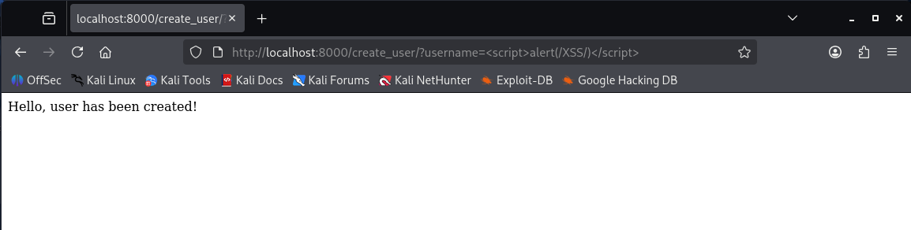
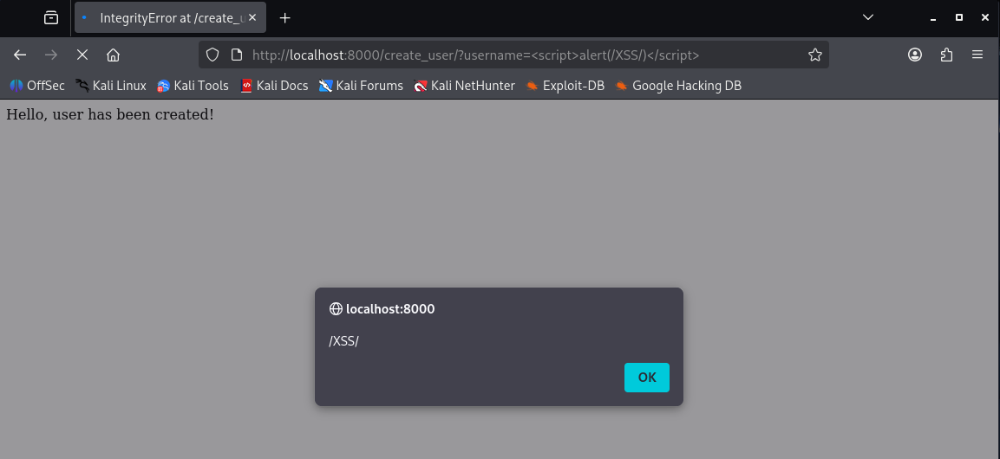

## CVE-2017-12794 漏洞复现笔记

### 一、漏洞基础信息

### 1.1 漏洞简介

CVE-2017-12794 是 Django Web 框架中的一个跨站脚本（XSS）漏洞，存在于其调试模式（Debug Mode）下的 500 错误页面中。该漏洞的核心原因是 Django 对数据库异常信息的 HTML 转义不充分，当触发特定数据库错误时，攻击者可构造恶意 payload 注入到错误页面中，导致 XSS 攻击成功，进而可能窃取用户会话、执行恶意脚本等。

该漏洞不影响生产环境中关闭 Debug 模式的 Django 应用，仅在 Debug = True（调试模式）下可被利用，这也是其风险等级未达到高危的主要原因，但对于开发、测试环境仍存在较大安全隐患。

### 1.2 影响版本

根据官方公告及漏洞详情，受影响的 Django 版本如下：

- Django 1.10.x 系列：1.10.0 至 1.10.7（不含 1.10.8）
- Django 1.11.x 系列：1.11.0 至 1.11.4（不含 1.11.5）

备注：Django 1.8.x 及以下版本、1.10.8 及以上、1.11.5 及以上版本已修复该漏洞，不受影响；Debian 系统中，wheezy、jessie 版本的 python-django 因不存在漏洞代码，同样不受影响。

### 1.3 漏洞原理

Django 的调试模式下，当应用触发 500 错误（服务器内部错误）时，会显示详细的调试页面（technical 500 debug page），用于开发者排查问题。该页面会展示异常堆栈、错误信息等内容，其中包含数据库异常的相关详情。

漏洞根源在于 Django 1.11.4 及以下版本的 django/views/debug.py 文件中，对数据库异常的 exc_cause 字段未进行充分的 HTML 自动转义，导致攻击者可控的字符串（如用户输入的用户名）会被直接渲染到错误页面中，触发 XSS 漏洞。

具体来说，当触发数据库唯一约束异常（如重复注册相同用户名）时，Postgres 等数据库会将字段名和字段值全部抛出，若字段值包含恶意 JavaScript 代码，该代码会被直接显示在调试页面中并执行。这是因为 Django 在关联数据库异常和当前异常时，会将原始异常信息赋值给 exc_cause，而该字段在模板渲染时未做转义处理。

### 1.4 漏洞风险等级

CVSS 评分：4.3（中危），风险点主要在于：

- 利用条件受限：仅在 Debug 模式下可利用，生产环境通常关闭该模式，降低了实际攻击风险；
- 攻击影响范围：成功利用后，可在受害者浏览器中执行任意 JavaScript 代码，可能导致会话劫持、敏感信息泄露等；
- 利用难度低：无需复杂构造 payload，仅需触发数据库异常即可实现注入。

## 二、复现环境准备

### 2.1 环境说明

为简化环境搭建，采用 Vulhub 漏洞环境（基于 Docker 容器），无需手动配置 Django 及数据库，直接通过 Docker 启动即可，适合快速复现。

| 环境类型 | 具体配置                                                     | 说明                                             |
| :------- | :----------------------------------------------------------- | :----------------------------------------------- |
| 攻击机   | Kali Linux（IP：192.168.101.136），自带浏览器、Burp Suite（可选） | 用于构造恶意请求、访问靶机漏洞页面               |
| 靶机     | Docker + Vulhub 环境，Django 1.11.4 + Postgres 数据库        | Vulhub 已封装好漏洞环境，直接启动即可            |
| 依赖工具 | Docker、Docker Compose、浏览器                               | Docker 用于运行容器，Docker Compose 用于编排环境 |

### 2.2 环境搭建步骤

#### 2.2.1 安装 Docker 及 Docker Compose（靶机/本地）

若已安装，可跳过此步骤；未安装则执行以下命令：

```bash
# 更新软件源
sudo apt update && sudo apt upgrade -y

# 安装 Docker
sudo apt install docker.io -y
sudo systemctl start docker
sudo systemctl enable docker

# 安装 Docker Compose
sudo apt install docker-compose -y

# 验证安装成功
docker --version
docker-compose --version
```

#### 2.2.2 下载 Vulhub 并进入漏洞目录

```bash
# 克隆 Vulhub 仓库（若已克隆，可直接进入对应目录）
git clone https://github.com/vulhub/vulhub.git

# 进入 CVE-2017-12794 漏洞目录
cd vulhub/django/CVE-2017-12794/
```

#### 2.2.3 启动漏洞环境

```bash
# 编译并启动容器（首次启动会自动拉取镜像，耗时稍长）
docker-compose up -d

# 查看容器运行状态，确认环境启动成功
docker ps | grep vulhub
```


启动成功后，容器会映射 8000 端口（Django 应用默认端口），可通过 http://靶机IP:8000 访问靶机应用。

#### 2.2.4 环境验证

打开浏览器，访问 http://靶机IP:8000，若出现 404 页面，说明环境启动正常（该漏洞环境默认未配置首页，需通过特定路径触发漏洞）；访问 http://靶机IP:8000/create_user，若出现参数异常报错，进一步确认环境可用。




## 三、漏洞复现步骤

复现核心逻辑：构造恶意用户名 → 首次注册（成功）→ 再次注册相同用户名（触发数据库唯一约束异常）→ 错误页面渲染恶意脚本，触发 XSS 弹窗。

### 步骤 1：构造恶意 Payload

由于漏洞触发需依赖数据库异常回显，Payload 需为可执行的 JavaScript 代码，且需注意弹窗格式（字符串需加引号，否则可能无法正常弹窗）。常用 Payload 如下：

```html
<script>alert('CVE-2017-12794 XSS')</script>
```

备注：避免使用 <script>alert(XSS)</script>（无引号），可能导致弹窗失败；也可替换为其他恶意脚本，如窃取 Cookie 的代码。

### 步骤 2：首次注册恶意用户名（触发正常请求）

在攻击机浏览器中，访问以下 URL，将 Payload 作为用户名参数传入，完成首次注册：

```url
http://靶机IP:8000/create_user/?username=<script>alert(/XSS/)</script>
```

访问后，页面无明显报错，说明用户名注册成功（数据库中新增该用户记录）。



### 步骤 3：再次注册相同用户名（触发数据库异常）

重复步骤 2 的操作，再次访问相同 URL（传入相同的恶意用户名）：

```url
http://靶机IP:8000/create_user/?username=<script>alert(/XSS/)</script>
```

此时，数据库会触发唯一约束异常（相同用户名不可重复注册），Django 会显示 500 调试错误页面，该页面中会回显包含恶意脚本的用户名信息。



## 

## 四、漏洞深度分析

### 4.1 代码层面分析

通过对比 Django 1.11.4（漏洞版本）和 1.11.5（修复版本）的 debug.py 文件，可发现漏洞修复点：

```bash
# 克隆 Django 仓库，对比两个版本的 debug.py 文件
git clone https://github.com/django/django.git
cd django
git diff 1.11.4 1.11.5 django/views/debug.py
```

修复前，debug.py 中对 exc_cause 字段的渲染未做 HTML 转义，代码片段如下（简化）：

```python

The above exception was the direct cause of the following exception:
{{ frame.exc_cause }}

```

修复后，新增了 HTML 转义处理，将 {{ frame.exc_cause }} 改为 {{ frame.exc_cause|escape }}，确保异常信息中的特殊字符被转义，避免 XSS 注入。

### 4.2 触发条件详解

漏洞触发需同时满足以下 3 个条件，缺一不可：

1. Django 应用开启 Debug 模式（Debug = True）：这是漏洞触发的前提，生产环境通常关闭该模式，因此该漏洞在生产环境中难以利用；
2. 触发数据库异常：需触发特定的数据库异常（如唯一约束异常、完整性错误等），使得 Django 关联异常信息并赋值给 exc_cause 字段；
3. 攻击者可控输入：异常信息中包含攻击者可控的字符串（如用户名、密码等用户输入内容），且该字符串未被转义直接渲染到页面。

### 4.3 漏洞利用场景扩展

除了注册重复用户名触发漏洞外，其他可触发数据库异常且包含可控输入的场景，也可利用该漏洞，例如：

- 表单提交重复的唯一字段（如邮箱、手机号）；
- 数据库查询时，传入包含恶意脚本的参数，触发查询异常；
- 后台管理页面中，输入恶意内容并触发数据库错误（若后台开启 Debug 模式）。

## 五、漏洞修复方案

### 5.1 官方修复方案（首选）

将 Django 版本升级至安全版本，具体升级方案如下：

- Django 1.10.x 系列：升级至 1.10.8 及以上版本；
- Django 1.11.x 系列：升级至 1.11.5 及以上版本；
- 其他版本：若使用 Django 1.8.x 及以下版本，无需升级（本身不受影响）；若使用更高版本，确保版本高于 1.11.5 即可。

升级命令（使用 pip 安装）：

```bash
# 升级至指定安全版本（以 1.11.5 为例）
pip install django==1.11.5

# 升级至最新稳定版本（推荐）
pip install --upgrade django
```

### 5.2 临时修复方案（无法立即升级时）

若因业务原因无法立即升级 Django 版本，可采取以下临时措施，降低漏洞风险：

1. 关闭 Debug 模式：在 Django 配置文件（settings.py）中，将 Debug = True 改为 Debug = False，这是最有效的临时防护措施，可直接阻断漏洞利用；
2. 过滤用户输入：对所有用户可控的输入（如用户名、表单内容）进行 HTML 转义处理，避免恶意脚本注入；
3. 修改 debug.py 代码：手动在 debug.py 文件中，对 exc_cause 字段添加 escape 转义，参考修复版本的代码修改。

### 5.3 长期防护建议

- 规范环境配置：生产环境严格关闭 Debug 模式，禁止在生产环境中暴露调试页面；
- 定期更新依赖：及时关注 Django 官方安全公告，定期升级 Django 及其他依赖库，修复已知漏洞；
- 加强输入验证：对所有用户输入进行严格过滤和转义，尤其是包含特殊字符的内容，防范 XSS 等注入类漏洞；
- 漏洞扫描：定期使用漏洞扫描工具对 Web 应用进行扫描，及时发现潜在的安全隐患。

## 七、总结

CVE-2017-12794 是一个典型的因 HTML 转义不充分导致的 XSS 漏洞，其利用条件较为特殊（需开启 Debug 模式），但在开发、测试环境中仍存在较大风险。通过本次复现，可清晰了解该漏洞的触发原理、利用方式及修复方案，同时也能加深对 XSS 漏洞和 Django 调试机制的理解。

在实际开发中，应重视 Debug 模式的使用场景，严格区分开发环境与生产环境的配置，同时加强输入验证和依赖更新，从根源上防范此类漏洞的发生。


