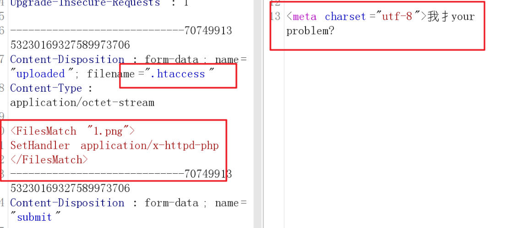
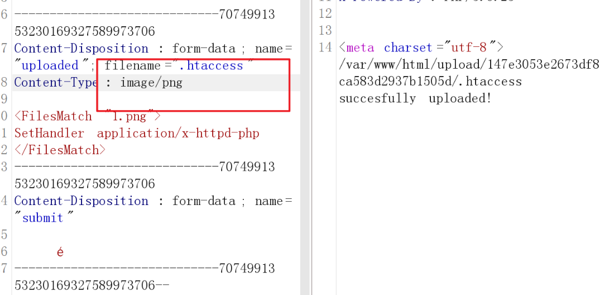
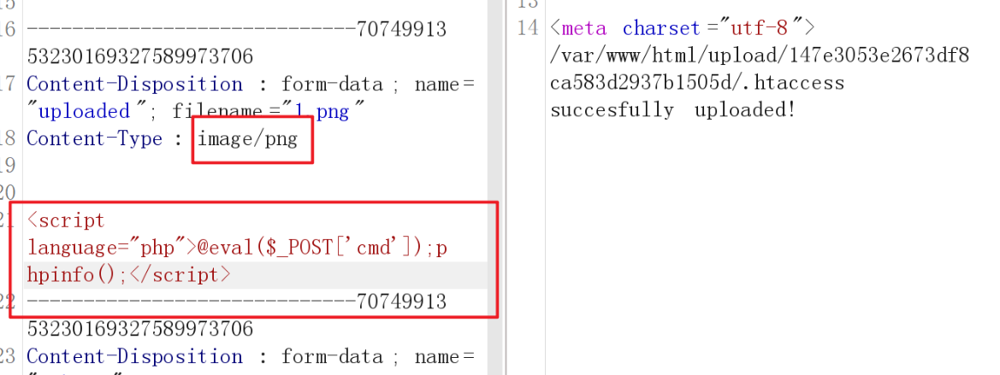
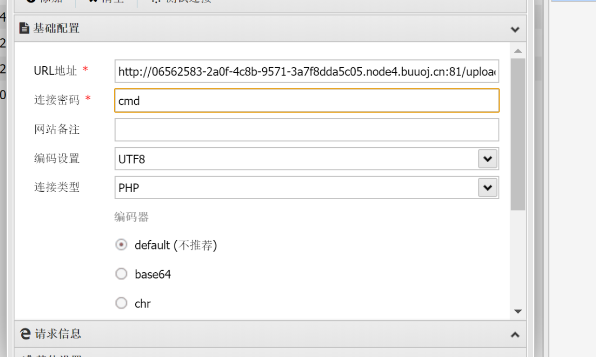
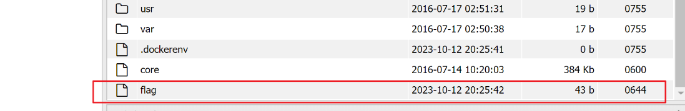

## BUUCTF之[MRCTF2020]你传你🐎呢1


很明显是[文件上传漏洞](https://so.csdn.net/so/search?q=文件上传漏洞&spm=1001.2101.3001.7020)，通过🐎可知应该是要传一个马进去，一开始把自己制作的图片马传进去后发现自己的[图片马](https://so.csdn.net/so/search?q=图片马&spm=1001.2101.3001.7020)不行

后上网找wp

发现如果一系列%00，改大小写，图片马之类都不行的话 ，或者上传之后 但是工具连接不了，回显显示没有数据的话，就代表要改配置文件

### .Htaccess绕过

htaccess文件是Apache服务器中的一个配置文件，它负责相关目录下的网页配置。通过htaccess文件，可以帮我们实现：网页301重定向、自定义404错误页面、改变文件扩展名、允许/阻止特定的用户或者目录的访问、禁止目录列表、配置默认文档等功能。

这道题是修改文件后缀

如果你要把jpg文件修改为php的话

编辑.htaccess文件（内容如下）

```
<FilesMatch "1.png">
SetHandler application/x-httpd-php
</FilesMatch>
```

注意你如果在.htaccess内容中的写了1.png

你上传的马的名字也要为1.png

如果内容是

```
AddType application/x-httpd-php .jpg
```

就是把所有jpg后缀的文件全都当作php文件来执行

那么你这是后上传之后的jpg文件会被当成php文件



还是不行，看wp



```html
Content-Disposition: form-data; name="uploaded"; filename=".htaccess"
Content-Type: image/jpeg

<FilesMatch "1.png">
SetHandler application/x-httpd-php
</FilesMatch>
```

上传成功 接着上传1.png



注意要删除/var/www/html 不知道为啥

直接用

```
http://06562583-2a0f-4c8b-9571-3a7f8dda5c05.node4.buuoj.cn:81//upload/147e3053e2673df8ca583d2937b1505d/

```



连接成功

flag在根目录

