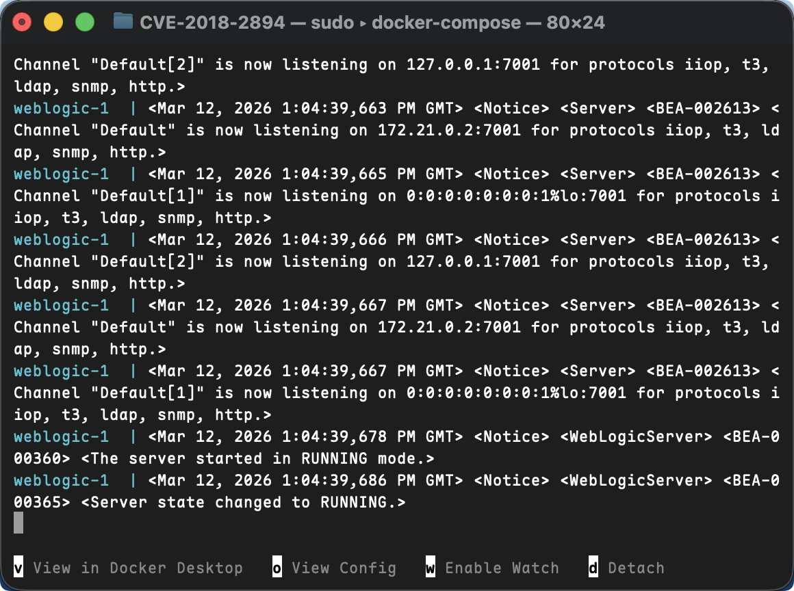
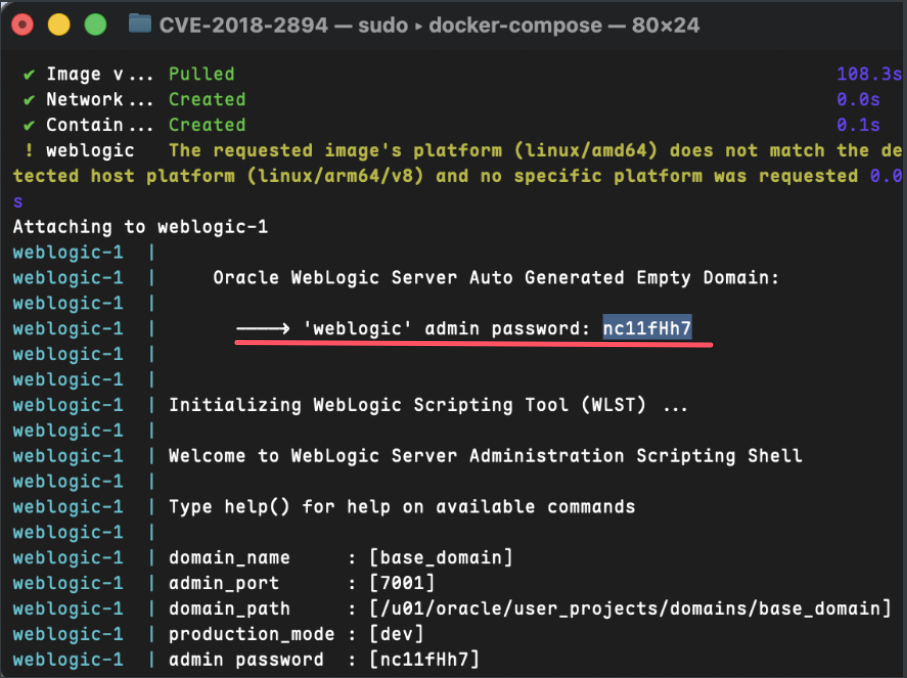
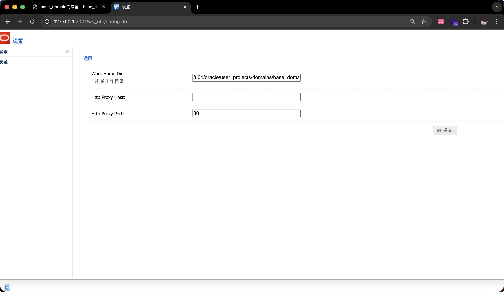
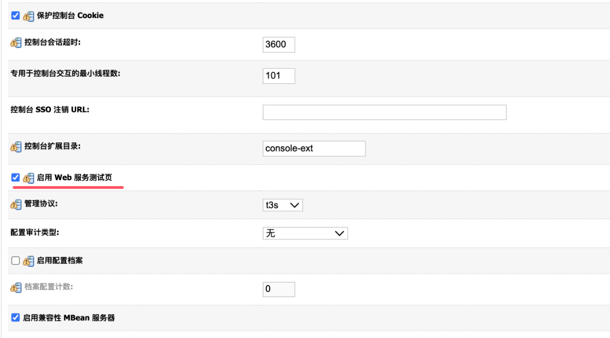
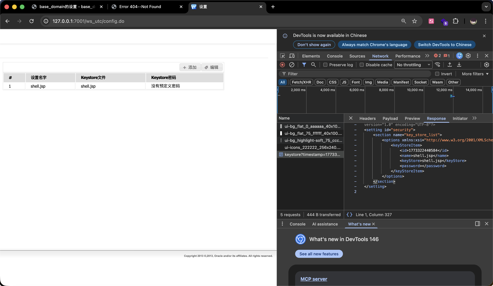
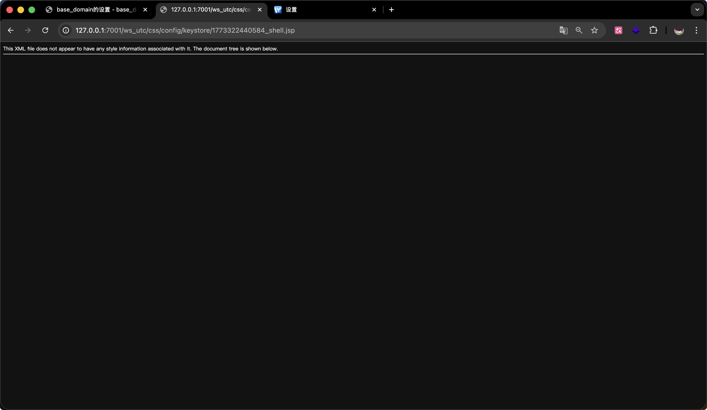
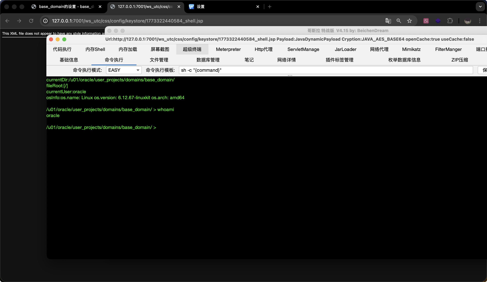

# 文件上传（CVE-2018-2894） 漏洞复现笔记

# 一、漏洞基础信息

## 1.1 漏洞简介

CVE-2018-2894 是 Oracle WebLogic Server 中的一个高危任意文件上传漏洞，属于远程代码执行（RCE）类漏洞，存在于 WebLogic 服务器的 Web 服务测试页（Web Service Test Page）组件中。该漏洞允许未授权攻击者通过构造恶意 HTTP 请求，上传任意 JSP 木马文件，进而获取服务器权限，执行任意系统命令，漏洞利用难度低、危害极大。

该漏洞的核心触发前提是 WebLogic 开启“启用 Web 服务测试页”选项（生产环境默认不开启，因此生产环境受影响范围有限，但开发、测试环境仍存在严重风险），攻击者可通过未授权访问的 `/ws_utc/config.do`、`/ws_utc/begin.do` 页面实现文件上传。

## 1.2 影响版本

根据 Oracle 官方公告及漏洞详情，受影响的 WebLogic Server 版本如下（含 Vulhub 复现环境所用版本）：

- Oracle WebLogic Server 10.3.6.0
- Oracle WebLogic Server 12.1.3.0
- Oracle WebLogic Server 12.2.1.2
- Oracle WebLogic Server 12.2.1.3

备注：Oracle 已于 2018 年 7 月的关键补丁更新（CPU）中修复该漏洞，升级至对应补丁版本或更高版本可彻底规避漏洞风险。

## 1.3 漏洞原理

漏洞根源在于 WebLogic Server 的 Web 服务测试页（ws_utc 应用）存在权限管控缺陷和文件上传校验不严问题，具体逻辑如下：

1. WebLogic 的 ws_utc 应用（对应路径 `/ws_utc/`）未做严格的权限验证，攻击者无需登录 WebLogic 管理端，即可直接访问 `/ws_utc/config.do` 页面，进行配置修改；
2. 该页面支持配置“工作目录（Work Home Dir）”，攻击者可将工作目录修改为 WebLogic 服务器的静态文件目录（如 css 目录），该目录无需权限即可访问；
3. 页面提供“安全→增加”功能，支持上传文件，但未对上传文件的类型、内容进行严格校验，攻击者可直接上传 JSP 木马文件；
4. 上传的 JSP 木马会被保存到攻击者指定的静态文件目录中，由于该目录可直接访问，攻击者通过访问木马文件路径，即可执行木马中的恶意代码，实现远程代码执行，最终获取服务器权限。

## 1.4 漏洞风险等级

CVSS 3.0 评分：9.8（高危），风险点核心如下：

- 利用条件简单：无需身份认证，未授权即可访问漏洞页面，无需复杂构造Payload；
- 攻击危害极大：成功利用可上传木马、执行任意系统命令，甚至接管整个 WebLogic 服务器，泄露敏感数据、篡改系统配置；
- 影响范围较广：覆盖 WebLogic 多个主流版本，且 Vulhub 已提供现成环境，降低了漏洞利用门槛。

# 二、复现环境准备

## 2.1 环境说明

采用 Vulhub 漏洞环境（基于 Docker 容器），无需手动配置 WebLogic 服务器及依赖，直接通过 Docker 启动即可，适合快速复现，环境配置如下表：

| 环境类型 | 具体配置                                                     | 说明                                                         |
| :------- | :----------------------------------------------------------- | :----------------------------------------------------------- |
| 攻击机   | Kali Linux（IP：192.168.101.136），自带浏览器、Burp Suite（可选）、哥斯拉（用于连接木马） | 用于访问漏洞页面、上传木马、连接并控制靶机                   |
| 靶机     | Docker + Vulhub 环境，WebLogic 12.2.1.3 版本（漏洞版本）     | Vulhub 已封装好漏洞环境，包含默认管理员账号密码，启动后即可使用 |
| 依赖工具 | Docker、Docker Compose、浏览器、冰蝎（JSP 木马工具）         | Docker 用于运行容器，冰蝎用于生成 JSP 木马并连接靶机         |

## 2.2 环境搭建步骤（详细可落地）

### 2.2.1 安装 Docker 及 Docker Compose（靶机/本地）

若已安装，可跳过此步骤；未安装则执行以下命令：

```bash
# 更新软件源
sudo apt update && sudo apt upgrade -y

# 安装 Docker
sudo apt install docker.io -y
sudo systemctl start docker
sudo systemctl enable docker

# 安装 Docker Compose
sudo apt install docker-compose -y

# 验证安装成功（显示版本号即为成功）
docker --version
docker-compose --version
```

### 2.2.2 下载 Vulhub 并进入漏洞目录

```bash
# 克隆 Vulhub 仓库（若已克隆，可直接进入对应目录）
git clone https://github.com/vulhub/vulhub.git

# 进入 CVE-2018-2894 漏洞目录（WebLogic 漏洞专属目录）
cd vulhub/weblogic/CVE-2018-2894/
```

### 2.2.3 启动漏洞环境

```bash
# 编译并启动容器（首次启动会自动拉取 WebLogic 镜像，耗时稍长，耐心等待）
docker-compose up -d

# 查看容器运行状态，确认环境启动成功（出现 "Up" 状态即为成功）
docker ps | grep vulhub
```

启动成功后，WebLogic 服务器默认映射 7001 端口（WebLogic 默认端口），可通过 `http://靶机IP:7001` 访问 WebLogic 首页，通过 `http://靶机IP:7001/console` 访问管理端登录页面。



### 2.2.4 获取 WebLogic 管理员账号密码

Vulhub 环境启动后，会自动生成 WebLogic 管理员账号密码，执行以下命令查看：

```bash
# 查看容器日志，过滤密码信息（账号固定为 weblogic）
docker-compose logs | grep password
```

执行后会输出类似如下内容（密码随机生成，以实际输出为准）：

```bash
cve-2018-2894-weblogic-1 | ----> 'weblogic' admin password: faTck3UE
```

记录账号密码：**账号：weblogic，密码：实际输出的随机字符串**（后续需登录管理端开启测试页）。



### 2.2.5 环境验证

打开攻击机浏览器，访问 `http://靶机IP:7001/console`，出现 WebLogic 管理端登录页面，输入获取到的账号密码，能成功登录，说明环境启动正常；同时访问 `http://靶机IP:7001/ws_utc/config.do`，能正常打开配置页面（无需登录），进一步确认漏洞环境可用。



# 三、漏洞复现步骤（详细可落地，每步带操作截图说明）

复现核心逻辑：登录 WebLogic 管理端开启测试页 → 未授权访问漏洞页面 → 配置工作目录为静态文件目录 → 上传 JSP 木马 → 访问木马路径触发漏洞 → 执行系统命令。

前置准备：在攻击机上打开哥斯拉，生成 JSP 木马保存为 `shell.jsp`（后续用于上传）。

## 步骤 1：登录 WebLogic 管理端，开启“启用 Web 服务测试页”

1. 攻击机浏览器访问 `http://靶机IP:7001/console`，输入账号（weblogic）和密码（步骤 2.2.4 获取的随机密码），点击登录；
2. 登录成功后，在左侧导航栏找到 `base_domain`（默认域名），点击右侧的“配置”按钮；
3. 进入配置页面后，下拉至页面底部，点击“高级”选项（展开高级配置）；
4. 在高级配置中，找到“启用 Web 服务测试页”选项，勾选该选项（默认未勾选），点击页面底部的“保存”按钮；
5. 保存后，系统会提示“配置已更改，需重启服务器生效”，无需手动重启，Vulhub 环境会自动应用配置，等待 1-2 分钟即可。



## 步骤 2：未授权访问漏洞页面，配置工作目录

1. 无需登录管理端，直接在攻击机浏览器访问漏洞页面：`http://靶机IP:7001/ws_utc/config.do`；
2. 进入页面后，找到“通用”选项下的“当前工作目录（Work Home Dir）”，输入以下路径（WebLogic 静态文件 css 目录，无需权限即可访问）：        `/u01/oracle/user_projects/domains/base_domain/servers/AdminServer/tmp/_WL_internal/com.oracle.webservices.wls.ws-testclient-app-wls/4mcj4y/war/css`
3. 输入路径后，点击页面底部的“保存”按钮，配置工作目录成功（页面无明显报错即为成功）。

说明：该路径是 Vulhub 环境中 WebLogic ws_utc 应用的默认静态 css 目录，固定不变，直接复制粘贴即可；配置该目录的目的是让上传的木马文件能被直接访问，进而触发执行。

## 步骤 3：上传 JSP 木马文件

1. 在漏洞页面（`/ws_utc/config.do`）左侧导航栏，点击“安全”选项，再点击“增加”按钮（用于上传文件）；

2. 进入文件上传页面，点击“选择文件”，选择攻击机上提前生成的 JSP 木马（`shell.jsp`）；

3. 点击“提交”按钮，上传文件；上传成功后，页面会提示“操作成功”，同时可通过浏览器 F12 查看网络请求，获取上传文件的时间戳（关键，后续访问木马需用到）；

4. 获取时间戳方法：按 F12 打开开发者工具，切换到“网络”选项卡，找到刚才的“upload”请求，查看响应内容，其中“timestamp”对应的数值即为时间戳（如 1710200000000）。

   


## 步骤 4：访问木马文件，触发漏洞并执行命令

1. 构造木马文件访问路径，格式如下（替换靶机IP、时间戳、木马文件名）：        `http://靶机IP:7001/ws_utc/css/config/keystore/时间戳_木马文件名.jsp`示例：`http://192.168.8.138:7001/ws_utc/css/config/keystore/1710200000000_shell.jsp`

2. 在攻击机浏览器中访问上述路径，页面无明显报错（空白页或显示木马相关内容），说明木马已成功执行；

   

3. 打开哥斯拉工具，点击“新建连接”，输入木马访问路径、木马密码，点击“连接”；

4. 连接成功后，即可在冰蝎中执行任意系统命令（如 `whoami`、`ls`），查看靶机系统信息，至此漏洞复现成功。

   

补充说明：若访问木马路径报错，可检查三点：① 工作目录配置是否正确；② 时间戳是否正确；③ 木马文件是否上传成功（可重新上传重试）。


## 步骤 5：关闭漏洞环境（可选）

复现完成后，建议关闭容器，避免环境残留，执行以下命令（在 Vulhub 漏洞目录下）：

```bash
# 停止并删除容器
docker-compose down

# 清理 Docker 缓存（可选，释放磁盘空间）
docker system prune -a -f
```

# 四、漏洞深度分析

## 4.1 漏洞触发关键点

1. 权限管控缺陷：ws_utc 应用的 `/ws_utc/config.do`、`/ws_utc/begin.do` 页面未做权限验证，未授权用户可直接访问并修改配置，这是漏洞利用的前提；
2. 工作目录可自定义：允许攻击者将工作目录修改为 WebLogic 的静态文件目录（如 css 目录），该目录无需权限即可访问，为木马执行提供了路径条件；
3. 文件上传校验不严：上传功能未校验文件类型、后缀名及内容，攻击者可直接上传 JSP 木马，且木马文件会被保存到指定的静态目录中，可直接访问执行；
4. Web 服务测试页开启：该选项是漏洞触发的必要条件，生产环境默认关闭，因此生产环境受影响较小，但开发、测试环境常开启该选项用于调试，风险较高。

## 4.2 漏洞利用场景扩展

- 未授权攻击：攻击者无需知道 WebLogic 管理员账号密码，仅需能访问靶机 7001 端口，即可利用漏洞上传木马、控制服务器；
- 内网渗透：若 WebLogic 服务器部署在内网，攻击者可通过漏洞获取内网服务器权限，进一步横向渗透内网其他主机；
- 持久化控制：上传木马后，攻击者可通过木马长期控制服务器，窃取敏感数据、篡改系统配置，甚至植入挖矿程序等恶意软件。

## 4.3 漏洞绕过思路（补充）

若靶机对文件上传做了简单的后缀名拦截（非 Vulhub 环境，实际生产环境可能存在），可通过以下方式绕过：

- 后缀名绕过：使用 `shell.jsp;.txt`、`shell.jsp%00.txt` 等格式，利用 WebLogic 对文件后缀的解析缺陷，上传后服务器会自动忽略多余后缀，保留 JSP 后缀；
- 文件内容绕过：在 JSP 木马头部添加正常的 HTML/CSS 代码，伪装成合法文件，绕过内容校验；
- 路径绕过：修改工作目录为其他可访问的静态目录（如 js 目录），避免 css 目录被拦截。

# 五、漏洞修复方案

## 5.1 官方修复方案（首选）

Oracle 官方已在 2018 年 7 月的关键补丁更新（CPU）中修复该漏洞，建议直接升级 WebLogic Server 至对应安全版本，具体升级方案如下：

- WebLogic Server 10.3.6.0：升级至 10.3.6.0.180717 及以上版本；
- WebLogic Server 12.1.3.0：升级至 12.1.3.0.180717 及以上版本；
- WebLogic Server 12.2.1.2：升级至 12.2.1.2.180717 及以上版本；
- WebLogic Server 12.2.1.3：升级至 12.2.1.3.180717 及以上版本。

官方补丁下载地址：[Oracle CPU July 2018 补丁](http://www.oracle.com/technetwork/security-advisory/cpujul2018-4258247.html)（需注册 Oracle 账号下载）。

## 5.2 临时修复方案（无法立即升级时）

若因业务原因无法立即升级 WebLogic 版本，可采取以下临时措施，阻断漏洞利用：

1. 关闭“启用 Web 服务测试页”选项：登录 WebLogic 管理端，进入 base_domain 配置→高级，取消勾选“启用 Web 服务测试页”，保存后重启服务器，彻底阻断漏洞触发路径；
2. 限制漏洞页面访问：通过防火墙或 Web 服务器配置，禁止外部访问 `/ws_utc/config.do`、`/ws_utc/begin.do` 页面，仅允许内网可信 IP 访问；
3. 删除漏洞相关应用：删除 WebLogic 安装目录下的 `ws_utc` 应用（对应路径：`DOMAIN_HOME/servers/AdminServer/tmp/_WL_internal/com.oracle.webservices.wls.ws-testclient-app-wls/`），删除后无法访问漏洞页面；
4. 加强文件上传校验：在 WebLogic 配置中，对 ws_utc 应用的文件上传功能添加校验，禁止上传 JSP、ASP、PHP 等可执行文件后缀。

## 5.3 长期防护建议

- 规范环境配置：生产环境严格关闭“启用 Web 服务测试页”选项，禁止在生产环境中开启调试相关功能；
- 定期更新补丁：及时关注 Oracle 官方安全公告，定期升级 WebLogic Server 及其他依赖组件，修复已知漏洞；
- 加强权限管控：对 WebLogic 管理端、漏洞相关页面进行严格的权限控制，禁止未授权访问，同时加强管理员密码强度；
- 漏洞扫描与监控：定期使用漏洞扫描工具（如 Nessus、AWVS）对 WebLogic 服务器进行扫描，及时发现潜在漏洞；同时监控服务器日志，发现异常文件上传、访问行为及时处置；
- 限制端口访问：通过防火墙限制 WebLogic 7001 端口（管理端端口）的访问范围，仅允许可信 IP 访问，降低外部攻击风险。


# 六、总结

CVE-2018-2894 是一个典型的未授权任意文件上传漏洞，核心在于 WebLogic  Web 服务测试页的权限管控缺陷和文件上传校验不严，利用难度低、危害极大。通过 Vulhub 环境复现，可清晰了解该漏洞的触发原理、利用流程——从开启测试页、配置工作目录，到上传木马、执行命令，每一步都贴合实际攻击场景，同时也能明确漏洞的防护重点。

在实际生产环境中，应优先通过升级官方补丁修复漏洞，同时规范环境配置、加强权限管控和日志监控，从根源上防范此类漏洞的利用。对于开发、测试环境，也需重视漏洞风险，避免因调试功能开启导致安全隐患，确保系统安全稳定运行。